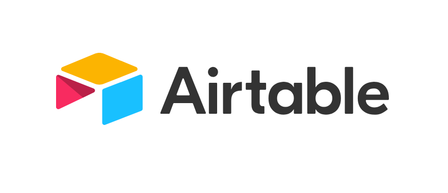
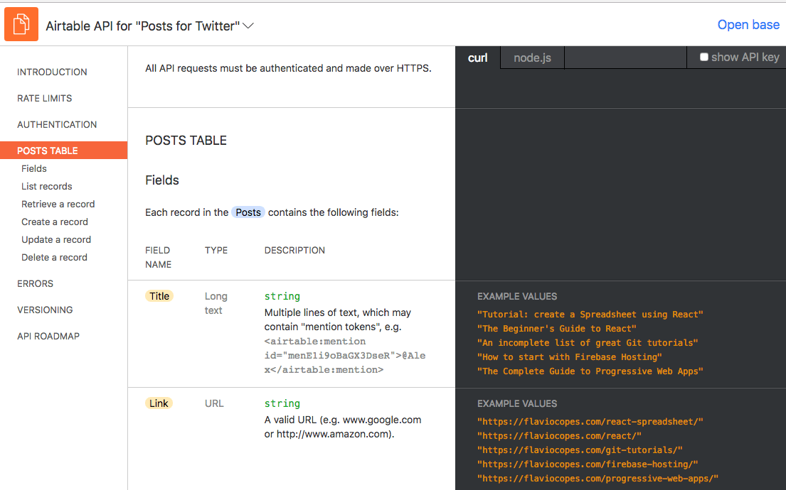
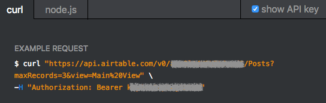
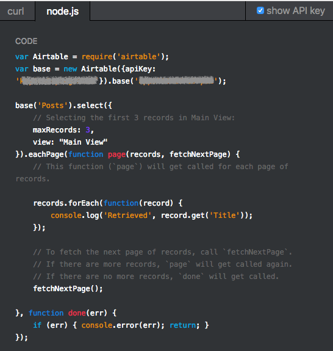

Airtable is an amazing tool.

It's a mix between a spreadsheet and a database.

As a developer you get to create a database with a very nice to use interface, with the ease of use and editing of a spreadsheet, and you can easily update your records even from a mobile app.

## Perfect for prototypes

Airtable is much more than a glorified spreadsheet, however. It is a perfect tool for a developer looking to prototype or create an MVP of an application.

An MVP, or Minimum Viable Product, is one initial version of an application or product.

Most products fail not because of technical limitations or because "the stack did not scale". They fail because either there is no need for them, or the maker does not have a clear way to market the product.

Creating an MVP minimizes the risks of spending months trying to build the perfect app, and then realizing no one wants it.

## A great API

Airtable has an absolutely nice API to work with, which makes it easy to interface with your Airtable database programmatically.

This is what makes it 10x superior to a standard spreadsheet, when it comes to data handling AND making it easy to authenticate.

The API has a limit of 5 requests per second, which is not high, but still reasonable to work with for most scenarios.

## A great documentation for the API

Here is the Airtable API documentation: <https://airtable.com/api>.

As developers we spend a lot of time reading through docs and trying to figure out how things work.

An API is tricky because you need to interact with a service, and you want to both learn what the service exposes, and how can you use the API to do what you need.

Airtable raises the bar for any API documentation out there. It puts your API keys, base IDs and table names directly in the examples, so you just need to copy and paste them into your codebase and you're ready to go.

Not just that, the examples in the API docs use the actual data in your table. In this image, notice how the fields example values are actual values I put in my table:



The API documentation offers examples using `curl`:



and their Node.js official client:



## The official Node.js client

Airtable maintains the official [Airtable.js](https://github.com/airtable/airtable.js) Node.js client library, a very easy to use way to access the Airtable data.

It's convenient because it offers a built-in logic to handle rate limits and retrying the requests when you exceed them.

Let's see a few common operations you can perform with the API, but first let's define a couple values we'll reference in the code:

- `API_KEY`: the Airtable API key
- `BASE_NAME`: the name of the base you'll work with
- `TABLE_NAME`: the name of the table in that base.
- `VIEW_NAME`: the name of the table view.

A base is a short term for _database_, and it can contain many tables.

A table has one or more views that organize the same data in a different way. There's always at least one view ([see more on views](https://support.airtable.com/hc/en-us/articles/202624989-Guide-to-views))

### Authenticate

You can set up the `AIRTABLE_API_KEY` environment variable, and Airbase.js will automatically use that, or explicitly add it into your code:

```js
const Airtable = require('airtable')

Airtable.configure({
    apiKey: API_KEY
})
```

### Initialize a base

```js
const base = require('airtable').base(BASE_NAME)
```

or, if you already initialized the Airtable variable, use

```js
const base = Airtable.base(BASE_NAME)
```

## Reference a table

With a `base` object, you can now reference a table using

```js
const table = base(TABLE_NAME)
```

## Retrieve the table records

Any row inside a table is called a **record**.

Airtable returns a maximum of 100 records in each page of results. If you know you will never go over 100 items in a table, just use the `firstPage` method:

```js
table.select({
    view: VIEW_NAME
}).firstPage((err, records) => {
    if (err) {
      console.error(err)
      return
    }

    //all records are in the `records` array, do something with it
})
```

If you have (or expect) more than 100 records, you need to  paginate through them, using the `eachPage` method:

```js
let records = []

// called for every page of records
const processPage = (partialRecords, fetchNextPage) => {
  records = [...records, ...partialRecords]
  fetchNextPage()
}

// called when all the records have been retrieved
const processRecords = (err) => {
  if (err) {
    console.error(err)
    return
  }

  //process the `records` array and do something with it
}

table.select({
    view: VIEW_NAME
}).eachPage(processPage, processRecords)
```

## Inspecting the record content

Any record has a number of properties which you can inspect.

First, you can get its ID:

```js
record.id

//or

record.getId()
```

and the time of creation:

```js
record.createdTime
```

and you can get any of its properties, which you access through the column name:

```js
record.get('Title')
record.get('Description')
record.get('Date')
```

## Get a specific record

You can get a specific record by ID:

```js
const record_id = //...

table.find(record_id, (err, record) => {
    if (err) {
      console.error(err)
      return
    }

    console.log(record)
})
```

## Create a new record

You can add a new record

```js
table.create({
  "Title": "Tutorial: create a Spreadsheet using React",
  "Link": "https://flaviocopes.com/react-spreadsheet/",
}, (err, record) => {
    if (err) {
      console.error(err)
      return
    }

    console.log(record.getId())
})
```

## Update a record

You can update a single field of a record, and leave the other fields untouched, using `update`:

```js
const record_id = //...

table.update(record_id, {
  "Title": "The modified title"
}, (err, record) => {
    if (err) {
      console.error(err)
      return
    }

    console.log(record.get('Title'))
})
```

Or, you can update some fields in a record and **clear out** the ones you did not touch, with `replace`:

```js
const record_id = //...

table.replace(record_id, {
  "Title": "The modified title",
  "Description": "Another description"
}, (err, record) => {
    if (err) {
      console.error(err)
      return
    }

    console.log(record)
})
```

## Delete a record

A record can be deleted using

```js
const record_id = //...

table.destroy(record_id, (err, deletedRecord) => {
    if (err) {
      console.error(err)
      return
    }

    console.log('Deleted record', deletedRecord.id)
})
```

