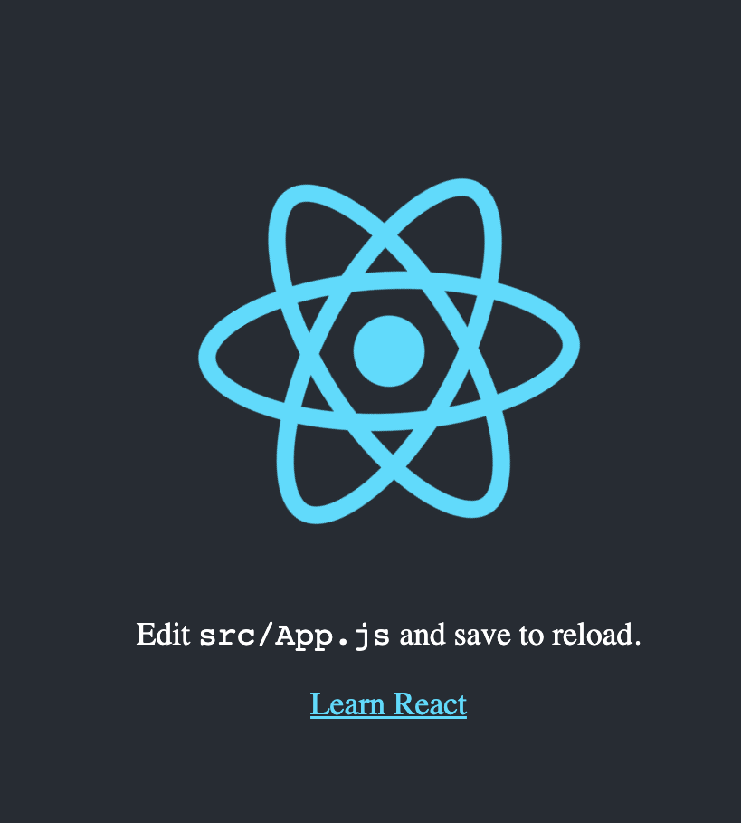
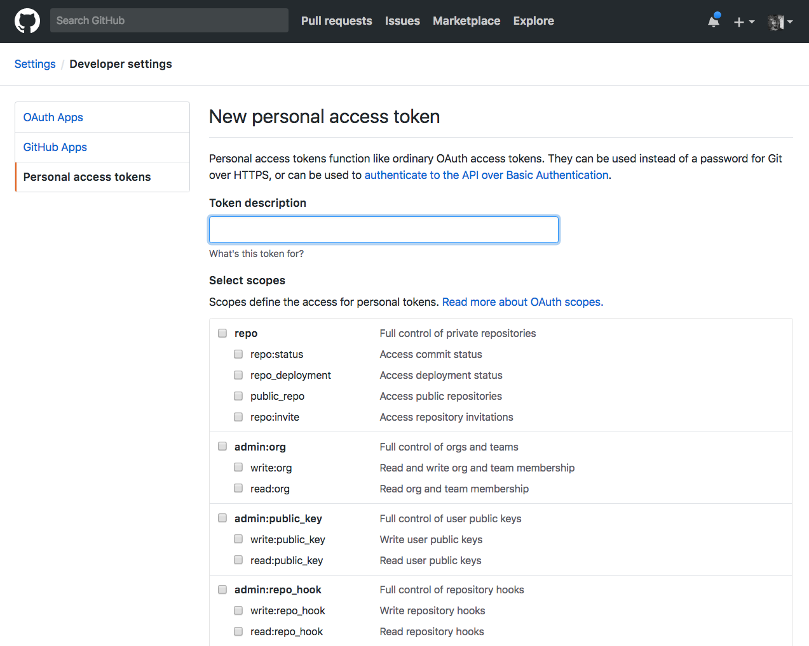
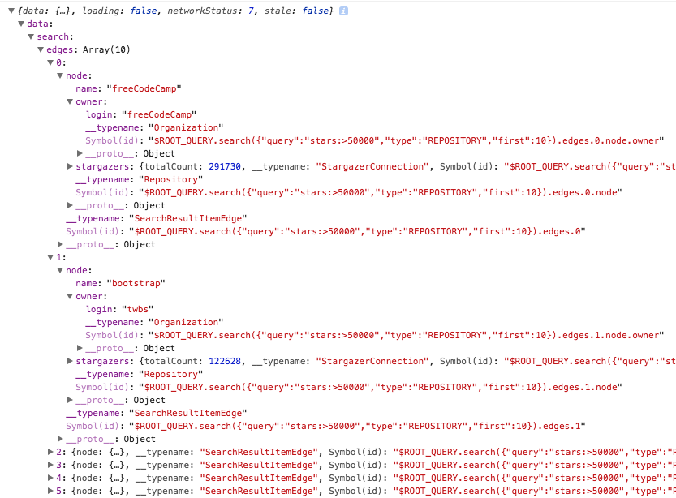
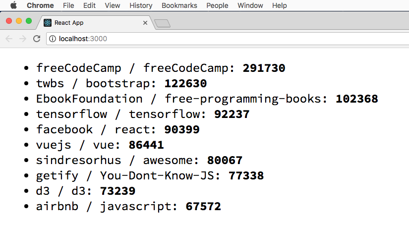

- [Introduction to Apollo](#introduction-to-apollo)
- [Apollo Client](#apollo-client)
  - [Start a React app](#start-a-react-app)
  - [Get started with Apollo Boost](#get-started-with-apollo-boost)
  - [Create an ApolloClient object](#create-an-apolloclient-object)
  - [Apollo Links](#apollo-links)
  - [Caching](#caching)
  - [Use `ApolloProvider`](#use-apolloprovider)
  - [The `gql` template tag](#the-gql-template-tag)
  - [Perform a GraphQL request](#perform-a-graphql-request)
    - [Obtain an access token for the API](#obtain-an-access-token-for-the-api)
    - [Use an Apollo Link to authenticate](#use-an-apollo-link-to-authenticate)
  - [Render a GraphQL query result set in a component](#render-a-graphql-query-result-set-in-a-component)
- [Apollo Server](#apollo-server)
  - [Apollo Playgrounds](#apollo-playgrounds)
  - [Apollo Server Hello World](#apollo-server-hello-world)

## Introduction to Apollo

In the last few years [GraphQL](/graphql/) got hugely popular as an alternative approach to building an API over REST.

GraphQL is a great way to let the client decide which data they want to be transmitted over the network, rather than having the server send a fixed set of data.

Also, it allows you to specify nested resources, reducing a lot the back and forth sometimes required when dealing with REST APIs.

Apollo is a team and community that builds on top of GraphQL, and provides different tools that help you build your projects.

The tools provided by Apollo are mainly 3: **Client**, **Server**, **Engine**.

**Apollo Client** helps you consume a GraphQL API, with support for the most popular frontend web technologies including React, [Vue](/vue-introduction/), Angular, Ember, Meteor and more, and native development on iOS and Android.

**Apollo Server** is the server part of GraphQL, which interfaces with your backend and sends responses back to the client requests.

**Apollo Engine** is an hosted infrastructure (SAAS) that serves as a middle man between the client and your server, providing caching, performance reporting, load measurement, error tracking, schema field usage statistics, historical stats and many more goodies. It's currently free up to 1 million requests per month, and it's the only part of Apollo that's not open source and free, and provides funding for the open source part of the project.

It's worth noting that those 3 tools are not linked together in any way, and you can use just Apollo Client to interface with a 3rd party API, or serve an API using Apollo Server without having a client at all, for example.

It's all **compatible with the GraphQL standard specification**, so there is no proprietary or incompatible tech in Apollo.

But it's very convenient to have all those tools together under a single roof, a complete suite for all your GraphQL-related needs.

Apollo strives to be easy to use and easy to contribute to.

Apollo Client and Apollo Server are all community projects, built by the community, for the community. Apollo is backed by the [Meteor Development Group](https://www.meteor.io/), the company behind [Meteor](/meteor/), a very popular [JavaScript](/javascript/) framework.

Apollo is focused on **keeping things simple**. This is something key to the success of a technology that wants to become popular, as some tech or framework or library might be overkill for 99% of the small or medium companies out there, and just suited for the big companies with very complex needs.

## Apollo Client

[Apollo Client](https://www.apollographql.com/client) is the leading JavaScript client for GraphQL. Community-driven, it's designed to let you build UI components that interface with GraphQL data, either in displaying data, or in performing mutations when certain actions happen.

You don't need to change everything in your application to make use of Apollo Client. You can start with just one tiny layer, one request, and expand from there.

Most of all, Apollo Client is built to be simple, small and flexible from the ground up.

In this post I'm going to detail the process of using Apollo Client within a React application.

I'll use the [GitHub GraphQL API](https://developer.github.com/v4/) as a server.

### Start a React app

I use [`create-react-app`](https://github.com/facebook/create-react-app) to setup the React app, which is very convenient and just adds the bare bones of what we need:

```bash
npx create-react-app myapp
```

> `npx` is a command available in the latest [npm](/npm/) versions. Update npm if you do not have this command.

and start the app local server with npm:

```bash
npm start
```

This will fire up an app on `localhost:3000`.

Now open `src/index.js`:

```js
import React from 'react'
import ReactDOM from 'react-dom'
import './index.css'
import App from './App'
import registerServiceWorker from './registerServiceWorker'

ReactDOM.render(<App />, document.getElementById('root'))
registerServiceWorker()
```

and remove all this content.

### Get started with Apollo Boost

Apollo Boost is the easiest way to start using Apollo Client on a new project. We'll install that in addition to `react-apollo` and `graphql`.

In the console, run

```bash
npm install apollo-boost react-apollo graphql
```

### Create an ApolloClient object

You start by importing ApolloClient from `apollo-client` in `index.js`:

```js
import { ApolloClient } from 'apollo-client'

const client = new ApolloClient()
```

By default Apollo Client uses the `/graphql` endpoint on the current host, so let's use an **Apollo Link** to specify the details of the connection to the GraphQL server by setting the GraphQL endpoint URI.

### Apollo Links

An Apollo Link is represented by an `HttpLink` object, which we import from `apollo-link-http`.

Apollo Link provides us a way to describe how we want to get the result of a GraphQL operation, and what we want to do with the response.

In short, you create multiple Apollo Link instances that all act on a GraphQL request one after another, providing the final result you want. Some Links can give you the option of retrying a request if not successful, batching and much more.

We'll add an Apollo Link to our Apollo Client instance to use the GitHub GraphQL endpoint URI `https://api.github.com/graphql`

```js
import { ApolloClient } from 'apollo-client'
import { HttpLink } from 'apollo-link-http'

const client = new ApolloClient({
  link: new HttpLink({ uri: 'https://api.github.com/graphql' })
})
```

### Caching

We're not done yet. Before having a working example we must also tell `ApolloClient` which [caching strategy](https://www.apollographql.com/docs/react/advanced/caching/) to use: `InMemoryCache` is the default and it's a good one to start.

```js
import { ApolloClient } from 'apollo-client'
import { HttpLink } from 'apollo-link-http'
import { InMemoryCache } from 'apollo-cache-inmemory'

const client = new ApolloClient({
  link: new HttpLink({ uri: 'https://api.github.com/graphql' }),
  cache: new InMemoryCache()
})
```

### Use `ApolloProvider`

Now we need to connect the Apollo Client to our component tree. We do so using `ApolloProvider`, by wrapping our application component in the main React file:

```js
import React from 'react'
import ReactDOM from 'react-dom'
import { ApolloClient } from 'apollo-client'
import { HttpLink } from 'apollo-link-http'
import { InMemoryCache } from 'apollo-cache-inmemory'
import { ApolloProvider } from 'react-apollo'

import App from './App'

const client = new ApolloClient({
  link: new HttpLink({ uri: 'https://api.github.com/graphql' }),
  cache: new InMemoryCache()
})

ReactDOM.render(
  <ApolloProvider client={client}>
    <App />
  </ApolloProvider>,
  document.getElementById('root')
)
```

This is enough to render the default `create-react-app` screen, with Apollo Client initialized:



### The `gql` template tag

We're now ready to do something with Apollo Client, and we're going to fetch some data from the GitHub API and render it.

To do so we need to import the `gql` template tag at the beginning of `index.js`:

```js
import gql from 'graphql-tag'
```

any GraphQL query will be built using this template tag, like this:

```js
const query = gql`
  query {
    ...
  }
`
```

### Perform a GraphQL request

Importing `gql` was the last item we needed in our toolset.

We're now ready to do something with Apollo Client, and we're going to fetch some data from the GitHub API and render it.

#### Obtain an access token for the API

The first thing to do is to [obtain a personal access token](https://help.github.com/articles/creating-a-personal-access-token-for-the-command-line/) from GitHub.

GitHub makes it easy by providing an interface from which you select any permission you might need:



For the sake of this example tutorial you don't need any of those permissions, they are meant for access to private user data but we will just query the public repositories data.

You still need a token though.

The token you get is an **OAuth 2.0 Bearer token**.

You can easily test it by running from the command line:

```bash
$ curl -H "Authorization: bearer ***_YOUR_TOKEN_HERE_***" -X POST -d " \
 { \
   \"query\": \"query { viewer { login }}\" \
 } \
" https://api.github.com/graphql
```

(replace `***_YOUR_TOKEN_HERE_***` with the actual token)

which should give you the result

```json
{"data":{"viewer":{"login":"***_YOUR_LOGIN_NAME_***"}}}
```

or

```json
{
  "message": "Bad credentials",
  "documentation_url": "https://developer.github.com/v4"
}
```

if something went wrong, for example if you forgot to insert the token.

#### Use an Apollo Link to authenticate

Now we need to send the **Authorization** header along with our GraphQL request, just like we did in the `curl` request above.

How we do this with Apollo Client is by creating an Apollo Link middleware. Start with installing [`apollo-link-context`](https://www.npmjs.com/package/apollo-link-context):

```bash
npm install apollo-link-context
```

This package allows us to add an authentication mechanism by setting the context of our requests.

We can use it in this code by referencing the `setContext` function in this way:

```js
import { setContext } from 'apollo-link-context'

...

const authLink = setContext((_, { headers }) => {
  const token = '***YOUR_TOKEN**'

  return {
    headers: {
      ...headers,
      authorization: `Bearer ${token}`
    }
  }
})
```

and once we have this new Apollo Link, we can [compose](https://www.apollographql.com/docs/link/composition.html) it with the `HttpLink` we already had, by using the `concat()` method on a link:

```js
const link = authLink.concat(httpLink)
```

Here is the full code for the `src/index.js` file with the code we have right now:

```js
import React from 'react'
import ReactDOM from 'react-dom'
import { ApolloClient } from 'apollo-client'
import { HttpLink } from 'apollo-link-http'
import { InMemoryCache } from 'apollo-cache-inmemory'
import { ApolloProvider } from 'react-apollo'
import { setContext } from 'apollo-link-context'
import gql from 'graphql-tag'

import App from './App'

const httpLink = new HttpLink({ uri: 'https://api.github.com/graphql' })

const authLink = setContext((_, { headers }) => {
  const token = '***YOUR_TOKEN**'

  return {
    headers: {
      ...headers,
      authorization: `Bearer ${token}`
    }
  }
})

const link = authLink.concat(httpLink)

const client = new ApolloClient({
  link: link,
  cache: new InMemoryCache()
})

ReactDOM.render(
  <ApolloProvider client={client}>
    <App />
  </ApolloProvider>,
  document.getElementById('root')
)
```

> WARNING ⚠️ 🚧 Keep in mind this code is an **example** for educational purposes and it exposes your GitHub GraphQL API token to the world to see in your frontend-facing code. Production code needs to keep this token private in the backend.

We can now make the first GraphQL request at the bottom of this file, and this sample query asks for the names and the owners of the 10 most popular repositories, with more than 50k stars:

```js
const POPULAR_REPOSITORIES_LIST = gql`
{
  search(query: "stars:>50000", type: REPOSITORY, first: 10) {
    repositoryCount
    edges {
      node {
        ... on Repository {
          name
          owner {
            login
          }
          stargazers {
            totalCount
          }
        }
      }
    }
  }
}
`

client.query({ query: POPULAR_REPOSITORIES_LIST }).then(console.log)
```

Running this code successfully returns the result of our query in the browser console:



### Render a GraphQL query result set in a component

What we saw up to now is already cool. What's even cooler is using the graphql result set to render your components.

We let Apollo Client the burden (or joy) or fetching the data and handling all the low-level stuff, and we can focus on showing the data, by using the `graphql` component enhancer offered by `react-apollo`.

Add this in the `App.js` file:

```js
import React from 'react'
import { graphql } from 'react-apollo'
import { gql } from 'apollo-boost'

const POPULAR_REPOSITORIES_LIST = gql`
{
  search(query: "stars:>50000", type: REPOSITORY, first: 10) {
    repositoryCount
    edges {
      node {
        ... on Repository {
          name
          owner {
            login
          }
          stargazers {
            totalCount
          }
        }
      }
    }
  }
}
`

const App = graphql(POPULAR_REPOSITORIES_LIST)(props =>
  <ul>
    {props.data.loading ? '' : props.data.search.edges.map((row, i) =>
      <li key={row.node.owner.login + '-' + row.node.name}>
        {row.node.owner.login} / {row.node.name}: {' '}
        <strong>
          {row.node.stargazers.totalCount}
        </strong>
      </li>
    )}
  </ul>
)

export default App
```

Here is the result of our query rendered in the component 😀



---

## Apollo Server

A GraphQL server has the job of accepting incoming requests on an endpoint, interpreting the request and looking up any data that's necessary to fulfill the client needs.

There are tons of different GraphQL server implementations for every possible language.

**Apollo Server is a GraphQL server implementation for JavaScript, in particular for the [Node.js](/nodejs/) platform**.

It supports many popular Node.js frameworks, including:

- [Express](/express/)
- [Hapi](https://hapijs.com/)
- [Koa](http://koajs.com/)
- [Restify](http://restify.com/)

Apollo Server gives us 3 things basically:

- gives us a way to describe our data with a **schema**.
- provides the framework for **resolvers**, which are functions we write to fetch the data needed to fulfill a request.
- facilitates handling **authentication** for our API.

To start, create a folder named `appserver`, go into it and run `npm init --yes` to initialize a `package.json` file.

Then run `npm install apollo-server graphql`.

### Apollo Playgrounds

If you prefer an online playground, there 2 amazing playgrounds for Apollo which I recommend.

The first is hosted on [Glitch](https://glitch.com/~apollo-launchpad), the second on [CodeSandbox](https://codesandbox.io/s/apollo-server).

Go and remix/fork those starter projects to create your own Apollo Server.

### Apollo Server Hello World

Create an `index.js` file.

First you import `ApolloServer` and `gql` from `apollo-server`:

```js
const { ApolloServer, gql } = require('apollo-server');
```

We create a schema definition using the `gql` tag. A schema definition is an template literal string containing the description of our query and the types associated with each field:

```js
const typeDefs = gql`
  type Query {
    hello: String
  }
`
```

A **resolver** is an object that maps fields in the schema to resolver functions, able to lookup data to respond to a query.

Here is a simple resolver containing the resolver function for the `hello` field, which returns the `Hello world!` string:

```js
const resolvers = {
  Query: {
    hello: (root, args, context) => {
      return 'Hello world!'
    }
  }
}
```

Given those 2 elements, the schema definition and the resolver, we initialize a new ApolloServer object:

```js
const server = new ApolloServer({ typeDefs, resolvers })
```

We then call the listen() method on the sever object, and we listen for the promise to resolve, which indicates the server is ready:

```js
server.listen().then(({ url }) => {
  console.log(`🚀 Server ready at ${url}`)
})
```

Here is the full code for the simple Hello World example:

```js
const { ApolloServer, gql } = require('apollo-server');

// Construct a schema, using GraphQL schema language
const typeDefs = gql`
  type Query {
    hello: String
  }
`

// Provide resolver functions for your schema fields
const resolvers = {
  Query: {
    hello: (root, args, context) => {
      return 'Hello world!'
    }
  }
}

const server = new ApolloServer({ typeDefs, resolvers })

server.listen().then(({ url }) => {
  console.log(`🚀 Server ready at ${url}`)
})
```

Now run `node index.js` and from another console window run:

```bash
$ curl \
  -X POST \
  -H "Content-Type: application/json" \
  --data '{ "query": "{ hello }" }' \
  http://localhost:4000/graphql
```

This should return you the data:

```json
{
  "data": {
    "hello": "Hello world!"
  }
}
```

You can have your client, interface with this using this simple App.js file example, which you can drop-in from the above GitHub API example:

```js
import React from 'react'
import { gql } from 'apollo-boost'
import { Query } from 'react-apollo'

const App = () => (
  <Query
    query={gql`
      {
        hello
      }
    `}
  >
    {({ loading, error, data }) => {
      if (loading) return <p>Loading...</p>
      if (error) return <p>Error :(</p>

      return data.hello
    }}
  </Query>
)

export default App
```

You have to change the `httpLink` uri in the `index.js` file to:

```js
const httpLink = new HttpLink({ uri: 'http://localhost:4000/graphql' })
```