<!-- TOC -->

- [The Browser DevTools](#the-browser-devtools)
- [HTML Structure and CSS](#html-structure-and-css)
  - [The HTML panel](#the-html-panel)
  - [The CSS styles panel](#the-css-styles-panel)
- [The Console](#the-console)
  - [Executing custom JavaScript](#executing-custom-javascript)
  - [Error reporting](#error-reporting)
- [The emulator](#the-emulator)
- [The network panel](#the-network-panel)
- [JavaScript debugger](#javascript-debugger)
- [Application and Storage](#application-and-storage)
  - [Storage](#storage)
  - [Application](#application)
- [Security tab](#security-tab)
- [Audits](#audits)

<!-- /TOC -->

## The Browser DevTools

I don't think there was a time where websites and web applications were easy to build, as for backend technologies, but client-side development was surely easier than now, generally speaking.

Once you figured out the differences between Internet Explored and Netscape Navigator, and avoided the proprietary tags and technology, all you had to use was HTML and later CSS.

[JavaScript](/javascript/) was a tech for creating dialog boxes and a little bit more, but was definitely not as pervasive as today.

Although lots of web pages are still plain HTML + CSS, like this page, many other websites are real applications that run in the browser.

Just providing the source of the page, like browser did once upon a time, was not enough.

Browser had to provide much more information on how they rendered the page, and what the page is currently doing, hence they introduced a **feature for developers**: their **developer tools**.

Every browser is different and so their dev tools are slightly different. At the time of writing my favorite developer tools are provided by Chrome, and this is the browser we'll talk here, although also Firefox and Edge have great tools as well.

---

## HTML Structure and CSS

The most basic form of usage, and a very common one, is inspecting the content of a webpage. When you open the DevTools that's the panel the Elements panel is what you see:

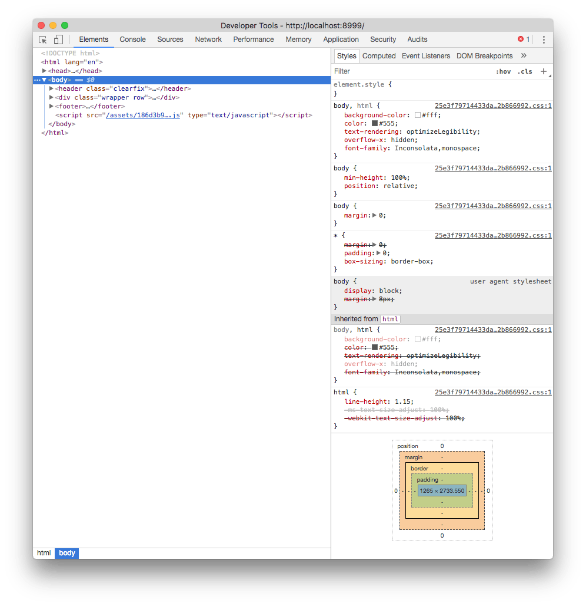

### The HTML panel

On the left, the HTML that composes the page.

Hovering the elements in the HTML panel highlights the element in the page, and clicking the first icon in the toolbar allows you to click an element in the page, and analyze it in the inspector.

You can drag and drop elements in the inspector to live change their positioning in the page.

### The CSS styles panel

On the right, the CSS styles that are applied to the currently selected element.

In addition to editing and disabling properties, you can add a new CSS property, with any target you want, by clicking the `+` icon.

Also you can trigger a state for the selected element, so you can see the styles applied when it’s active, hovered, on focus.

At the bottom, the **box model** of the selected element helps you figure out margins, paddings, border and dimensions at a quick glance:

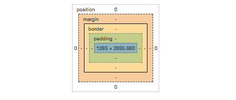

---

## The Console

The second most important element of the DevTools is the Console.

The Console can be seen on its own panel, or by pressing `Esc` in the Elements panel, it will show up in the bottom.

The Console serves mainly two purposes: _executing custom JavaScript_ and _error reporting_.

### Executing custom JavaScript

At the bottom of the Console there is a blinking cursor. You can type any JavaScript there, and it will be promptly executed. As an example, try running:

```js
alert('test')
```

The special identifier `$0` allows you to reference the element currently selected in the elements inspector. If you want to reference that as a jQuery selector, use `$($0)`.

You can write more than one line with `shift-enter`. Pressing enter at the end of the script runs it.

### Error reporting

Any error, warning or information that happens while rendering the page, and subsequently executing the JavaScript, is listed here.

For example failing to load a resource from the network, with information on _why_, is reported in the console.

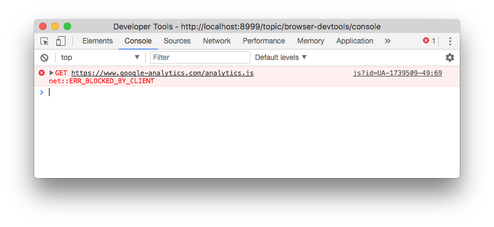

In this case, clicking the resource URL brings you to the Network panel, showing more info which you can use to determine the cause of the problem.

You can filter those messages by level (Error / Warning / Info) and also filter them by content.

Those messages can be user-generated in your own JavaScript by using the [**Console API**](/console-api/):

```js
console.log('Some info message')
console.warn('Some warning message')
console.error('Some error message')
```

---

## The emulator

The Chrome DevTools embed a very useful device emulator which you can use to visualize your page in every device size you want.

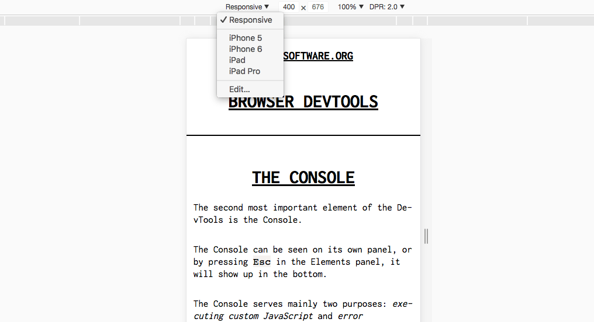

You can choose from the presets the most popular mobile devices, including iPhones, iPads, Android devices and much more, or specify the pixel dimensions yourself, and the screen definition (1x, 2x retina, 3x retina HD).

In the same panel you can setup **network throttling** for that specific Chrome tab, to emulate a low speed connection and see how the page loads, and the "**show media queries**" option shows you how media queries modify the CSS of the page.

---

## The network panel

The Network Panel of the DevTools allows you to see all the connections that the browser must process while rendering a page.

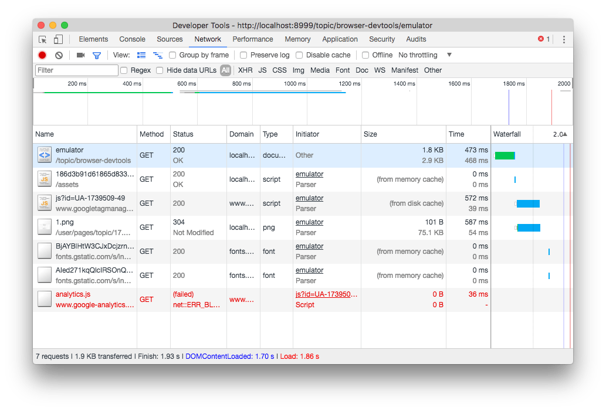

At a quick glance the page shows:

- a toolbar where you can setup some options and filters
- a loading graph of the page as a whole
- every single request, with HTTP method, response code, size and other details
- a footer with the summary of the total requests, the total size of the page and some timing indications.

A very useful option in the toolbar is **preserve log**. By enabling it, you can move to another page, and the logs will not be cleared.

Another very useful tool to track loading time is **disable cache**. This can be enabled globally in the DevTools settings as well, to always disable cache when DevTools is open.

Clicking a specific request in the list shows up the detail panel, with HTTP Headers report:

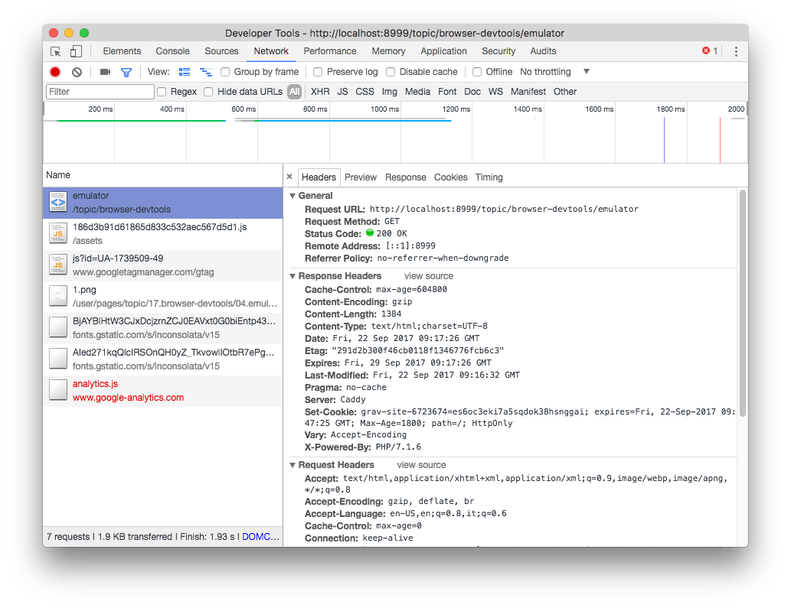

And the loading time breakdown:

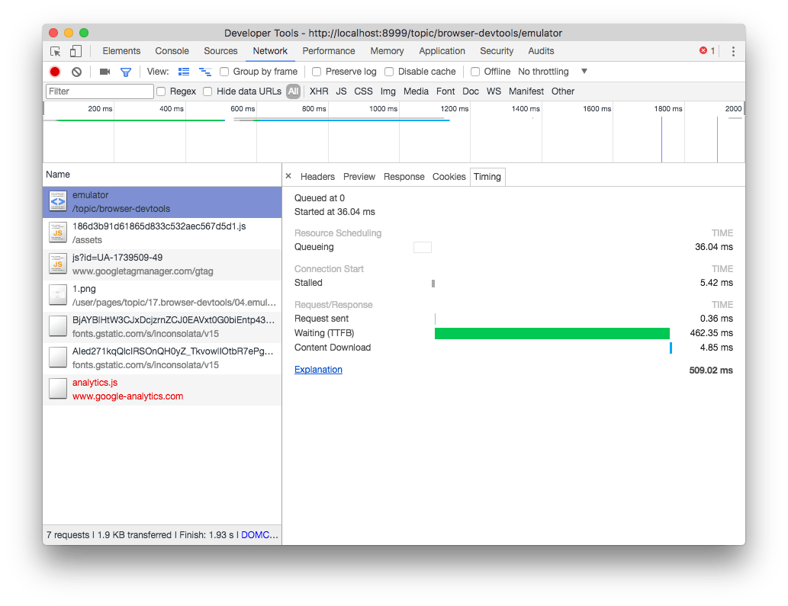

---

## JavaScript debugger

If you click an error message in the DevTools Console, the Sources tab opens and in addition to pointing you to the file and line where the error happened, you have the option to use the JavaScript debugger.

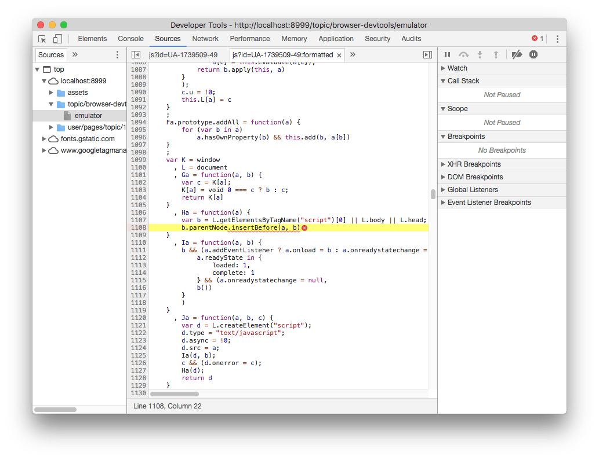

This is a full-featured debugger. You can set breakpoints, watch variables, and listen to [DOM](/dom/) changes or break on specific [XHR](/xhr/) (AJAX) network requests, or event listeners.

---

## Application and Storage


The Application tab gives you lots of information about which information is stored inside the browser relative to your website.

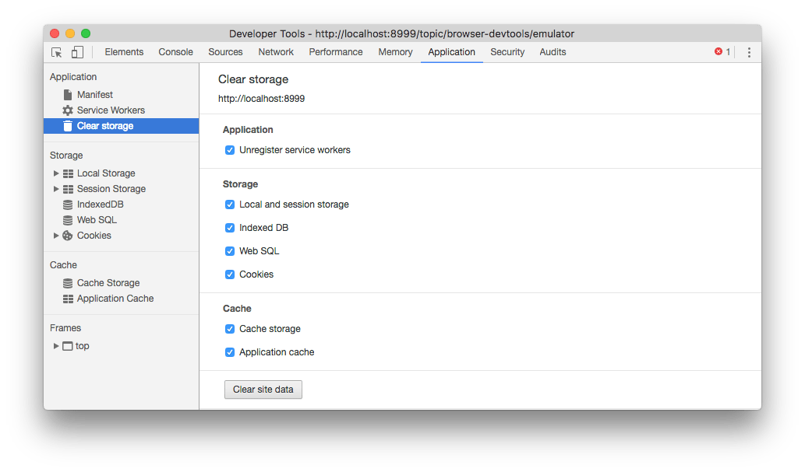

### Storage

You gain access to detailed reports and tools to interact with the application storage:

- [Local Storage](/web-storage-api/)
- Session Storage
- [IndexedDb](/indexeddb/)
- Web SQL
- [Cookies](/cookies/)

and you can quickly wipe any information, to start with a clean slate.

### Application

This tab also gives you tools to inspect and debug Progressive Web Apps.

Click **manifest** to get information about the web app manifest, used to allow mobile users to add the app to their home, and simulate the "add to homescreen" events.

**Service workers** let you inspect your application service workers. If you don't know what service workers are, in short they are a fundamental technology that powers modern web apps, to provide features like notification, capability to run offline and synchronize across devices.

---

## Security tab


The Security tab gives you all the information that the browser has relatively to the security of the connection to the website.

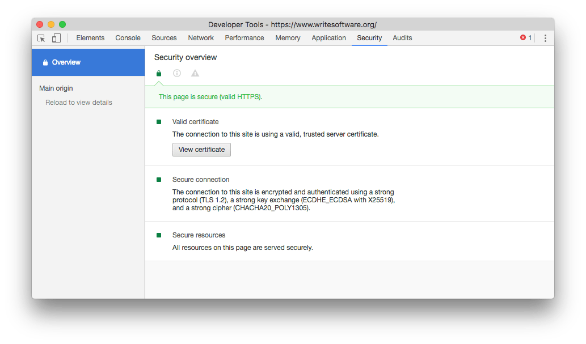

If there is any problem with the HTTPS connection, if the site is served over TLS, it will provide you more information about what's causing it.

---

## Audits

The Audits tab will help you find and solve some issues relative to performance and in general the quality of the experience that users have when accessing your website.

You can perform various kinds of audits depending on the kind of website:

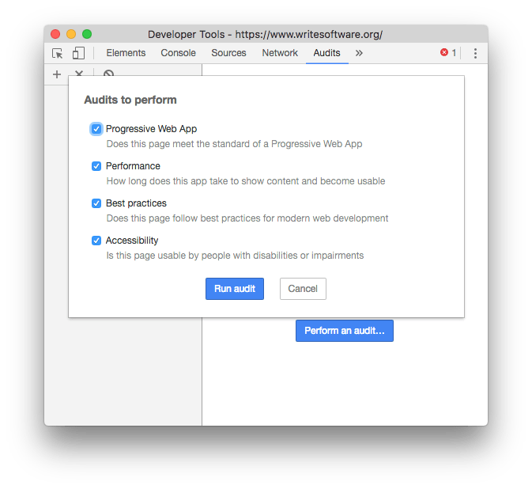

The audit is provided by [Lighthouse](https://developers.google.com/web/tools/lighthouse/), an open source automated website quality check tool. It takes a while to run, then it provides you a very nice report with key actions to check.

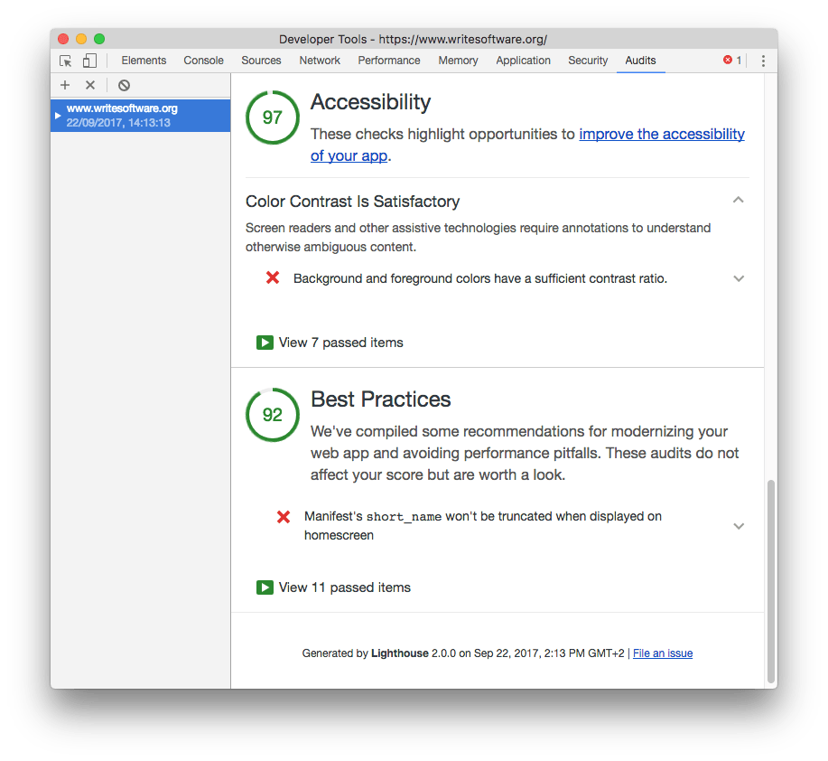

---

If you want to know more about the Chrome DevTools, check out this [Chrome DevTools Tips list](/chrome-devtools-tips/) 😀