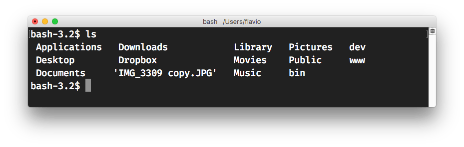
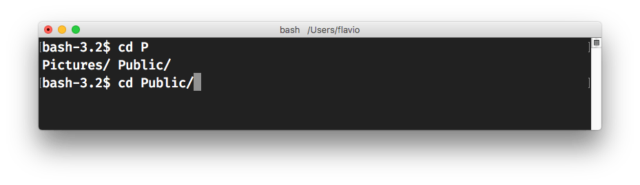
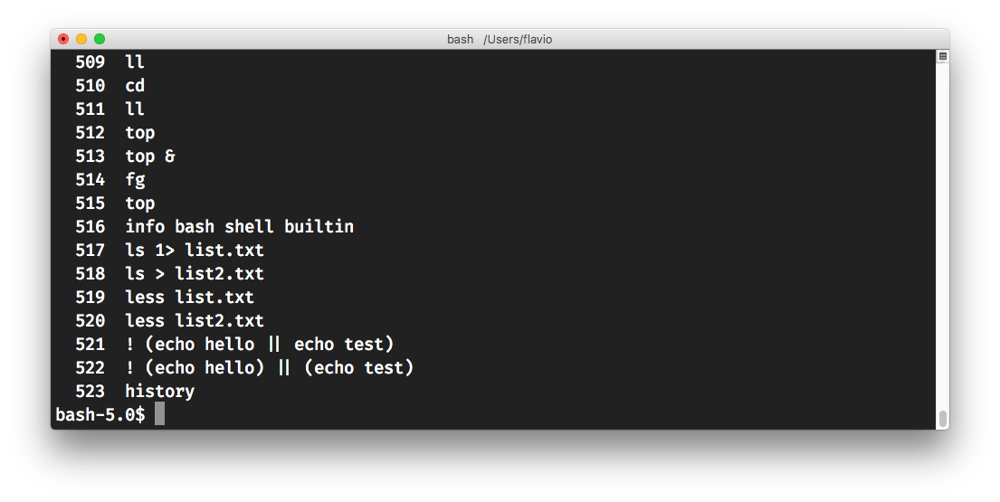

Bash is (as of 2019) _the_ de facto shell on most systems you'll get in touch with: Linux, macOS, and the WSL on Windows 10.

There are historical reasons that made Bash the most popular shell in the world. Back in 1989, when its was first released, the tech world was very different. At that time, most software in the UNIX world was closed source. Unix itself was proprietary and closed source.

To use a UNIX system you had to use a shell.

The most popular shell at the time was closed source and proprietary, you had to pay to use it. It was the Bourne shell, available under the `/bin/sh` command. It was called "Bourne" because its creator was Steve Bourne.

Richard Stallman in those years with the GNU Project (and later on Linux) was about to revolution everything, starting the Open Source revolution. The GNU Project needed a shell, and, with the help of the Free Software Foundation, Bash was born. Heavily inspired by the Bourne Shell, Bash means *Bourne-again shell* and it is one key ingredient of the GNU Project, and probably one of its most successful pieces of software that we still use today.

Bash could run all scripts written for `sh`, which was a mandatory feature for its adoption, and it also introduced many more features, since the very early days, offering a better experience to its users. Since those early days, Bash gained lots of improvements. This tutorial describes the most popular and useful things you can do with it.

## First steps in Bash

Since Bash is the default shell in many systems, all you need to start a bash shell is to

- log in to the system, if it's a server
- open your terminal, if it's your computer

> See my [macOS terminal guide](/macos-terminal/) for more info on using your terminal on a Mac.

As soon as you start it, you should see a prompt (which usually ends with `$`).

How do you know the shell is running bash? Try typing `help` and pressing enter.


See? We just told Bash to execute the `help` command. This command in turns shows you the version of Bash you are running and a list of commands you can use.

> Warning: see the version I have there? It's 3.2.57. This is the default Bash version shipped in macOS, which does not include a higher release for licensing issues. This Bash version is from 2014. Install the latest Bash 5.x using Homebrew, by typing `brew install bash`.

More often than not you'll never use any of the commands listed in the bash help, unless you are creating *shell scripts* or advanced things.

99% of the day to day shell use is navigating through folders and executing programs like `ls`, `cd` and other commun UNIX utilities.

## Navigating the filesystem

To navigate through the filesystem you will use the `ls` command. It's available in the `/bin/ls`, and since Bash has the `/bin` folder in its paths list, you can just type `ls` to use it.

`ls` lists the file in the current folder. You usually start from your home folder, which depends on the system but on macOS is under `/Users`. My home folder is in `/Users/flavio`. This is not Bash related, it's more of a UNIX filesystem thing, but arguments overlap and if you never used a shell it's good to know.



To navigate to other folders you use the `cd` command, followed by the name of the folder you want to move to:

```bash
cd Documents
```

`cd ..` goes back to the parent folder.

Depending on your Bash configuration, you will see your current folder shown before the prompt (the `$` symbol). Or you might now, but you can always know where you are by typing `pwd` and pressing enter.

> `pwd` means *p*athname of *w*orking *d*irectory

## Command line editing

When you are writing your commands in the shell, notice that you can move left and right with the arrow keys. This is a shell feature. You can move around your commands, press the backspace button and correct commands. Pressing the `enter` key tells the shell to go and let the system execute the command.

This is normal and accepted behavior as of 2019, but something that probably made "wow" the early UNIX users.

Keyboard combinations allow you to be quick at editing without reaching for the arrow keys:

- `ctrl+d` to delete the currently selected character
- `ctrl+f` to go to the character on the right
- `ctrl+b` to go to the character on the left

## Autocompletion

A nice feature of Bash when moving around the file system is autocompletion. Try typing `cd Doc` and press the `tab` key to make Bash autocomplete that to `cd Documents`. If there are multiple choices for those first characters Bash will return you the list, so you can type a couple more characters to help it remove the ambiguity and press `tab` again to complete.



The shell can autocomplete file names, but also command names.

## Shell commands

Using the shell we can run commands available on the system. We can prefix the commands with the full path (e.g. `/bin/ls` to list files in a folder) but the shell has the concept of *path* so we can just type `ls` and it knows where most commands are found (and we can add folders to this path by configuring it).

Commands accept arguments. For example `ls /bin` will list all files in the `/bin` folder.

Parameters are prefixed by a dash `-`, like `ls -a` which tells `ls` to also show hidden files. Hidden files as a convention are files (and folders) starting with a dot (`.`).

## Common shell commands

There are a lot of commands preinstalled on any system, and they vary considerably depending if it's Linux / macOS or even the Linux distribution you are running.

However let's do a brief roundup of the most common shell commands you can run. Those are not provided by shells per se, but rather they are command line commands you can invoke through shells.

Any time you have problems, like you don't know what a command does, or you don't know how to use it, use `man`. It lets you get the help for all of the commands I will list, and more. Run `man ls` for example.

These are filesystem commands:

- `ls` to list files
- `cd` to change folder
- `rm` to remove a file or folder
- `mv` to move a file to another folder, or change a file name
- `cp` to copy a file
- `pwd` to show the current working directory
- `mkdir` to create a folder

Every file on a Unix filesystem has permissions. `chmod` allows you to change those (not going into it now), and `chown` allows you to change the file *owner*.

`cat`, `tail` and `grep` are two super useful commands to work with files. I will make a dedicated article for each of them soon.

`pico`, `nano`, `vim` and `emacs` are commonly installed editors.

`whereis` on macOS shows where a command is located on the system.

There are many more commands, of course, but those are a few you might run into more often.

## Executing commands

`ls` and `cd` are commands, as I mentioned, which are found in the `/bin` folder. You can execute any file, as long as it's an executable file, by typing its full path, for example `/bin/pwd`. Commands don't need to be in the `/bin` folder, and you can run executable files that are in your current folder using the `./` path indicator.

For example if you have a `runme` file in your `/Users/flavio/scripts` folder, you can run

```bash
cd /Users/flavio/scripts
```

and then run `./runme` to run it.

Or you could run `/Users/flavio/scripts/runme` from Bash, wherever your current folder is.

### Jobs

Whenever you run a command, if it's a long running program, you will have your shell completely owned by that command. You can kill the command using `ctrl-C` .

At any time you can run `jobs` to see the jobs you are running, and their state.

```
$ jobs
Job	Group	State	Command
1	72292	stopped	ftp
```

Another useful command is `ps` which lists the processes running.

```
$ ps
  PID TTY           TIME CMD
19808 ttys000    0:00.56 /usr/local/bin/fish -l
65183 ttys001    0:04.34 -fish
72292 ttys001    0:00.01 ftp
```

`top` shows the processes and the resources they are consuming on your system.

A job or process can be killed using `kill <PID>`.

## Command history

Pressing the `up` arrow key will show you the history of the commands you entered. Again, this is a shell feature. Pressing the `down` arrow key will let you navigate back and forth in time to see what commands you entered previously, and pressing `enter` will let you run that command again.

This is a quick access to the command history. Running the `history` command will show you all the commands entered in the shell:



When you start typing a command, Bash can autocomplete it by referencing a previously entered command in the history. Try it by pressing `esc` followed by `tab`.

> To be honest I find the Fish shell implementation of this to be much better and easier

## Setting your default shell

There are many more shells other than Bash. You have Fish, ZSH, TCSH, and others. Any user on the system can choose its own shell.

You set your default login shell by running the `chsh -s
chsh -s /bin/bash` command. You'll almost never need to do that, unless it was previously changed, for example with Fish:

```bash
chsh -s /usr/local/bin/fish
```

## Customizing Bash

I noticed before that you might (or not) see your current working directory in the Bash prompt. Where is this determined? In the Bash configuration!

There's a bit of confusion here because Bash uses a different configuration file for different scenarios, and it also reads multiple configuration files.

Let's give some order to this confusion. First, there's a big distinction whether Bash is initialized as a *login shell* or not. By login shell we mean that the system is not running a GUI (Graphical User Interface) and you log in to the system through the shell. That's the case of servers, for example.

In this case, Bash loads this configuration file:

```
/etc/profile
```

and then looks in the user home folder and looks for one of these files, in order, executing the first one it finds:

```
~/.bash_profile
~/.bash_login
~/.profile
```

were `~` means your home folder (it's automatically translated by Bash)

This means that if there's a `.bash_profile`, `~/.bash_login` and `~/.profile` are never run, unless explicitly executed in `.bash_profile`.

If instead of being a login shell Bash is run like I do with macOS, for example, as a normal application, the configuration files change. Bash loads first `/etc/bash.bashrc`, then `~/.bashrc`.

## Environment variables

Sometimes you have programs that use environment variables. Those are values that you can set outside of the program, and alter the execution of the program itself. An API key, for example. Or the name of a file.

You can set an environment variable using the syntax

```bash
VARIABLE_NAME=variable_value
```

The value can contain white spaces, by using quotes

```bash
VARIABLE_NAME="variable value"
```

A bash script can use this value by prepending a dollar sign: `$VARIABLE_NAME`.

Also other programming languages commands can use environment variables, for example here's [how to read environment variables with Node.js](/node-environment-variables/).

The system sets up some environment variables for you, like

- `$HOME` your home folder
- `$LOGNAME` your user name
- `$SHELL` the path to your default shell
- `$PATH` the path where the shell looks for commands

You can inspect their value by prepending `echo` to them:

```bash
echo $LOGNAME # flavio
echo $HOME # /Users/flavio
```

## A special environment variable: $PATH

I mentioned the $PATH variable. This is a list of folders where the shell will look into when you type a command. Folders are separated by a colon `:` and they are written in order - Bash will look into the first, search for the command you asked for, and run it if it finds it. Otherwise if goes to the next folder and so on.

My path is currently:

```
bash-5.0$ echo $PATH
/usr/local/bin:/usr/bin:/bin:/usr/sbin:/sbin:/usr/local/go/bin
```

You typically edit this in the `~/.bashrc` file by prepending or appending items:

```bash
PATH = "$PATH:/Users/flavio/bin"
```

## Aliases

Using aliases we can set up shortcuts for common commands. You can give a quick name to a complex combination of parameters, for example.

You define an alias using the syntax

```bash
alias <alias>=<command>
```

if there's a space in the command you use quotes:

```bash
alias <alias>="<command>"
```

One alias I commonly add to my system is `ll`:

```bash
alias ll="ls --al"
```

You normally define aliases in your `~/.bashrc` file.

Just be careful with quotes if you have variables in the command: using double quotes the variable is resolved at definition time, using single quotes it's resolved at invokation time. Those 2 are different:

```bash
alias lsthis="ls $PWD"
alias lscurrent='ls $PWD'
```

$PWD refers to the current folder the shell is into. If you now navigate away to a new folder, `lscurrent` lists the files in the new folder, `lsthis` still lists the files in the folder you were when you defined the alias.

## Advanced command line features

### Wildcards

`ls` and many other commands can make great use of wildcards. You can list all files *starting* with image:

```bash
ls image*
```

Or all files *ending* with image:

```bash
ls *image
```

or all files that contain image inside the name:

```bash
ls *image*
```

### Redirecting output and standard error error

By default, commands started in the shell print out both the output and errors back to the shell. This might not be what you want. You can decide to write the output to a file instead.

Actually, to a /different file/, because in Unix even the screen is considered to be a file. In particular,

- `0` identifies the standard input
- `1` identifies the standard output
- `2` identifies the standard error

You can redirect the standard output to a file by appending `1>` after a command, followed by a file name.

Using the same technique you can use `2>` to redirect the standard error.

There is a shortcut `>` for `1>`, since that is used quite a lot.

Example:

```bash
ls 1> list.txt 2> error.txt
ls > list.txt 2> error.txt
```

Another shortcut, `&>`, redirects /both/ standard output and standard error to a file.

```bash
ls &> output.txt
```

Another frequent thing is to redirect standard error to standard output using `2>&1`.

### Running a command in the background

You can tell Bash to run a program in the background without it taking control of the shell, by appending `&` after it:

```bash
top &
```

> `top` is a command that lists the processes running, ordered by most resource consuming.

The application that would normally get control of the shell, is now started but nothing seems to happen. You can bring it back into focus by typing `fg` (aka *f*ore*g*round), but now we're entering in the realm of processes and jobs which is a big topic on its own, but a quick overview:

When a command is running you can use `ctrl-Z` to pause it and bring it to the background. The shell comes back again in the foreground, and you can now run `bg` to move resume execution of that previously paused job.

When you are  ready to go back to it, run `fg` to bring back that program in the foreground.

You can see all processes running using `ps`, and the list shows all the processes `pid` numbers. Using the paused process `pid`, you can bring to foreground a specific command, for example `fg 72292`. Same works for `bg`.

### Queuing commands

You can instruct Bash to run a command right after another ends by separating them with a semicolon:

```bash
cd /bin; ls
```

You can repeat this to queue multiple commands in the same line.

### Output redirection

A program can receive input from any file using the `<` operator, and save to a file the output using the `>` operator:

```bash
echo hello > result.txt
wc < result.txt
```

`wc` is a command that counts the words it receives as input.

### Pipe

Using pipes, any command output can be used as input for a second command. Use the `|` operator to combine the two. In this example, `wc` gets its input from the output of `echo hello`:

```bash
echo hello | wc
```

### Grouping commands

Use `&&` to combine two commands using "and". If the first command executes without problems, run the second, and so on.

Use `||` to combine two commands using "or". If the first command executes without problems the second does not run.

`!` negates the next logical operation:

```bash
$ echo hello && echo test
hello
test
$ echo hello || echo test
hello
$ ! echo hello || echo test
hello
test
```

You can use parentheses to combine expressions to avoid confusion, and also to change the precedence:

```bash
$ ! (echo hello) || (echo test)
hello
test
$ ! (echo hello || echo test)
hello
```

## Programming shells

One of the best features of a shell like Bash is its ability to create programs with it, by basically automating commands execution.

I'm going to write a separate guide on Bash scripting soon, which will be separate from this tutorial because the topic is really more in-depth than what I want to add in this introductory Bash guide.

A quick intro though: a script is a text file that starts with a line that indicates that it's a shell script (and **what** shell it requires), followed by a list of commands, one per line. Example:

```bash
#!/bin/bash
ls
```

You can save this as a file `myscript` and make it executable using `chmod +x myscript`, and run it using `./myscript` (`./` means "current folder").

Shell scripting is outside of the scope of this post, but I want you to know about this. Scripts can have control structures and many other cool things.

This same scripting strategy works for other shells, like Zsh:

```bash
#!/bin/zsh
ls
```
