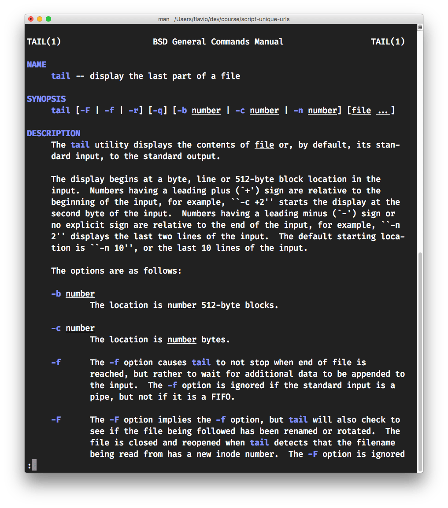

One very useful command line tool I use is `tail`. It's a little Unix utility command that is found on almost any *nix system, including macOS and of course Linux.

Here's the man page for `tail`. It says  the command *displays the last part of a file*.

The command can be used to display the last x lines of a file by using it with the `-n` option. For example this command shows the last 2 lines of the file specified:

`tail -n 2 <filename>`

I almost never used `tail` like this though. What I used it the most was to "watch" a file for new content appended to it, by using the `-f` option:

`tail -f <filename>`

This starts the command and it just waits until there's something new appended to the file.

For example I have a script that stays active for a while and fetches remote data, then prints some results to a text file. I just watch the `results.txt` file for incoming data using

`tail -f results.txt`
