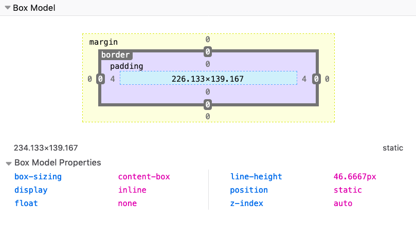

Every CSS element is essentially a box. Every element is a generic box.

The box model explains the sizing of the elements based on a few CSS properties.

From the inside to the outside, we have:

- the content area
- padding
- border
- margin

The best way to visualize the box model is to open the browser DevTools and check how it is displayed:

Here you can see how Firefox tells me the properties of a  `span` element I highlighted. I right-clicked on it, pressed Inspect Element, and went to the Layout panel of the DevTools.

See, the light blue space is the content area. Surrounding it there is the padding, then the border and finally the margin.

By default, if you set a width (or height) on the element, that is going to be applied to the **content area**. All the padding, border, and margin calculations are done outside of the value, so you have to take this in mind when you do your calculation.

You can change this behavior using Box Sizing.