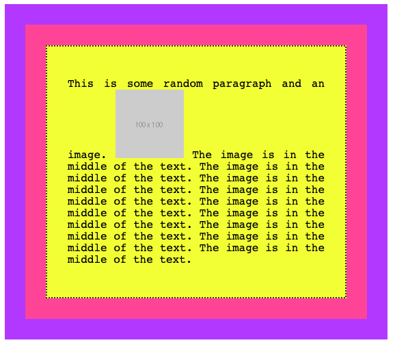
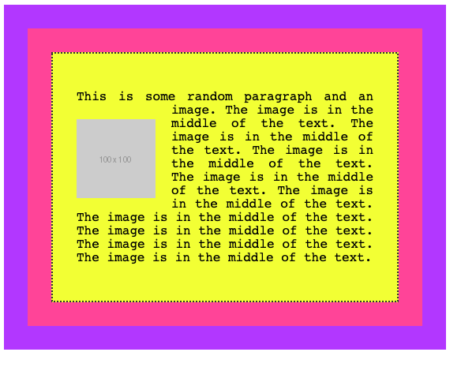
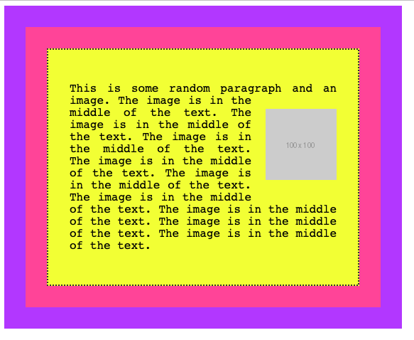
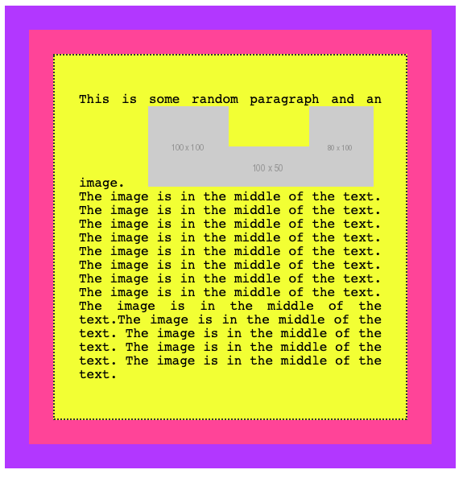
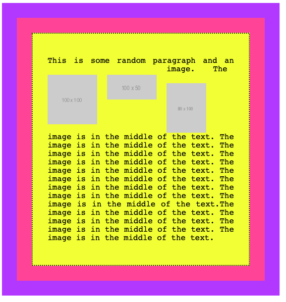
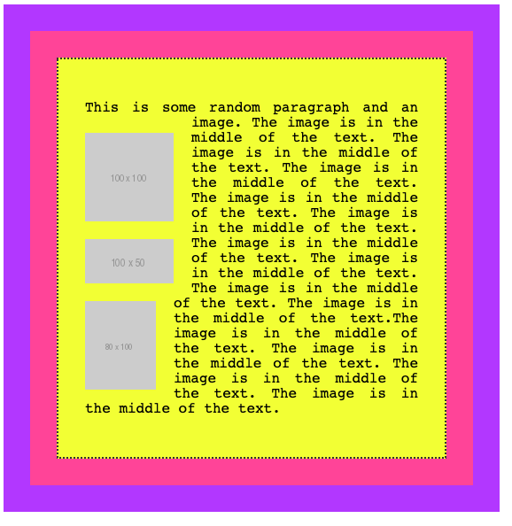

Floating has been a very important topic in the past.

It was used in lots of hacks and creative usages because it was one of the few ways, along with tables, we could really implement some layouts. In the past we used to float the sidebar to the left, for example, to show it on the left side of the screen and added some margin to the main content.

Luckily times have changed and today we have Flexbox and Grid to help us with layout, and float has gone back to its original scope: placing content on one side of the container element, and make its siblings show up around it.

The `float` property supports 3 values:

- `left`
- `right`
- `none` (the default)

Say we have a box which contains a paragraph with some text, and the paragraph also contains an image.

Here's some code:

```html
<div class="parent">
  <div class="child">
    <div class="box">
      <p>This is some random paragraph and an image.  The image is in the middle of the text. The image is in the middle of the text. The image is in the middle of the text. The image is in the middle of the text. The image is in the middle of the text. The image is in the middle of the text. The image is in the middle of the text. The image is in the middle of the text. The image is in the middle of the text.
      </p>
    </div>
  </div>
</div>
```

```css
.parent {
  background-color: #af47ff;
  padding: 30px;
  width: 500px;
}

.child {
  background-color: #ff4797;
  padding: 30px;
}

.box {
  background-color: #f3ff47;
  padding: 30px;
  border: 2px solid #333;
  border-style: dotted;
  font-family: courier;
  text-align: justify;
  font-size: 1rem;
}
```

and the visual appearance:



As you can see, the normal flow by default considers the image inline, and makes space for it in the line itself.

If we add `float: left` to the image, and some padding:

```css
img {
  float: left;
  padding: 20px 20px 0px 0px;
}
```

this is the result:



and this is what we get by applying a float: right, adjusting the padding accordingly:

```css
img {
  float: right;
  padding: 20px 0px 20px 20px;
}
```



A floated element is removed from the normal flow of the page, and the other content flows around it.

[See the example on Codepen](https://codepen.io/flaviocopes/pen/WWGqPr?editors=1100)

You are not limited to floating images, too. Here we switch the image with a `span` element:

```html
<div class="parent">
  <div class="child">
    <div class="box">
      <p>This is some random paragraph and an image. <span>Some text to float</span> The image is in the middle of the text. The image is in the middle of the text. The image is in the middle of the text. The image is in the middle of the text. The image is in the middle of the text. The image is in the middle of the text. The image is in the middle of the text. The image is in the middle of the text. The image is in the middle of the text.
      </p>
    </div>
  </div>
</div>
```

```css
span {
  float: right;
  margin: 20px 0px 20px 20px;
  padding: 10px;
  border: 1px solid black
}
```

and this is the result:


## Clearing

What happens when you float more than one element?

If when floated they find another floated image, by default they are stacked up one next to the other, horizontally. Until there is no room, and they will start being stacked on a new line.

Say we had 3 inline images inside a `p` tag:



If we add `float: left` to those images:

```css
img {
  float: left;
  padding: 20px 20px 0px 0px;
}
```

this is what we'll have:



if you add `clear: left` to images, those are going to be stacked vertically rather than horizontally:



I used the `left` value for `clear`. It allows

- `left` to clear left floats
- `right` to clear right floats
- `both` to clear both left and right floats
- `none` (default) disables clearing