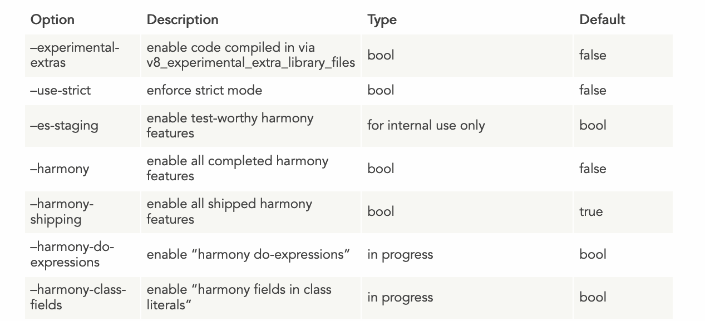
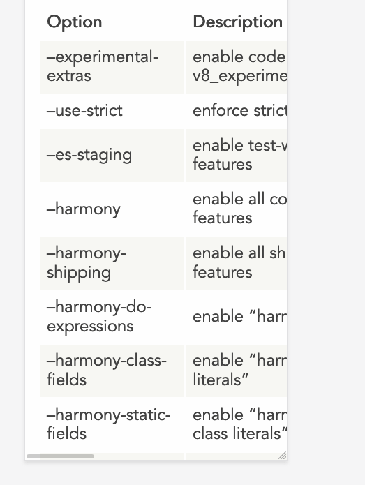
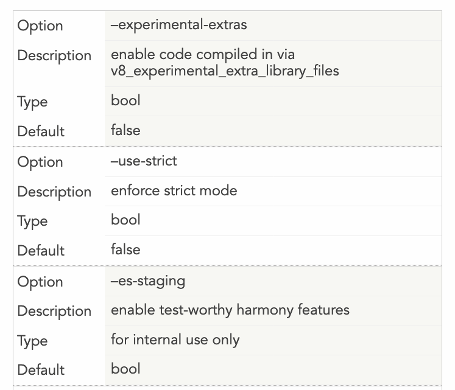

A few days ago I got a warning from the _Google Search Console_. It detected a Mobile Usability issue on a page where I have a big table.

This is the table that gave me the problem:



On mobile, it rendered pretty poorly:



Not a nice user experience, and an error in the Google Search Console. If there's something I don't want is an error/warning in that place. Not when it's something I can fix.

Hugo, the static site generator I use, lets me inject CSS specific to a single page, simply by adding a `<style>` tag into the markdown file. Handy.

So I started searching for a good way to make my table responsive. I came across this very nice article on CSS Tricks: [Responsive Data Tables](https://css-tricks.com/responsive-data-tables/). It's from 2011, and still works fine!

The trick is this: we want to make the table display as a block element rather than as a table in the traditional CSS sense.
We hide all the table headings by moving them out of the view, and we insert a new block in the table, and each row will have its own set of headings, like this:



Here is the code that achieves the above design:

```css
@media
only screen and (max-width: 1500px) {
  table, thead, tbody, th, td, tr {
    display: block;
  }
  thead tr {
    position: absolute;
    top: -9999px;
    left: -9999px;
  }
  tr { border: 1px solid #ccc; }
  td {
    border: none;
    border-bottom: 1px solid #eee;
    position: relative;
    padding-left: 200px;
    margin-left: 150px;
  }
  td:before {
    position: absolute;
    top: 12px;
    left: 6px;
    width: 200px;
    padding-right: 40px;
    white-space: nowrap;
    margin-left: -150px;
  }
  td:nth-of-type(1):before { content: "Option"; }
  td:nth-of-type(2):before { content: "Description"; }
  td:nth-of-type(3):before { content: "Type"; }
  td:nth-of-type(4):before { content: "Default";}
}
```

The important things you'll want to customize to make your own table responsive are the last 4 lines - you need to enter the title of each "column", and you need to add more if you have more columns. Or remove them if you have less.

The other thing is the space that the new "headings" will take for each row. I added a `150px` margin, and you need to reference it 2 times: one as a `margin-left: 150px` in the `td`, and as a `margin-left: -150px` in the `td: before`.

Finally, you need to decide when this new layout kicks in. I made it active when the page is less than 1500px, because that table is huge. I could as well make this the default behavior rather than displaying the normal table on huge screens, but so far I think the problem is solved.

I hope this helps.