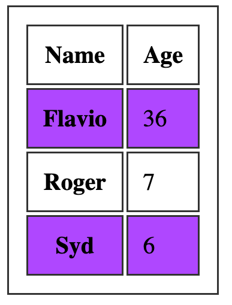
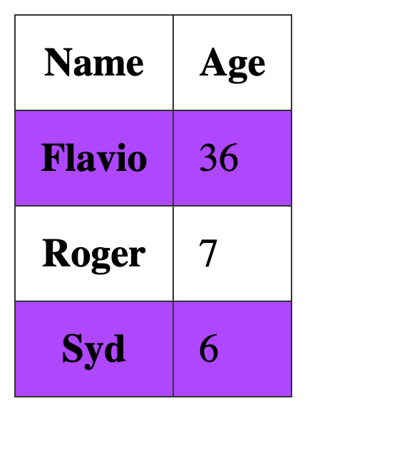

Tables in the past were greatly overused in CSS, as they were one of the only ways we could create a fancy page layout.

Today with Grid and Flexbox we can move tables back to the job they were intended to do: styling tables.

Let's start from the HTML. This is a basic table:

```html
<table>
  <thead>
    <tr>
      <th scope="col">Name</th>
      <th scope="col">Age</th>
    </tr>
  </thead>
  <tbody>
    <tr>
      <th scope="row">Flavio</th>
      <td>36</td>
    </tr>
    <tr>
      <th scope="row">Roger</th>
      <td>7</td>
    </tr>
  </tbody>
</table>
```

By default it's not very attractive. The browser provides some standard styles, and that's it:


We can use CSS to style all the elements of the table, of course.

Let's start with the border. A nice border can go a long way.

We can apply it on the `table` element, and on the inner elements too, like `th` and `td`:

```css
table, th, td {
  border: 1px solid #333;
}
```

If we pair it with some margin, we get a nice result:


One common thing with tables is the ability to add a color to one row, and a different color to another row. This is possible using the `:nth-child(odd)` or `:nth-child(even)` selector:

```css
tbody tr:nth-child(odd) {
  background-color: #af47ff;
}
```

This gives us:



If you add `border-collapse: collapse;` to the table element, all borders are collapsed into one:


