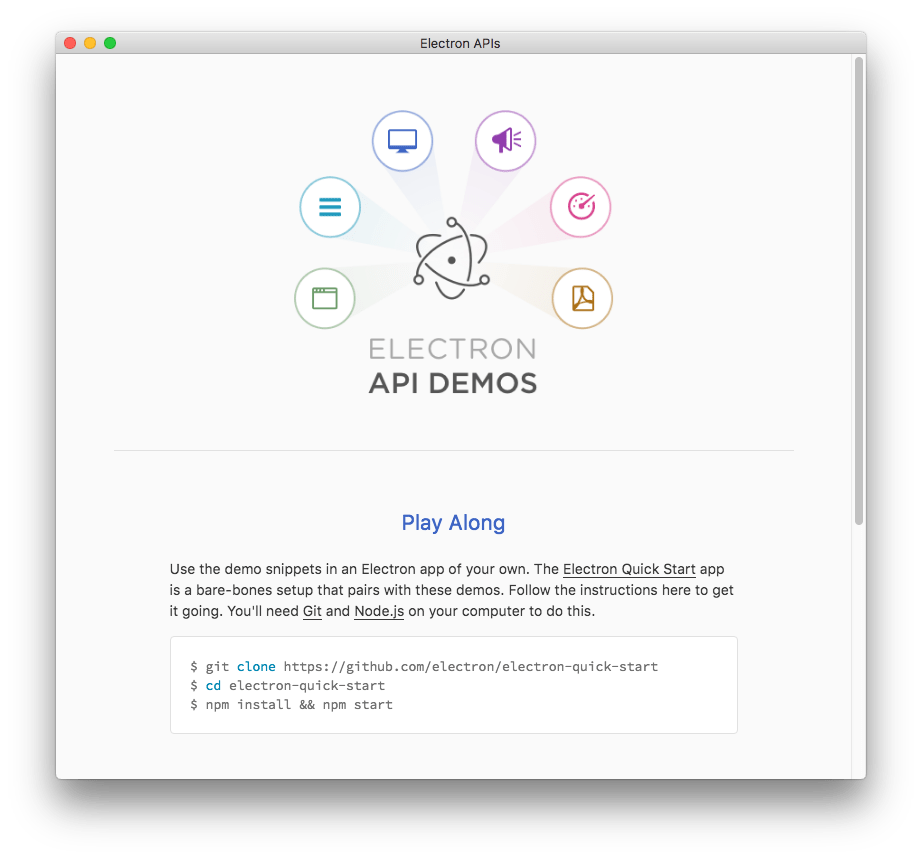
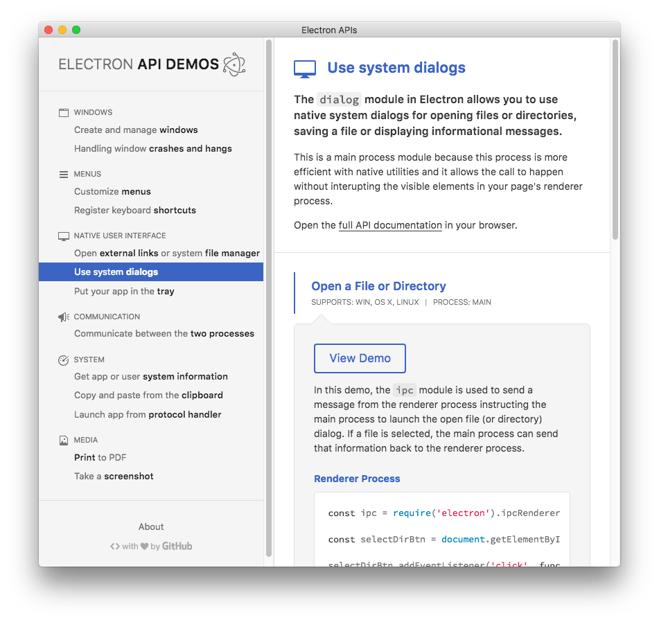
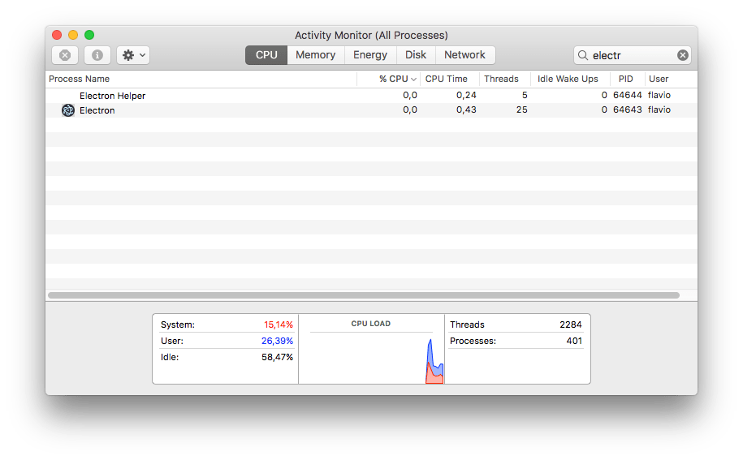
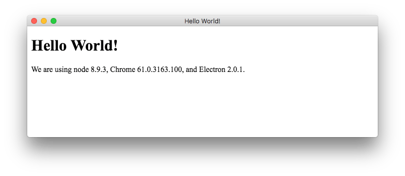

## What is Electron?

Electron is an Open Source and free tool for building **cross-platform desktop apps** with JS, HTML and CSS, built by GitHub

It's very popular and hugely successful applications use it, including:

- Slack
- Atom
- VS Code
- Calypso (WordPress.com)
- Discord

Electron is a huge project, and in May 2018 it reached version 2.0. Check out the official site at [https://electronjs.org](https://electronjs.org)

## Before Electron

Before Electron, you could not make a cross-platform desktop app with web technologies.

On the Mac, there were frameworks like MacGap that let you create an application which basically embedded a Safari page (WebView), and you could load your JavaScript into that.

Being a Mac application, you had the option to write native code using Objective-C, and access the system APIs, but this was not portable outside the Mac platform. No chance to make this work on Linux or Windows, and I'm sure those had their own tools to do this kind of thing.

There was no unique tool that could run the same app everywhere.

Until 2014, when Electron was released (initially under the name Atom Shell, then renamed in 2015).

## A quick look into the Electron internals

Electron is basically bundling the Chromium rendering library and Node.js (Chromium the open source project made by Google, on which they build the Chrome browser).

You have both access to a canvas powered by Chromium, which runs the V8 JavaScript engine, and use any Node.js package, and run your own Node.js code.

It's a sort of Node.js for the desktop, if you wish. It does not provide any kind of GUI elements, but rather lets you create UIs using HTML, CSS and JavaScript.

Electron aims to be fast, small in size, and as slim as possible, yet providing the core features that all apps can rely upon.

## Which kind of apps you can do

You can do lots of different kind of apps, including

- regular apps, with a dock icon, and a window
- menu bar apps, which don't have any dock icon
- daemons
- command line utilities

A good collection of Electron apps is available on the official site: [https://electronjs.org/apps](https://electronjs.org/apps). With Electron you can create apps and publish them on the Windows and Mac App Store.

## The Electron APIs app

On the Mac App Store you can [download the Electron APIs app](https://www.notion.so/flaviocopes/Electron-a27eb785cf1349f39e6b08c82cf88eff), which is an official sample desktop app built using Electron.



The app is pretty cool and it lets you experiment with several features of Electron. It's open source, and the code is available at [https://github.com/electron/electron-quick-start](https://github.com/electron/electron-quick-start).



## How to create your first Electron app

First, create a new folder on your filesystem and into it run:

```bash
yarn init
```

to create a `package.json` file:

```json
{
  "name": "electron",
  "version": "1.0.0",
  "main": "index.js",
  "license": "MIT"
}
```

change main to `main.js`, and add this line:

```json
"scripts": {
  "start": "electron ."
}
```

Now install Electron:

```bash
yarn add --dev electron
```

Electron can now be started with

```bash
yarn start
```

However as you haven't added any code, this command will do nothing, it will just start a bare Electron application, but you're not going to see any windows:



## An Hello World Electron GUI app!

Let's create an application that shows an Hello World in a window.

Create 2 files, `main.js`:

```js
'use strict'

const { app, BrowserWindow } = require('electron')
const path = require('path')
const url = require('url')

app.on('ready', () => {
  // Create the browser window.
  const win = new BrowserWindow({ width: 800, height: 600 })

  // and load the index.html of the app.
  win.loadURL(
    url.format({
      pathname: path.join(__dirname, 'index.html'),
      protocol: 'file:',
      slashes: true
    })
  )
})
```

and `index.html`:

```html
<!DOCTYPE html>
<html>
  <head>
    <meta charset="UTF-8">
    <title>Hello World!</title>
  </head>
  <body>
    <h1>Hello World!</h1>
    We are using node <script>document.write(process.versions.node)</script>,
    Chrome <script>document.write(process.versions.chrome)</script>,
    and Electron <script>document.write(process.versions.electron)</script>.
  </body>
</html>
```

Now run again `yarn start`, and this window should show up:



This is a very simple one-window app, and when you close this window, the application exits.

## Making app developer's life easier

Electron aims to make the developer's life easier. Applications have lots of problems in common. They need to perform things that the native APIs sometimes make a little bit more complicated that one might imagine.

Electron provides an easy way to [manage In-App Purchases](https://electronjs.org/blog/in-app-purchases), Notifications, Drag and Drop, managing key shortcuts and much more.

It also provides a [hosted service for app updates](https://electronjs.org/blog/autoupdating-electron-apps), to make updating your apps much simpler than if you had to build such as service yourself.
