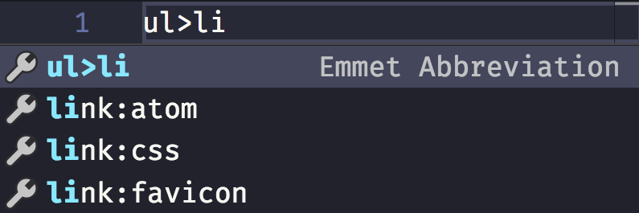

<!-- TOC -->

- [Create an HTML file from scratch](#create-an-html-file-from-scratch)
- [> and +](#-and-)
- [Level up](#level-up)
- [Multipliers](#multipliers)
- [Group an expression to make it more readable](#group-an-expression-to-make-it-more-readable)
- [`id` and `class` attributes](#id-and-class-attributes)
- [Adding an unique class or id](#adding-an-unique-class-or-id)
- [Other attributes](#other-attributes)
- [Adding content](#adding-content)
- [Adding an incremental number in your markup](#adding-an-incremental-number-in-your-markup)
- [A reference for tags used in the page `head`](#a-reference-for-tags-used-in-the-page-head)
- [A reference for common tags](#a-reference-for-common-tags)
- [A reference for semantic HTML tags](#a-reference-for-semantic-html-tags)
- [A reference for form elements](#a-reference-for-form-elements)

<!-- /TOC -->

---

Emmet is a pretty cool tool that helps you write HTML very very fast.

It's like magic.

Emmet is not something new, it's been around for years and there is a plugin for every editor out there. On [VS Code](/vscode/), Emmet is integrated out of the box, and whenever the editor recognizes a possible Emmet command, it will show you a tooltip.



If the thing you write has no other interpretations, and VS Code thinks it must be an Emmet expression, it will preview it directly in the tooltip, nicely enough:


Yet I didn't really know how to use it in all its intricacies until I set out to research and write about it, so I had to learn how to use it in depth.

I want to use it in my day to day work, so here's what I learned about it.

## Create an HTML file from scratch

Type `!` and you will get a basic HTML boilerplate to work with:

```html
<!DOCTYPE html>
<html lang="en">
<head>
    <meta charset="UTF-8" />
    <title>Document</title>
</head>
<body>

</body>
</html>
```

## > and +

- `>` means child
- `+` means sibling

```html
nav>ul>li

<nav>
    <ul>
        <li></li>
    </ul>
</nav>
```

```html
div+p+span

<div></div>
<p></p>
<span></span>
```

You can combine those to perform more complex markups. VS Code is so nice to show a preview when the Emmet snippet has no

```html
ul>li>div+p+span

<ul>
    <li>
        <div></div>
        <p></p>
        <span></span>
    </li>
</ul>
```

## Level up

Using `^` you can level up from any time you used `>` to create a children:

```html
ul>li>div+p^li>span

<ul>
    <li>
        <div></div>
        <p></p>
    </li>
    <li><span></span></li>
</ul>
```

You can use it multiple times to "up" more than once:

```html
ul>li>div+p^^p

<ul>
    <li>
        <div></div>
        <p></p>
    </li>
</ul>
<p></p>
```

## Multipliers

Any tag can be added multiple times using `*`:

```html
ul>li*5>p

<ul>
    <li>
        <p></p>
    </li>
    <li>
        <p></p>
    </li>
    <li>
        <p></p>
    </li>
    <li>
        <p></p>
    </li>
    <li>
        <p></p>
    </li>
</ul>
```

## Group an expression to make it more readable

With multiplication in the mix, things start to get a bit more complex. What if you want to multiply 2 items? You group them in parentheses `( )`:

```html
ul>li>(p+span)*2

<ul>
    <li>
        <p></p>
        <span></span>
        <p></p>
        <span></span>
    </li>
</ul>
```

## `id` and `class` attributes

`id` and `class` are probably the most used attributes in HTML.

You can create an HTML snippet that includes them by using a CSS-like syntax:

```html
ul>li>p.text#first

<ul>
    <li>
        <p class="text" id="first"></p>
    </li>
</ul>
```

You can add multiple classes:

```html
ul>li>p.text.paragraph#first

<ul>
    <li>
        <p class="text paragraph" id="first"></p>
    </li>
</ul>
```

## Adding an unique class or id

`id` must be unique in your page, at any time.

`class` can be repeated, but sometimes you want an incremental one for your elements.

You can do that using `$`:

```html
ul>li.item$*2>p

<ul>
    <li class="item1">
        <p></p>
    </li>
    <li class="item2">
        <p></p>
    </li>
</ul>
```

## Other attributes

Attributes other than class and id must be added using `[]` parentheses:

```html
ul>li.item$*2>p[style="color: red"]

<ul>
    <li class="item1">
        <p style="color: red"></p>
    </li>
    <li class="item2">
        <p style="color: red"></p>
    </li>
</ul>
```

You can add multiple attribute at once:

```html
ul>li.item$*2>p[style="color: red" title="A color"]

<ul>
    <li class="item1">
        <p style="color: red" title="A color"></p>
    </li>
    <li class="item2">
        <p style="color: red" title="A color"></p>
    </li>
</ul>
```

## Adding content

Of course you can also fill the HTML with content:

```html
ul>li.item$*2>p{Text}

<ul>
    <li class="item1">
        <p>Text</p>
    </li>
    <li class="item2">
        <p>Text</p>
    </li>
</ul>
```

## Adding an incremental number in your markup

You can add an incremental number in the text:

```html
ul>li.item$*2>p{Text $}

<ul>
    <li class="item1">
        <p>Text 1</p>
    </li>
    <li class="item2">
        <p>Text 2</p>
    </li>
</ul>
```

That number normally starts at 1, but you can make it start at an arbitrary number:

```html
ul>li.item$@10*2>p{Text $@3}

<ul>
    <li class="item10">
        <p>Text 3</p>
    </li>
    <li class="item11">
        <p>Text 4</p>
    </li>
</ul>
```

## A reference for tags used in the page `head`

| Abbreviation | Rendered html                                                                                                                      |
| ------------ | ---------------------------------------------------------------------------------------------------------------------------------- |
| link         | `<link rel="stylesheet" href="" />`                                                                                                |
| link:css     | `<link rel="stylesheet" href="style.css" />`                                                                                       |
| link:favicon | `<link rel="shortcut icon" type="image/x-icon" href="favicon.ico" />`                                                              |
| link:rss     | `<link rel="alternate" type="application/rss+xml" title="RSS" href="rss.xml" />`                                                   |
| meta:utf     | `<meta http-equiv="Content-Type" content="text/html;charset=UTF-8" />`                                                             |
| meta:vp      | `<meta name="viewport" content="width=device-width, user-scalable=no, initial-scale=1.0, maximum-scale=1.0, minimum-scale=1.0" />` |
| style        | `<style></style>`                                                                                                                  |
| script       | `<script></script>`                                                                                                                |
| script:src   | `<script src=""></script>`                                                                                                         |

## A reference for common tags

| Abbreviation | Rendered html           |
| ------------ | ----------------------- |
| img          | `` |
| a            | `<a href=""></a>`       |
| br           | `<br />`                |
| hr           | `<hr />`                |
| c            | `<!-- -->`              |
| tr+          | `<tr><td></td></tr>`    |
| ol+          | `<ol><li></li></ol>`    |
| ul+          | `<ul><li></li></ul>`    |

## A reference for semantic HTML tags

| Abbreviation | Rendered html         |
| ------------ | --------------------- |
| mn           | `<main></main>`       |
| sect         | `<section></section>` |
| art          | `<article></article>` |
| hdr          | `<header></header>`   |
| ftr          | `<footer></footer>`   |
| adr          | `<address></address>` |
| str          | `<strong></strong>`   |

## A reference for form elements

| Abbreviation                                 | Rendered html                                               |
| -------------------------------------------- | ----------------------------------------------------------- |
| form                                         | `<form action=""></form>`                                   |
| form:get                                     | `<form action="" method="get"></form>`                      |
| form:post                                    | `<form action="" method="post"></form>`                     |
| label                                        | `<label for=""></label>`                                    |
| input                                        | `<input type="text" />`                                     |
| inp                                          | `<input type="text" name="" id="" />`                       |
| input:hidden, input:h                        | `<input type="hidden" name="" />`                           |
| input:text, input:t                          | `<input type="text" name="" id="" />`                       |
| input:search                                 | `<input type="search" name="" id="" />`                     |
| input:email                                  | `<input type="email" name="" id="" />`                      |
| input:url                                    | `<input type="url" name="" id="" />`                        |
| input:password, input:p                      | `<input type="password" name="" id="" />`                   |
| input:datetime                               | `<input type="datetime" name="" id="" />`                   |
| input:date                                   | `<input type="date" name="" id="" />`                       |
| input:datetime-local                         | `<input type="datetime-local" name="" id="" />`             |
| input:month                                  | `<input type="month" name="" id="" />`                      |
| input:week                                   | `<input type="week" name="" id="" />`                       |
| input:time                                   | `<input type="time" name="" id="" />`                       |
| input:tel                                    | `<input type="tel" name="" id="" />`                        |
| input:number                                 | `<input type="number" name="" id="" />`                     |
| input:color                                  | `<input type="color" name="" id="" />`                      |
| input:checkbox, input:c                      | `<input type="checkbox" name="" id="" />`                   |
| input:radio, input:r                         | `<input type="radio" name="" id="" />`                      |
| input:range                                  | `<input type="range" name="" id="" />`                      |
| input:file, input:f                          | `<input type="file" name="" id="" />`                       |
| input:submit, input:s                        | `<input type="submit" value="" />`                          |
| input:image, input:i                         | `<input type="image" src="" alt="" />`                      |
| input:button, input:b                        | `<input type="button" value="" />`                          |
| input:reset                                  | `<input type="reset" value="" />`                           |
| button:submit, button:s, btn:s               | `<button type="submit"></button>`                           |
| button:reset, button:r, btn:r                | `<button type="reset"></button>`                            |
| button:disabled, button:d, btn:d             | `<button disabled="disabled"></button>`                     |
| btn                                          | `<button></button>`                                         |
| fieldset:disabled, fieldset:d, fset:d, fst:d | `<fieldset disabled="disabled"></fieldset>`                 |
| fst, fset                                    | `<fieldset></fieldset>`                                     |
| optg                                         | `<optgroup></optgroup>`                                     |
| select                                       | `<select name="" id=""></select>`                           |
| select:disabled, select:d                    | `<select name="" id="" disabled="disabled"></select>`       |
| select+                                      | `<select name="" id=""><option value=""></option></select>` |
| option, opt                                  | `<option value=""></option>`                                |
| table+                                       | `<table><tr><td></td></tr></table>`                         |
| textarea                                     | `<textarea name="" id="" cols="30" rows="10"></textarea>`   |
| tarea                                        | `<textarea name="" id="" cols="30" rows="10"></textarea>`   |
