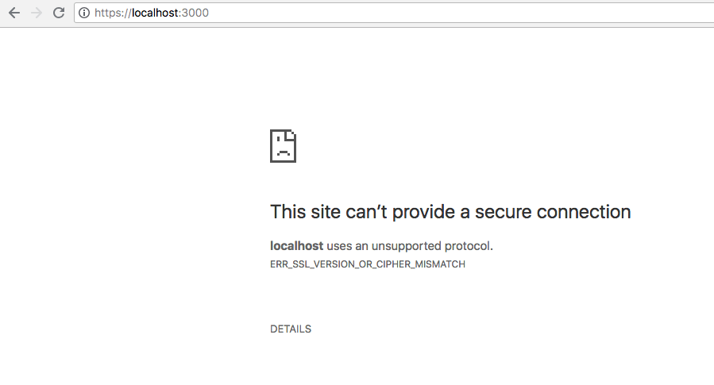
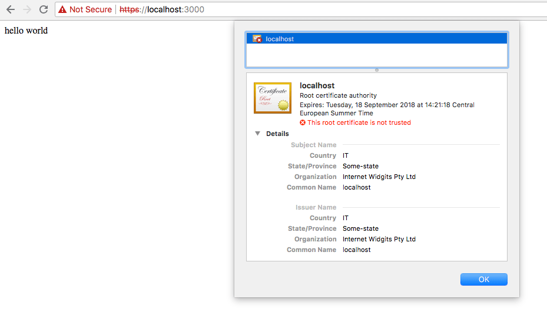

To be able to serve a site on HTTPS from localhost you need to create a self-signed certificate.

A self-signed certificate will be enough to establish a secure HTTPS connection, although browsers will complain that the certificate is self-signed and as such it's not trusted. It's great for development purposes.

To create the certificate you must have **OpenSSL** installed on your system.

You might have it installed already, just test by typing `openssl` in your terminal.

If not, on a Mac you can install it using `brew install openssl` if you use [Homebrew](https://brew.sh). Otherwise search on Google "how to install openssl on <your-operating-system>".

Once OpenSSL is installed, run this command:

```bash
openssl req -nodes -new -x509 -keyout server.key -out server.cert
```

It will as you a few questions. The first is the country name:

```txt
Generating a 1024 bit RSA private key
...........++++++
.........++++++
writing new private key to 'server.key'
-----
You are about to be asked to enter information that will be incorporated into your certificate request.
What you are about to enter is what is called a Distinguished Name or a DN.
There are quite a few fields but you can leave some blank
For some fields there will be a default value,
If you enter '.', the field will be left blank.
-----
Country Name (2 letter code) [AU]:
```

Then your state or province:

```txt
State or Province Name (full name) [Some-State]:
```

your city:

```txt
Locality Name (eg, city) []:
```

and your organization name:

```txt
Organization Name (eg, company) [Internet Widgits Pty Ltd]:
Organizational Unit Name (eg, section) []:
```

You can leave all of these empty.

Just remember to set this to `localhost`:

```txt
Common Name (e.g. server FQDN or YOUR name) []: localhost
```

and to add your email address:

```txt
Email Address []:
```

That's it! Now you have 2 files in the folder where you ran this command:

- `server.cert` is the self-signed certificate file
- `server.key` is the private key of the certificate

Both files will be needed to establish the HTTPS connection, and depending on how you are going to setup your server, the process to use them will be different.

Those files need to be put in a place reachable by the application, then you need to configure the server to use them.

This is an example using the `https` core module and Express:

```js
const https = require('https')
const app = express()

app.get('/', (req, res) => {
  res.send('Hello HTTPS!')
})

https.createServer({}, app).listen(3000, () => {
  console.log('Listening...')
})
```

without adding the certificate, if I connect to `https://localhost:3000` this is what the browser will show:



With the certificate in place:

```js
const fs = require('fs')

//...

https.createServer({
  key: fs.readFileSync('server.key'),
  cert: fs.readFileSync('server.cert')
}, app).listen(3000, () => {
  console.log('Listening...')
})
```

Chrome will tell us the certificate is invalid, since it's self-signed, and will ask us to confirm to continue, but the HTTPS connection will work:

