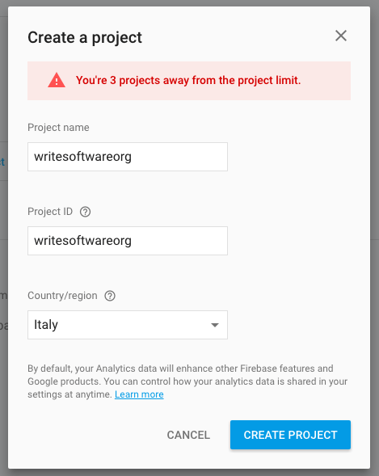
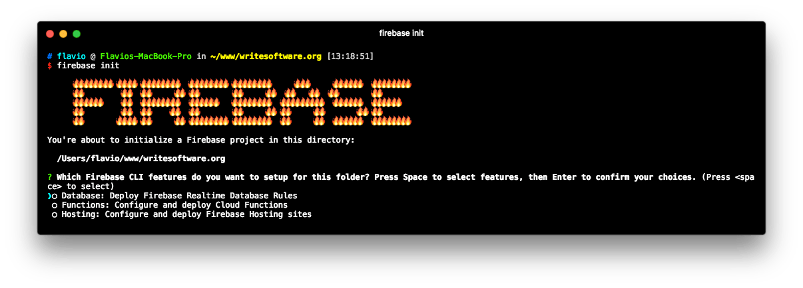
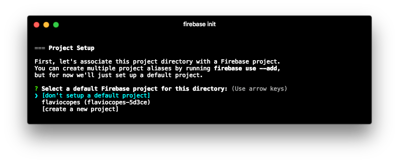
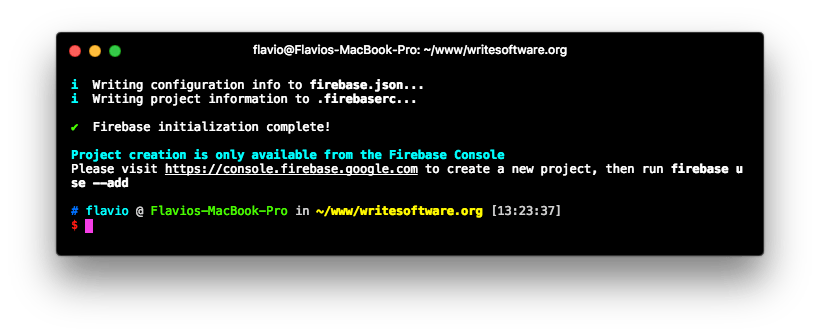
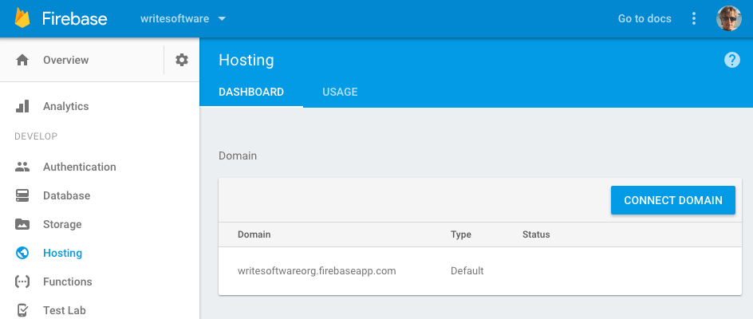

<!-- TOC -->

- [Intro to Firebase](#intro-to-firebase)
- [Firebase Hosting Features](#firebase-hosting-features)
- [Why should you use Firebase Hosting?](#why-should-you-use-firebase-hosting)
- [Install the Firebase CLI tool](#install-the-firebase-cli-tool)
- [Create a project on Firebase](#create-a-project-on-firebase)
- [Configure the site](#configure-the-site)
- [Publish the site](#publish-the-site)
- [Custom Domain](#custom-domain)

<!-- /TOC -->

## Intro to Firebase

Firebase is a mobile and web application development platform developed by Firebase, Inc. in 2011, and was acquired by Google in 2014.

So now Firebase is a Google Cloud service, and not just that - it's a flagship product of their Cloud offering.

Firebase is a complex and articulated product, mainly targeted at mobile applications.

One of its features however is an advanced web hosting service.

## Firebase Hosting Features

Firebase Hosting provides hosting for static web sites, such as the ones you can generate using static site generators or even sites built with server-side CMS platforms, from which you generate a static copy of the website.

You can host anything as long as it's not dynamic. A WordPress blog for example is almost always a good candidate to be a static site, if you use Disqus or Facebook comments.

Firebase Hosting delivers files through the Fastly [CDN](/cdn/), using HTTPS and provides an automatic SSL certificate, with custom domain support.

Its **free tier is generous**, with cheap plans if you outgrow it, and is very developer-friendly: Firebase provides a CLI interface tool, an easy deployment process, and one-click rollbacks

## Why should you use Firebase Hosting?

Firebase can be a good choice to deploy static websites, and Single Page Apps.

I like to use Firebase Hosting mainly because I tested many different providers and Firebase offers an **awesome speed** across the continents without the need for a separate CDN on top, since **the CDN is built-in** for free.

Also while having your own VPS is a very good option as well, **I don't want to manage my own server** just for a simple website, I prefer to focus on the content rather than on the operations, much like I would deploy an app on Heroku.

Firebase is even easier to setup than Heroku.

## Install the Firebase CLI tool

Install the Firebase CLI with [npm](/npm/):

```
npm install -g firebase-tools
```

or

```
yarn global add firebase-tools
```

and authenticate with the Google account (I assume you already have a Google account) by running

```
firebase login
```

## Create a project on Firebase

Go to <https://console.firebase.google.com/> and create a new project.



Now back to the console, from the site you're working on, in the root folder, run

```
firebase init
```



Choose "Hosting" by pressing space, then enter to go on.

Now you need to choose the project you want to deploy the site to.



Choose "create a new project".

Now you choose which folder contains the static version of your site. For example, `public`.

Reply "No" to the _Configure as a single-page app (rewrite all urls to /index.html)?_ question, and also reply "No" to _File public/index.html already exists. Overwrite?_ to avoid Firebase to add its own default index.html file.

You're good to go:



## Configure the site

The Firebase CLI app created the `firebase.json` file in the root site folder.

In this article I tell how to configure a simple feature in Firebase Hosting, by adding a small bit of configuration in the `firebase.json` file.

I want to set the Cache-Control header directive on all the site assets: images as well as CSS and JS files.

A clean `firebase.json` file contains the following:

```json
{
  "hosting": {
    "public": "public",
    "ignore": [
      "firebase.json",
      "**/.*",
      "**/node_modules/**"
    ]
  }
}
```

It tells Firebase where is the site content, and which files it should ignore. Feel free to add all the folders you have, except `public`.

We're going to add a new property in there, called `headers`:

```json
{
  "hosting": {
    "public": "public",
    "ignore": [
      "firebase.json",
      "**/.*",
      "**/node_modules/**"
    ],
    "headers": [
      {
        "source" : "**/*.@(jpg|jpeg|gif|png|css|js)",
        "headers" : [ {
            "key" : "Cache-Control",
            "value" : "max-age=1000000" //1 week+
        } ]
      }
    ]
  }
}
```

As you can see we tell that for all files ending with `jpg|jpeg|gif|png|css|js` Firebase should apply the Cache-Control:max-age=1000000` directive, which means all assets are cached for more than 1 week.

## Publish the site

When you are ready to publish the site, you just run

```
firebase deploy
```

and Firebase takes care of everything.

You can now open `https://yourproject.firebaseapp.com` and you should see the website running.

## Custom Domain

The next logical step is to make your site use a custom domain.

Go to <https://console.firebase.google.com/project/_/hosting/main> and click the "Connect Domain" button:



The wizard will ask you for the domain name, then it will provide a TXT record you need to add to your hosting DNS panel to verify the domain.

If the domain is brand new, it might take some time before you can pass this step.

Once this is done, the interface will give you two **A records** to add as well to your hosting DNS panel.

If you set up `yourdomain.com`, don't forget to also set up `www.yourdomain.com`, by making it a redirect.


Now you just have to wait for your hosting to update the DNS records and for DNS caches to flush.

Also, keep in mind that your SSL certificate is automatically provisioned but requires a bit of time to be valid.