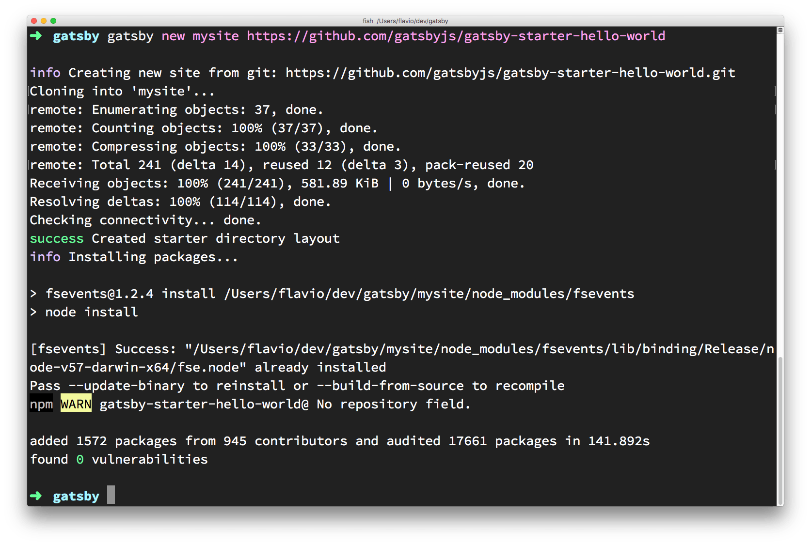
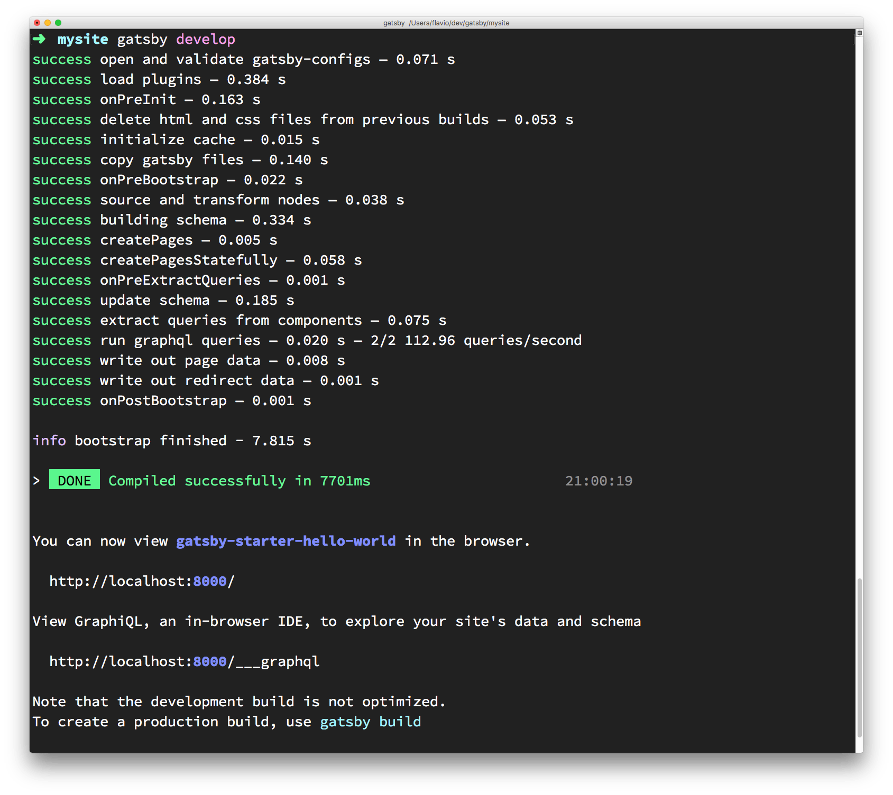
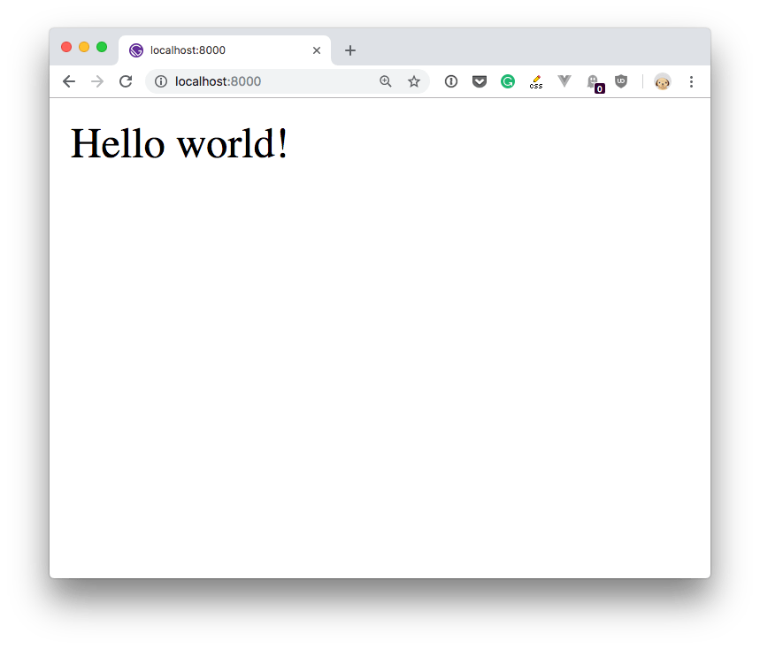
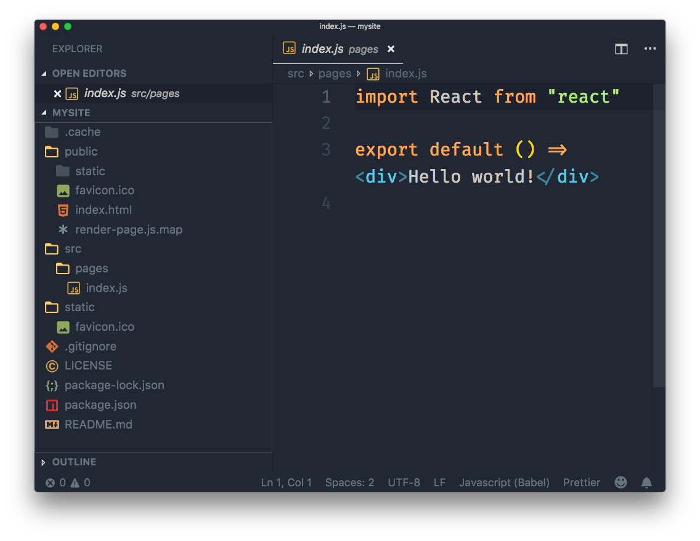
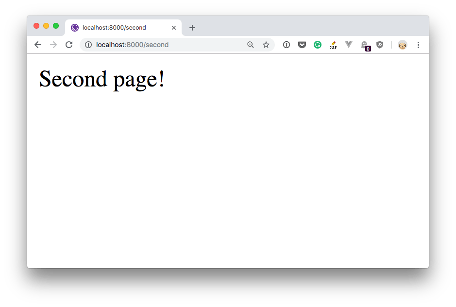

Gatsby is a platform for building apps and websites using React.

It is one of the tools that allow you to build on a set of technologies and practices collectively known as [JAMstack](https://flaviocopes.com/jamstack/).

Gatsby is one of the cool kids in the Frontend Development space right now. Why? I think the reasons are:

- the explosion of the JAMstack approach to building Web Apps and Web Sites
- the rapid adoption of the [Progressive Web Apps](https://flaviocopes.com/progressive-web-apps/) technology in the industry, which is one of the key features of Gatsby
- it's built in [React](https://flaviocopes.com/react/) and [GraphQL](https://flaviocopes.com/graphql/), which are two very popular and rising technologies
- it's really powerful
- it's fast
- the documentation is great
- the network effect (people use it, create sites, make tutorials, people know more about it, creating a cycle)
- everything is JavaScript (no need to learn a new templating language)
- it hides the complexity, in the beginning, but allows us access into every step to customize

All those are great points, and Gatsby is definitely worth a look.

## How does it work?

With Gatsby, your applications are built using React components.

The content you'll render in a site is generally written using Markdown, but you can use any kind of data source, like an headless CMS or a web service like Contentful.

Gatsby builds the site, and it's compiled to static HTML which can be deployed on any Web Server you want, like [Netlify](https://flaviocopes.com/netlify/), AWS S3, GitHub Pages, regular hosting providers, PAAS and more. All you need is a place that serves plain HTTP pages and your assets to the client.

I mentioned Progressive Web Apps in the list. Gatsby automatically generates your site as a PWA, with a service worker that speeds up page loading and resource caching.

You can enhance the functionality of Gatsby via plugins.

## Installation

You can install Gatsby by running this in your [terminal](https://flaviocopes.com/macos-terminal/):

```bash
npm install -g gatsby-cli
```

This installs the `gatsby` CLI utility.

(when a new version is out, update it by calling this command again)

You create a new "Hello World" site by running

```bash
gatsby new mysite https://github.com/gatsbyjs/gatsby-starter-hello-world
```

This command creates a brand new Gatsby site in the `mysite` folder, using the *starter* available at <https://github.com/gatsbyjs/gatsby-starter-hello-world>.



A *starter* is a sample site that you can build upon. Another common starter is `default`, available at <https://github.com/gatsbyjs/gatsby-starter-default>.

> [Here you can find a list of all the starters you can use](https://www.gatsbyjs.org/docs/gatsby-starters/)

## Running the Gatsby site

After the terminal has finished installing the starter, you can run the website by calling

```bash
cd mysite
gatsby develop
```

which will start up a new Web Server and serve the site on port 8000 on localhost.



And here is our Hello World starter in action:



## Inspecting the site

If you open the site you created with your favorite code editor (I use [VS Code](https://flaviocopes.com/vscode/)), you'll find there are 3 folders:

- `.cache`, an hidden folder that contains the Gatsby internals, nothing you should change right now
- `public`, which contains the resulting website once you build it
- `src` contains the React components, in this case just the `index` component
- `static` which will contain the static resources like CSS and images



Now, making a simple change to the default page is easy, just open `src/pages/index.js` and change "Hello world!" to something else, and save. The browser should instantly **hot reload** the component (which means the page does not actually refresh, but the content changes - a trick made possible by the underlying technology).

To add a second page, just create another .js file in this folder, with the same content of `index.js` (tweak the content) and save it.

For example I created a `second.js` file with this content:

```js
import React from 'react'

export default () => <div>Second page!</div>
```

and I opened the browser to <http://localhost:8000/second>:



## Linking pages

You can link those pages by importing a Gatsby-provided React component called `Link`:

```js
import { Link } from "gatsby"
```

and using it in your component [JSX](https://flaviocopes.com/jsx/):

```js
<Link to="/second/">Second</Link>
```

## Adding CSS

You can import any CSS file using a JavaScript import:

```js
import './index.css'
```

You can use React styling:

```js
<p style={{
    margin: '0 auto',
    padding: '20px'
  }}>Hello world</p>
```

## Using plugins

Gatsby provides lots of things out of the box, but many other functionalities are provided by [plugins](https://www.gatsbyjs.org/plugins/).

There are 3 kind of plugins:

- **source plugins** fetch data from a source. Create nodes that can be then filtered by transformer plugins
- **transformer plugins** transform the data provided by source plugins into something Gatsby can use
- **functional plugins** implement some kind of functionality, like adding sitemap support or more

Some commonly used plugins are:

- [gatsby-plugin-react-helmet](https://www.gatsbyjs.org/packages/gatsby-plugin-react-helmet/) which allows to edit the `head` tag content
- [gatsby-plugin-catch-links](https://www.gatsbyjs.org/packages/gatsby-plugin-catch-links/) which uses the [History API](https://flaviocopes.com/history-api/) to prevent the browser reloading the page when a link is clicked, loading the new content using AJAX instead

A Gatsby plugin is installed in 2 steps. First you install it using `npm`, then you add it to the Gatsby configuration in `gatsby-config.js`.

For example you can install the Catch Links plugin:

```js
npm install gatsby-plugin-catch-links
```

In `gatsby-config.js` (create it if you don't have it, in the website root folder), add the plugin to the `plugins` exported array:

```js
module.exports = {
  plugins: ['gatsby-plugin-catch-links']
}
```

That's it, the plugin will now do its job.

## Building the static website

Once you are done tweaking the site and you want to generate the production static site, you will call

```bash
gatsby build
```

At this point you can check that it all works as you expect by starting a local Web Server using

```bash
gatsby serve
```

which will render the site as close as possible to how you will see it in production.

## Deployment

Once you build the site using `gatsby build`, all you need to do is to deploy the result  contained in the `public` folder.

Depending on the solution you choose, you'll need different steps here, but generally you'll push to a Git repository and let the Git post-commit hooks do the job of deploying.

[Here are some great guides for some popular hosting platforms](https://www.gatsbyjs.org/docs/deploying-and-hosting/).
