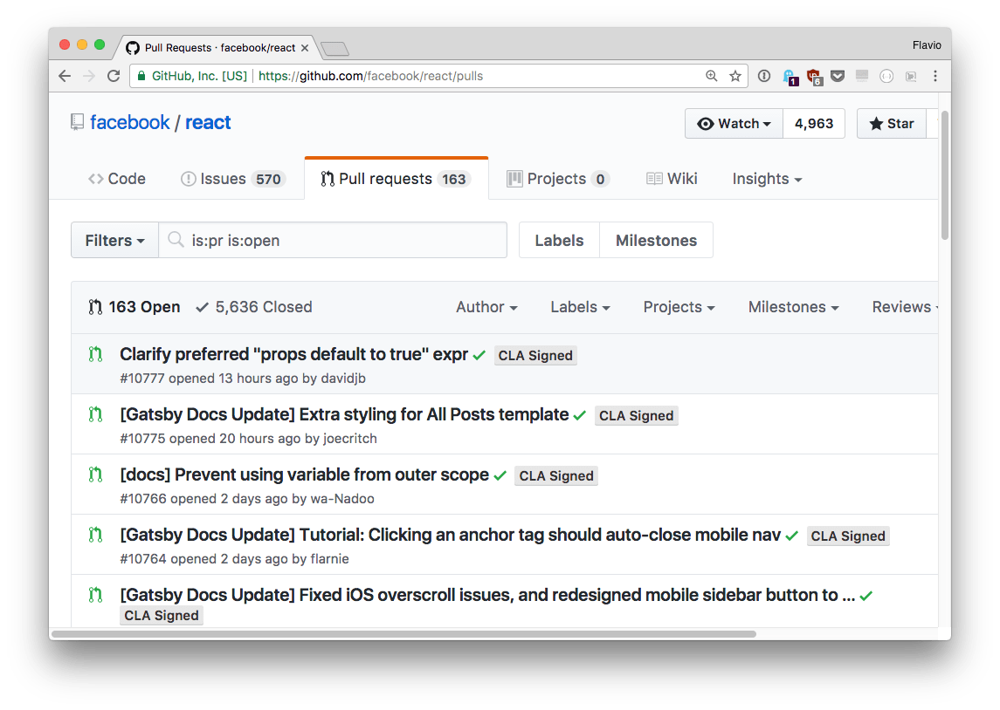
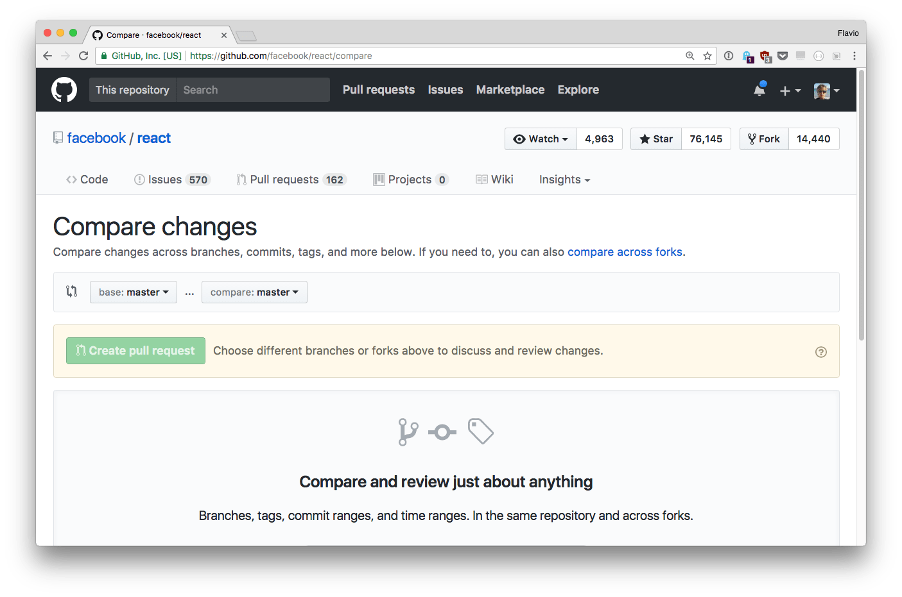

<!-- TOC -->

- [Introduction to GitHub](#introduction-to-github)
- [Why GitHub?](#why-github)
- [GitHub issues](#github-issues)
- [Social coding](#social-coding)
  - [Follow](#follow)
  - [Stars](#stars)
  - [Fork](#fork)
  - [Popular = better](#popular--better)
- [Pull requests](#pull-requests)
- [Project management](#project-management)
- [Comparing commits](#comparing-commits)
- [Webhooks and Services](#webhooks-and-services)
  - [Webhooks](#webhooks)
  - [Services](#services)
- [Final words](#final-words)

<!-- /TOC -->

## Introduction to GitHub

GitHub is a website where millions of developers gather every day to collaborate on open source software. It's also the place that hosts billions of lines of code, and also a place where users of software go to report issues they might have.

In short, it's a platform for software developers, and it's built around Git.

> TIP: If you don't know about Git yet, checkout the [Git guide](/git/).

As a developer **you can't avoid using GitHub daily**, either to host your code or to make use of other people's code. This post explains you some key concepts of GitHub, and how to use some of its features that improve your workflow, and how to integrate other applications into your process.

## Why GitHub?

Now that you know what GitHub _is_, you might ask _why_ you should use it.

GitHub after all is managed by a private company, which profits from hosting people's code. So why should you use that instead of similar platforms such as BitBucket or GitLab, which are very similar?

Beside personal preferences, and technical reasons, there is one big reason: everyone uses GitHub, so the network effect is huge.

Major codebases migrated over time to Git from other version control systems, because of its convenience, and GitHub was historically well positioned into (and put a lot of effort to "win") the Open Source community.

So today any time you look up some library, you will 99% of the times find it on GitHub.

Apart from Open Source code, many developers also host private repositories on GitHub because of the convenience of a unique platform.

## GitHub issues

GitHub issues are one of the most popular bug tracker in the world.

It provides the owners of a repository the ability to organize, tag and assign to milestones issues.

If you open an issue on a project managed by someone else, it will stay open until either you close it (for example if you figure out the problem you had) or if the repo owner closes it.

Sometimes you'll get a definitive answer, other times the issue will be left open and tagged with some information that categorizes it, and the developer could get back to it to fix a problem or improve the codebase with your feedback.

Most developers are not paid to support their code released on GitHub, so you can't expect prompt replies, but other times Open Source repositories are published by companies that either provide services around that code, or have commercial offerings for versions with more features, or a plugin-based architecture, in which case they might be working on the open source software as paid developers.

## Social coding

Some years ago the GitHub logo included the "social coding" tagline.

What did this mean, and is that still relevant? It certainly is.

### Follow

With GitHub **you can follow developers**, by going on their profile and clicking "follow".

**You can also follow a repository**, by clicking the "**watch**" button on a repo.

In both cases the activity will show up in your dashboard. You don't follow like in Twitter, where you see what people say, but **you see what people do**.

### Stars

One big feat of GitHub is the ability to **star a repository**. This action will include it in your "starred repositories" list, which allows you to find things you found interesting before, and it's also one of the most important rating mechanisms, as the more stars a repo has, the more important it is, and the more it will show up in search results.

Major projects can have 70.000 and more stars.

GitHub also has a [trending page](https://github.com/trending) where it features the repositories that get the most stars in a determined period of time, e.g. today or this week or month.

Getting into those trending lists can cause other network effects like being featured on other sites, just because you have more visibility.

### Fork

The last important network indicator of a project is the number of forks.

This is key to how GitHub works, as a fork is the base of a Pull Request (PR), a change proposal. Starting from your repository, a person forks it, makes some changes, then creates a PR to ask you to merge those changes.

Sometimes the person that forks never asks you to merge anything, just because they liked your code and decided to add something on top of it, or they fixed some bug they were experiencing.

A fork clones the files of a GitHub project, but not any of the stars or issues of the original project.

### Popular = better

All in all, those are all key indicators of the popularity of a project, and generally along with the date of the latest commit and the involvement of the author in the issues tracker, is a useful indication of whether or not you should rely on a library or software.

## Pull requests

Before I introduced what is a Pull Request (PR)

Starting from your repository, a person forks it, makes some changes, then creates a PR to ask you to merge those changes.

A project might have hundreds of PRs, generally the more popular a project, the more PRs, like the React project:

Once a person submits a PR, an easy process using the GitHub interface, it needs to be reviewed by the core maintainers of the project.

Depending on the _scope_ of your PR (the number of changes, or the number of things affected by your change, or the complexity of the code touched) the maintainer might need more or less time to make sure your changes are compatible with the project.

A project might have a clear timeline of changes they want to introduce. The maintainer might like to keep things simple while you are introducing a complex architecture in a PR.

This is to say that **not always a PR gets accepted fast**, and also **there is no guarantee that the PR will even get accepted**.

In the example i posted above, there is a PR in the repo that dates back 1.5 years. And this happens in **all** the projects.

## Project management

Along with issues, which are the place where developers get feedback from users, the GitHub interface offers other features aimed at helping project management.

One of those is **Projects**. It's very new in the ecosystem and very rarely used, but it's a **kanban board** that helps organizing issues and work that needs to be done.

The **Wiki** is intended to be used as a documentation for users. One of the most impressive usage of the Wiki I saw up to now is the [Go Programming Language GitHub Wiki](https://github.com/golang/go/wiki).

Another popular project management aid is **milestones**. Part of the issues page, you can assign issues to specific milestones, which could be release targets.

Speaking of releases, GitHub enhances the **Git tag** functionality by introducing **releases**.

A Git tag is a pointer to a specific commit, and if done consistently, helps you roll back to previous version of your code without referencing specific commits.

A GitHub release builds on top of Git tags and represents a complete release of your code, along with zip files, release notes and binary assets that might represent a fully working version of your code end product.

While a Git tag can be created programmatically (e.g. using the Command Line `git` program), creating a GitHub release is a manual process that happens through the GitHub UI. You basically tell GitHub to create a new release and tell them which tag you want to apply that release to.

## Comparing commits

GitHub offers many tools to work with your code.

One of the most important things you might want to do is compare one branch to another one. Or, compare the latest commit with the version you are currently using, to see which changes were made over time.

GitHub allows you to do this with the **compare view**, just add `/compare` to the repo name, for example: <https://github.com/facebook/react/compare>

For example here I choose to compare the latest _React v15.x_ to the latest _v16.0.0-rc_ version available at the time of writing, to check what's changed:

The view shows you **the commits made** between two releases (or tags or commits references) and **the actual diff**, **if the number of changes is lower than a reasonable amount**.

## Webhooks and Services

GitHub offers many features that help the developer workflow. One of them is webhooks, the other one is services.

### Webhooks

Webhooks allow external services to be pinged when certain events happen in the repository, like when code is pushed, a fork is made, a tag was created or deleted.

When an event happens, GitHub sends a POST request to the URL we told it to use.

A common usage of this feature is to ping a remote server to fetch the latest code from GitHub when we push an update from our local computer.

We push to GitHub, GitHub tells the server we pushed, the server pulls from GitHub.

### Services

GitHub services, and the new GitHub apps, are 3rd party integrations that improve the developer experience or provide a service to you.

For example you can setup a test runner to run the tests automatically every time you push some new commits, using [TravisCI](https://travis-ci.org/).

You can setup Continuous Integration using [CircleCI](https://circleci.com/).

You might create a [Codeclimate](https://codeclimate.com/) integration that analyzes the code and provides a report of technical debt and test coverage.

## Final words

GitHub is an amazing tool and service to take advantage of, a real gem in today’s developer toolset. This tutorial will help you start, but the real experience of working on GitHub on open source (or closed source) projects is something not to be missed.
