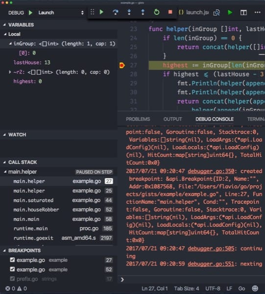

VS Code from Microsoft is my favorite code editor. I used _tons_ of editors in the last 20 years and this is the best by far.

It's [Open Source](http://www.catb.org/esr/halloween/), fast, even on my not-so-recent MacBook Pro, it never crashed in the middle of something, it's hackable and yet works great out of the box.

It's all amazing, but how do you debug Go programs? You might think you need a heavy IDE for that, but that's not true. It's super easy, with [Delve](https://github.com/derekparker/delve), made by [Derek Parker](https://twitter.com/DerkTheDaring).

First of course you need to install [the official Go VS Code extension](https://github.com/Microsoft/vscode-go), and [make sure $GOPATH is configured](https://github.com/Microsoft/vscode-go/wiki/GOPATH-in-the-VS-Code-Go-extension).

Once this is installed, on Linux/Win you just need to execute the command `Go: Install/Update Tools`. On a Mac, you need to download Delve through **Brew**, by typing `brew install go-delve/delve/delve` in your favorite shell (which should be **zsh**!) - the docs talk about self-signing, but Brew handles this for you.

Once you're done, setup the debugger configuration.

Click the VS Code **debug menu** and click "Start debugging", or just press `F5`.

VS Code puts the debug information in the `.vscode/launch.json` file in the root of your workspace. This will will be auto-generated and should work out of the box for local debugging:

```json
{
    "version": "0.2.0",
    "configurations": [
        {
            "name": "Launch",
            "type": "go",
            "request": "launch",
            "mode": "debug",
            "remotePath": "",
            "port": 2345,
            "host": "127.0.0.1",
            "program": "${fileDirname}",
            "env": {},
            "args": [],
            "showLog": true
        }
    ]
}
```

As per the docs, the mode parameter can be set to:

`debug` to compile and debug the current program
`test` to debug tests (to debug a single test, pass -test.run and the Test name as args)
`exec` to run a pre-built binary specified in program, for example `"program":"${workspaceRoot}/mybin"`.
`remote` to debug remotely (refer to the [official documentation on Remote Debugging](https://github.com/Microsoft/vscode-go/wiki/Debugging-Go-code-using-VS-Code#remote-debugging))

Having trouble? Here are some [common pitfalls](https://github.com/Microsoft/vscode-go/wiki/Debugging-Go-code-using-VS-Code#troubleshooting).

Once this is done, Delve is ready to run!



You can see that this is a pretty standard debugger, with local and global **variables inspection**, the option to **watch specific variables**, the **call stack visualization** and **breakpoints**.

What I especially like about debugging Go, and stepping into lib calls is that the standard library is very clean, well documented and readable, and by debuggging you learn a lot of things on how things work internally as well.

Happy debugging!