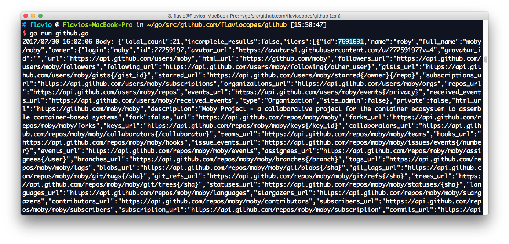
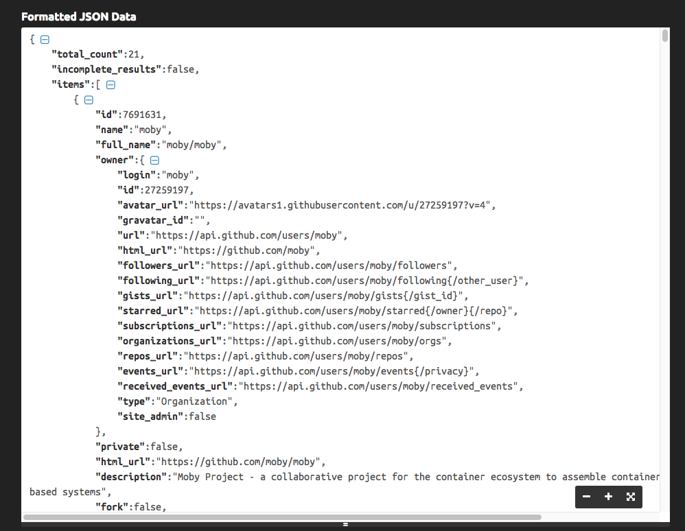
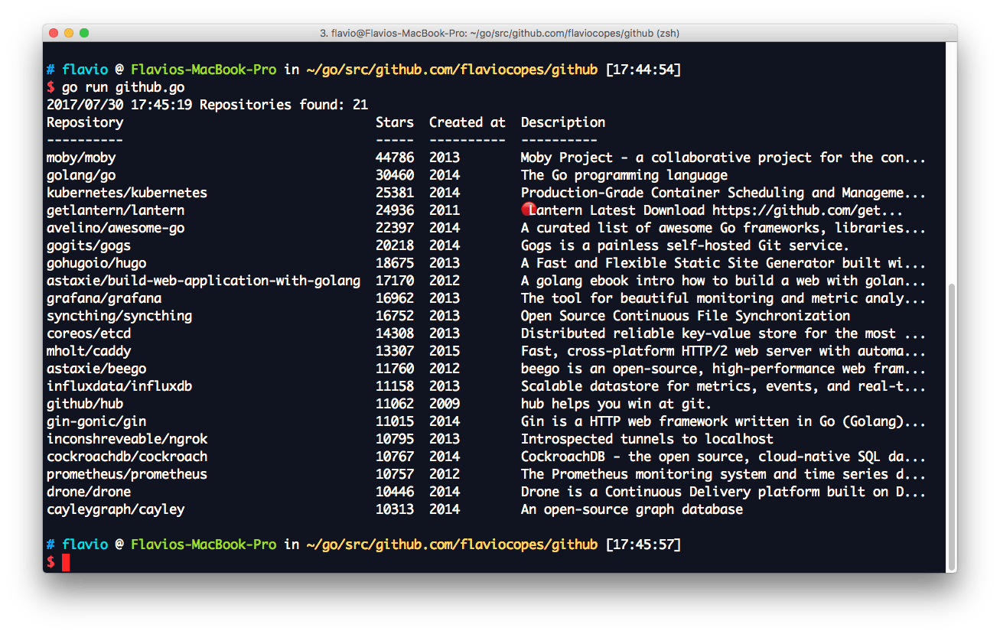

In this post I'm going to ask to the GitHub API information about public repositories, using just the Go `net/http` stdlib package, without any additional library.

GitHub has a nice public API called Search, which you can inspect at <https://developer.github.com/v3/search/#search-repositories>.

In particular, I'm interested in **getting the Go repos with more than 10k stars** at this point in time.

We can pass it a query to get exactly what we want. Looking at the Search API docs we'll have to make an HTTP GET request to `https://api.github.com/search/repositories` passing the query `?q=stars:>=10000+language:go&sort=stars&order=desc`: give me the repositories with more than 10k stars, with language Go, sort them by number of stars.

Simplest snippet: we use `http.Get` from `net/http`  and we read everything that's returned using `ioutil.ReadAll`:

```go
package main

import (
	"io/ioutil"
	"log"
	"net/http"
)

func main() {
	res, err := http.Get("https://api.github.com/search/repositories?q=stars:>=10000+language:go&sort=stars&order=desc")

	if err != nil {
		log.Fatal(err)
	}

	body, err := ioutil.ReadAll(res.Body)
	res.Body.Close()
	if err != nil {
		log.Fatal(err)
	}
	if res.StatusCode != 200 {
		log.Fatal("Unexpected status code", res.StatusCode)
	}

	log.Printf("Body: %s\n", body)
}
```



It's _not much readable_, as you can see. You can paste what you get using [an online formatter](https://jsonformatter.curiousconcept.com/) to understand the actual structure.



Let's now process the JSON and generate a nice table from it.

If you're new to the JSON topic, check out my preliminary guide on [how to process JSON with Go](/go-json/).

```go
package main

import (
	"encoding/json"
	"fmt"
	"io/ioutil"
	"log"
	"net/http"
	"os"
	"text/tabwriter"
	"time"
)

// Owner is the repository owner
type Owner struct {
	Login string
}

// Item is the single repository data structure
type Item struct {
	ID              int
	Name            string
	FullName        string `json:"full_name"`
	Owner           Owner
	Description     string
	CreatedAt       string `json:"created_at"`
	StargazersCount int    `json:"stargazers_count"`
}

// JSONData contains the GitHub API response
type JSONData struct {
	Count int `json:"total_count"`
	Items []Item
}

func main() {
	res, err := http.Get("https://api.github.com/search/repositories?q=stars:>=10000+language:go&sort=stars&order=desc")
	if err != nil {
		log.Fatal(err)
	}
	body, err := ioutil.ReadAll(res.Body)
	res.Body.Close()
	if err != nil {
		log.Fatal(err)
	}
	if res.StatusCode != http.StatusOK {
		log.Fatal("Unexpected status code", res.StatusCode)
	}
	data := JSONData{}
	err = json.Unmarshal(body, &data)
	if err != nil {
		log.Fatal(err)
	}
	printData(data)
}

func printData(data JSONData) {
	log.Printf("Repositories found: %d", data.Count)
	const format = "%v\t%v\t%v\t%v\t\n"
	tw := new(tabwriter.Writer).Init(os.Stdout, 0, 8, 2, ' ', 0)
	fmt.Fprintf(tw, format, "Repository", "Stars", "Created at", "Description")
	fmt.Fprintf(tw, format, "----------", "-----", "----------", "----------")
	for _, i := range data.Items {
		desc := i.Description
		if len(desc) > 50 {
			desc = string(desc[:50]) + "..."
		}
		t, err := time.Parse(time.RFC3339, i.CreatedAt)
		if err != nil {
			log.Fatal(err)
		}
		fmt.Fprintf(tw, format, i.FullName, i.StargazersCount, t.Year(), desc)
	}
	tw.Flush()
}
```

The above code creates 3 structs to unmarshal the JSON provided by GitHub. `JSONData` is the main container, `Items` is a slice of `Item`, the repository struct, and inside item, `Owner` contains the repository owner data.

Given the HTTP response `res` returned by [`http.Get`](https://golang.org/pkg/net/http/#Get) we extract the body using `res.Body` and we read all of it in `body` with [`ioutil.ReadAll`](https://golang.org/pkg/io/ioutil/#ReadAll).

After checking the `res.StatusCode` matches the [`http.StatusOK`](https://golang.org/pkg/net/http/#pkg-constants) constant (which corresponds to `200`), we unmarshal the JSON using [`json.Unmarshal`](https://golang.org/pkg/encoding/json/#Unmarshal) into our `JSONData` struct `data`, and we print it by passing it to our `printData` struct.

Inside `printData` I instantiate a [`tabwriter.Writer`](https://golang.org/pkg/text/tabwriter/#Writer), then process and format the JSON data accordingly to output a nice table layout:


