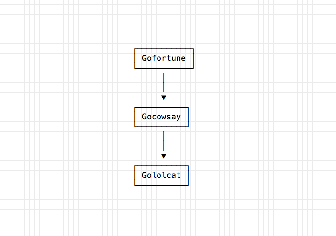
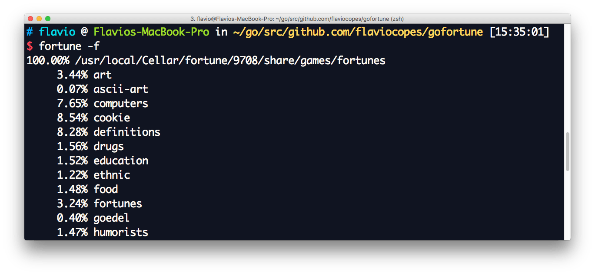
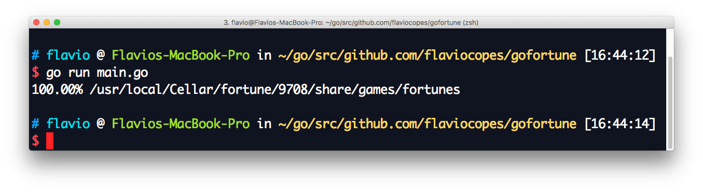
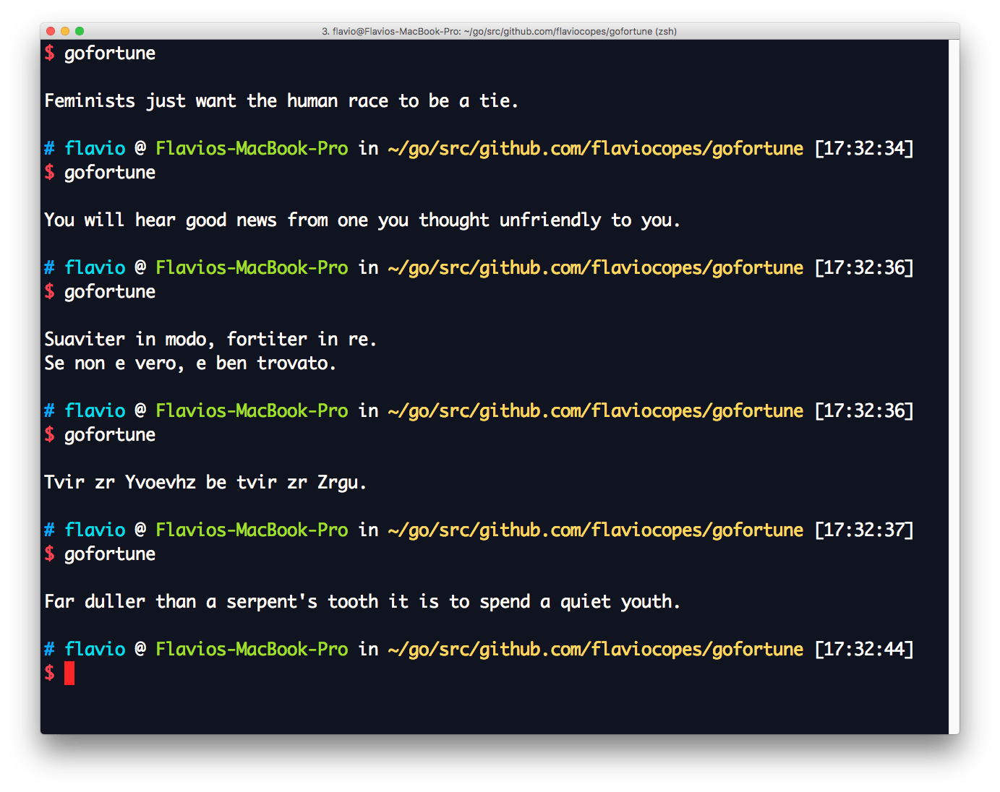
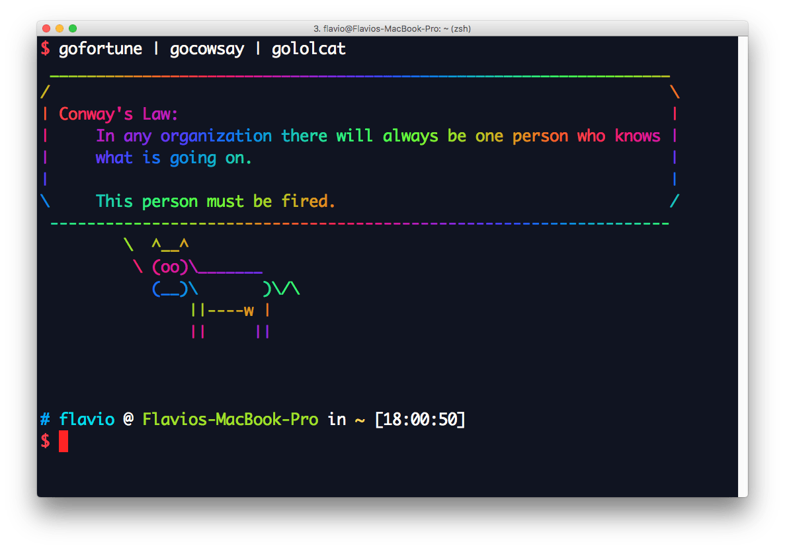

I've written two CLI app tutorials to build [gololcat](/go-tutorial-lolcat) and [gocowsay](/go-tutorial-cowsay). In both I used `fortune` as the input generator.

In this article, I'll complete the pipe triology with `gofortune`.



What is **fortune**, first? [As Wikipedia says](https://en.wikipedia.org/wiki/Fortune_(Unix)), Fortune is a simple program that display a pseudorandom message from a database of quotations.

Basically, a random quote generator.

It has a very long history dating back to Unix Version 7 (1979). It's still going strong. Many Linux distributions preinstall it, and on OSX you can install it using `brew install fortune`.

On some systems, it's used as a greeting or parting message when using shells.

Wikipedia also says

> Many people choose to pipe fortune into the **cowsay** command, to add more humor to the dialog.

That's me! Except I use my `gocowsay` command.

Enough with the intro, **let's build a fortune clone with Go**.

Here's a breakdown of what our program will do.


The fortunes folder location depends on the system and distribution, being a build flag. I could hardcode it or use an environment variable but as an exercise, I'll do a dirty thing and ask `fortune` directly, by executing it with the `-f` flag, which outputs:



The first line of the output contains the path of the fortunes folder.

```go
package main

import (
	"fmt"
	"os/exec"
)

func main() {
	out, err := exec.Command("fortune", "-f").CombinedOutput()
	if err != nil {
		panic(err)
	}

	fmt.Println(string(out))
}
```

This snippet replicates the output exactly as I got it.
It seems that `fortune -f` writes the output to stderr, that's why I used `CombinedOutput`, to get both `stdout` and `stderr`.

But, I just want the first line. How to do it? This prints all the output of `stderr` line-by-line:

```go
package main

import (
	"bufio"
	"fmt"
	"os/exec"
)

func main() {
	fortuneCommand := exec.Command("fortune", "-f")
	pipe, err := fortuneCommand.StderrPipe()
	if err != nil {
		panic(err)
	}
	for outputStream.Scan() {
	 	fmt.Println(outputStream.Text())
	}
}
```

To get just the first line, I remove the for loop, and just scan the first line:

```go
package main

import (
	"bufio"
	"fmt"
	"os/exec"
)

func main() {
	fortuneCommand := exec.Command("fortune", "-f")
	pipe, err := fortuneCommand.StderrPipe()
	if err != nil {
		panic(err)
	}
	fortuneCommand.Start()
	outputStream := bufio.NewScanner(pipe)
	outputStream.Scan()
	fmt.Println(outputStream.Text())
}
```



Now let's pick that line and extract the path.

On my system the first line of the output is `100.00% /usr/local/Cellar/fortune/9708/share/games/fortunes`. Let's make a substring starting from the first occurrence of the `/` char:

```go
line := outputStream.Text()
path := line[strings.Index(line, "/"):]
```

Now I have the path of the fortunes. I can index the files found in there. There are `.dat` binary files, and plain text files. I'm going to discard the binary files, and the `off/` folder altogether, which contains offensive fortunes.

Let's first index the files. I use the `path/filepath` package `Walk` method to iterate the file tree starting from `root`. I use it instead of `ioutil.ReadDir()` because we might have nested folders of fortunes. In the `WalkFunc` `visit` I discard .dat files using `filepath.Ext()`, I discard the folder files (e.g. `/off`, but not the files in subfolders) and all the offensive fortunes, conveniently located under `/off`, and I print the value of each remaining file.

```go
func visit(path string, f os.FileInfo, err error) error {
	if strings.Contains(path, "/off/") {
		return nil
	}
	if filepath.Ext(path) == ".dat" {
		return nil
	}
	if f.IsDir() {
		return nil
	}
	files = append(files, path)
	return nil
}

func main() {
	fortuneCommand := exec.Command("fortune", "-f")
	pipe, err := fortuneCommand.StderrPipe()
	if err != nil {
		panic(err)
	}
	fortuneCommand.Start()
	outputStream := bufio.NewScanner(pipe)
	outputStream.Scan()
	line := outputStream.Text()
	root := line[strings.Index(line, "/"):]

	err = filepath.Walk(root, visit)
	if err != nil {
		panic(err)
	}
}
```

Let's put those values in a slice, so I can later pick a random one: I define a `files` slice of strings and I append to that in the `visit()` function. At the end of `main()` I print the number of files I got.

```go
package main

import (
	"bufio"
    "log"
	"os"
	"os/exec"
	"path/filepath"
	"strings"
)

var files []string

func visit(path string, f os.FileInfo, err error) error {
    if err != nil {
        log.Fatal(err)
    }
	if strings.Contains(path, "/off/") {
		return nil
	}
	if filepath.Ext(path) == ".dat" {
		return nil
	}
	if f.IsDir() {
		return nil
	}
	files = append(files, path)
	return nil
}

func main() {
	fortuneCommand := exec.Command("fortune", "-f")
	pipe, err := fortuneCommand.StderrPipe()
	if err != nil {
		panic(err)
	}
	fortuneCommand.Start()
	outputStream := bufio.NewScanner(pipe)
	outputStream.Scan()
	line := outputStream.Text()
	root := line[strings.Index(line, "/"):]

	err = filepath.Walk(root, visit)
	if err != nil {
		panic(err)
	}

	println(len(files))
}
```

I now use the [Go random number generator](/go-random) functionality to pick a random item from the array:

```go
// Returns an int >= min, < max
func randomInt(min, max int) int {
	return min + rand.Intn(max-min)
}

func main() {

    //...

    rand.Seed(time.Now().UnixNano())
	i := randomInt(1, len(files))
	randomFile := files[i]
	println(randomFile)
}
```

Our program now prints a random fortune filename on every run.

What I miss now is scanning the fortunes in a file, and printing a random one. In each file, quotes are separated by a `%` sitting on a line on its own. I can easily detect this pattern and scan every quote in an array:

```go
file, err := os.Open(randomFile)
if err != nil {
    panic(err)
}
defer file.Close()

b, err := ioutil.ReadAll(file)
if err != nil {
    panic(err)
}

quotes := string(b)

quotesSlice := strings.Split(quotes, "%")
j := randomInt(1, len(quotesSlice))

fmt.Print(quotesSlice[j])
```

This is not really efficient, as I'm scanning the entire fortune file in a slice and then I pick a random item, but it works:



So, here's the final version of our very basic `fortune` clone. It misses a lot of the original `fortune` command, but it's a start.

```go
package main

import (
	"bufio"
	"fmt"
	"io/ioutil"
    "log"
	"math/rand"
	"os"
	"os/exec"
	"path/filepath"
	"strings"
	"time"
)

var files []string

// Returns an int >= min, < max
func randomInt(min, max int) int {
	return min + rand.Intn(max-min)
}

func visit(path string, f os.FileInfo, err error) error {
    if err != nil {
        log.Fatal(err)
    }
	if strings.Contains(path, "/off/") {
		return nil
	}
	if filepath.Ext(path) == ".dat" {
		return nil
	}
	if f.IsDir() {
		return nil
	}
	files = append(files, path)
	return nil
}

func main() {
	fortuneCommand := exec.Command("fortune", "-f")
	pipe, err := fortuneCommand.StderrPipe()
	if err != nil {
		panic(err)
	}
	fortuneCommand.Start()
	outputStream := bufio.NewScanner(pipe)
	outputStream.Scan()
	line := outputStream.Text()
	root := line[strings.Index(line, "/"):]

	err = filepath.Walk(root, visit)
	if err != nil {
		panic(err)
	}

	rand.Seed(time.Now().UnixNano())
	i := randomInt(1, len(files))
	randomFile := files[i]

	file, err := os.Open(randomFile)
	if err != nil {
		panic(err)
	}
	defer file.Close()

	b, err := ioutil.ReadAll(file)
	if err != nil {
		panic(err)
	}

	quotes := string(b)

	quotesSlice := strings.Split(quotes, "%")
	j := randomInt(1, len(quotesSlice))

	fmt.Print(quotesSlice[j])
}
```

Wrapping up, I move `visit` as an inline function argument of `filepath.Walk` and move `files` to be a local variable inside `main()` instead of a global file variable:

```go
package main

import (
	"bufio"
	"fmt"
	"io/ioutil"
    "log"
	"math/rand"
	"os"
	"os/exec"
	"path/filepath"
	"strings"
	"time"
)

// Returns an int >= min, < max
func randomInt(min, max int) int {
	return min + rand.Intn(max-min)
}

func main() {
	var files []string

	fortuneCommand := exec.Command("fortune", "-f")
	pipe, err := fortuneCommand.StderrPipe()
	if err != nil {
		panic(err)
	}
	fortuneCommand.Start()
	outputStream := bufio.NewScanner(pipe)
	outputStream.Scan()
	line := outputStream.Text()
	root := line[strings.Index(line, "/"):]

	err = filepath.Walk(root, func(path string, f os.FileInfo, err error) error {
        if err != nil {
            log.Fatal(err)
        }
		if strings.Contains(path, "/off/") {
			return nil
		}
		if filepath.Ext(path) == ".dat" {
			return nil
		}
		if f.IsDir() {
			return nil
		}
		files = append(files, path)
		return nil
	})
	if err != nil {
		panic(err)
	}

	rand.Seed(time.Now().UnixNano())
	i := randomInt(1, len(files))
	randomFile := files[i]

	file, err := os.Open(randomFile)
	if err != nil {
		panic(err)
	}
	defer file.Close()

	b, err := ioutil.ReadAll(file)
	if err != nil {
		panic(err)
	}

	quotes := string(b)

	quotesSlice := strings.Split(quotes, "%")
	j := randomInt(1, len(quotesSlice))

	fmt.Print(quotesSlice[j])
}
```

I can now `go build; go install` and the triology `gofortune` `gocowsay` and `gololcat` is completed:


