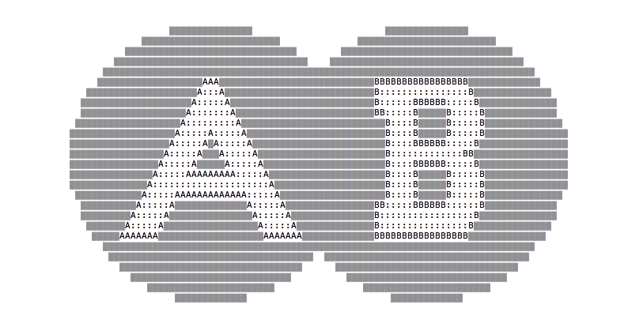
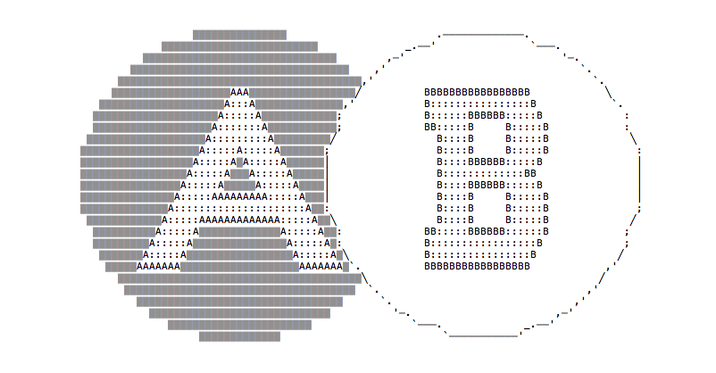

A Set is a collection of values. You can iterate over those values, add new values, remove values and clear the set, get the set size, and check if the set contains an item. A value in the set might only be stored once, duplicates are not possible.

## First implementation

Here is a simple implementation of the set, not yet concurrency safe, without locking resources for the benefit of simplicity and understanding. I'll add locking later in the article.

Notice the second line, which allows us to use the Set for any type we want, by [generating a specific implementation of this generic data structure](/golang-generic-generate/).

> `set.go`

```go
// Package set creates a ItemSet data structure for the Item type
package set

import "github.com/cheekybits/genny/generic"

// Item the type of the Set
type Item generic.Type

// ItemSet the set of Items
type ItemSet struct {
    items map[Item]bool
}

// Add adds a new element to the Set. Returns a pointer to the Set.
func (s *ItemSet) Add(t Item) *ItemSet {
    if s.items == nil {
        s.items = make(map[Item]bool)
    }
    _, ok := s.items[t]
    if !ok {
        s.items[t] = true
    }
    return s
}

// Clear removes all elements from the Set
func (s *ItemSet) Clear() {
    s.items = make(map[Item]bool)
}

// Delete removes the Item from the Set and returns Has(Item)
func (s *ItemSet) Delete(item Item) bool {
    _, ok := s.items[item]
    if ok {
        delete(s.items, item)
    }
    return ok
}

// Has returns true if the Set contains the Item
func (s *ItemSet) Has(item Item) bool {
    _, ok := s.items[item]
    return ok
}

// Items returns the Item(s) stored
func (s *ItemSet) Items() []Item {
    items := []Item{}
    for i := range s.items {
        items = append(items, i)
    }
    return items
}

// Size returns the size of the set
func (s *ItemSet) Size() int {
    return len(s.items)
}
```

## Testing the implementation

Here is the test suite for the above code, which explains how to use it in detail, and the expected results for any operation:

> `set_test.go`

```go
package set

import (
    "fmt"
    "testing"
)

func populateSet(count int, start int) *ItemSet {
    set := ItemSet{}
    for i := start; i < (start + count); i++ {
        set.Add(fmt.Sprintf("item%d", i))
    }
    return &set
}

func TestAdd(t *testing.T) {
    set := populateSet(3, 0)
    if size := set.Size(); size != 3 {
        t.Errorf("wrong count, expected 3 and got %d", size)
    }
    set.Add("item1") //should not add it, already there
    if size := set.Size(); size != 3 {
        t.Errorf("wrong count, expected 3 and got %d", size)
    }
    set.Add("item4") //should not add it, already there
    if size := set.Size(); size != 4 {
        t.Errorf("wrong count, expected 4 and got %d", size)
    }
}

func TestClear(t *testing.T) {
    set := populateSet(3, 0)
    set.Clear()
    if size := set.Size(); size != 0 {
        t.Errorf("wrong count, expected 0 and got %d", size)
    }
}

func TestDelete(t *testing.T) {
    set := populateSet(3, 0)
    set.Delete("item2")
    if size := set.Size(); size != 2 {
        t.Errorf("wrong count, expected 2 and got %d", size)
    }
}

func TestHas(t *testing.T) {
    set := populateSet(3, 0)
    has := set.Has("item2")
    if !has {
        t.Errorf("expected item2 to be there")
    }
    set.Delete("item2")
    has = set.Has("item2")
    if has {
        t.Errorf("expected item2 to be removed")
    }
    set.Delete("item1")
    has = set.Has("item1")
    if has {
        t.Errorf("expected item1 to be removed")
    }
}

func TestItems(t *testing.T) {
    set := populateSet(3, 0)
    items := set.Items()
    if len(items) != 3 {
        t.Errorf("wrong count, expected 3 and got %d", len(items))
    }
    set = populateSet(520, 0)
    items = set.Items()
    if len(items) != 520 {
        t.Errorf("wrong count, expected 520 and got %d", len(items))
    }
}

func TestSize(t *testing.T) {
    set := populateSet(3, 0)
    items := set.Items()
    if len(items) != set.Size() {
        t.Errorf("wrong count, expected %d and got %d", set.Size(), len(items))
    }
    set = populateSet(0, 0)
    items = set.Items()
    if len(items) != set.Size() {
        t.Errorf("wrong count, expected %d and got %d", set.Size(), len(items))
    }
    set = populateSet(10000, 0)
    items = set.Items()
    if len(items) != set.Size() {
        t.Errorf("wrong count, expected %d and got %d", set.Size(), len(items))
    }
}
```

## Concurrency safe version

The first version is not concurrency safe because a routine might add an item to the set while another routine is getting the list of items, or the size.

The following code adds a `sync.RWMutex` to the data structure, making it concurrency safe. The above tests are running fine without any modification to this implementation as well.

The implementation is very simple and we're good with adding a lock and unlocking with a `defer`. Since we'll generate the code for specific implementations which might be more than one in the same file, we need to either add the lock inside the struct, or add the generic type into the lock name (`Itemlock`). I chose the first option:

> `set.go`

```go
// Package set creates a ItemSet data structure for the Item type
package set

import (
    "sync"

    "github.com/cheekybits/genny/generic"
)

// Item the type of the Set
type Item generic.Type

// ItemSet the set of Items
type ItemSet struct {
    items map[Item]bool
    lock  sync.RWMutex
}

// Add adds a new element to the Set. Returns a pointer to the Set.
func (s *ItemSet) Add(t Item) *ItemSet {
    s.lock.Lock()
    defer s.lock.Unlock()
    if s.items == nil {
        s.items = make(map[Item]bool)
    }
    _, ok := s.items[t]
    if !ok {
        s.items[t] = true
    }
    return s
}

// Clear removes all elements from the Set
func (s *ItemSet) Clear() {
    s.lock.Lock()
    defer s.lock.Unlock()
    s.items = make(map[Item]bool)
}

// Delete removes the Item from the Set and returns Has(Item)
func (s *ItemSet) Delete(item Item) bool {
    s.lock.Lock()
    defer s.lock.Unlock()
    _, ok := s.items[item]
    if ok {
        delete(s.items, item)
    }
    return ok
}

// Has returns true if the Set contains the Item
func (s *ItemSet) Has(item Item) bool {
	s.lock.RLock()
	defer s.lock.RUnlock()
    _, ok := s.items[item]
    return ok
}

// Items returns the Item(s) stored
func (s *ItemSet) Items() []Item {
	s.lock.RLock()
	defer s.lock.RUnlock()
    items := []Item{}
    for i := range s.items {
        items = append(items, i)
    }
    return items
}

// Size returns the size of the set
func (s *ItemSet) Size() int {
	s.lock.RLock()
	defer s.lock.RUnlock()
    return len(s.items)
}
```

## Creating a concrete set data structure

Install [`genny`](https://github.com/cheekybits/genny) if you don't have it already.

Run

```bash
//generate a `StringSet` set of `string`s
genny -in set.go -out set-string.go gen "Iten=string Value=int"

//generate a `IntSet` set of `int`s
genny -in set.go -out set-int.go gen "Item=int"
```

Here's an example of the `set-string.go` generated file:

```go
// This file was automatically generated by genny.
// Any changes will be lost if this file is regenerated.
// see https://github.com/cheekybits/genny

// Package set creates a StringSet data structure for the string type
package set

import "sync"

// StringSet the set of Strings
type StringSet struct {
    items map[string]bool
    lock  sync.RWMutex
}

// Add adds a new element to the Set. Returns a pointer to the Set.
func (s *StringSet) Add(t string) *StringSet {
    s.lock.Lock()
    defer s.lock.Unlock()
    if s.items == nil {
        s.items = make(map[string]bool)
    }
    _, ok := s.items[t]
    if !ok {
        s.items[t] = true
    }
    return s
}

// Clear removes all elements from the Set
func (s *StringSet) Clear() {
    s.lock.Lock()
    defer s.lock.Unlock()
    s.items = make(map[string]bool)
}

// Delete removes the string from the Set and returns Has(string)
func (s *StringSet) Delete(item string) bool {
    s.lock.Lock()
    defer s.lock.Unlock()
    _, ok := s.items[item]
    if ok {
        delete(s.items, item)
    }
    return ok
}

// Has returns true if the Set contains the string
func (s *StringSet) Has(item string) bool {
	s.lock.RLock()
	defer s.lock.RUnlock()
    _, ok := s.items[item]
    return ok
}

// Strings returns the string(s) stored
func (s *StringSet) Strings() []string {
	s.lock.RLock()
	defer s.lock.RUnlock()
    items := []string{}
    for i := range s.items {
        items = append(items, i)
    }
    return items
}

// Size returns the size of the set
func (s *StringSet) Size() int {
	s.lock.RLock()
	defer s.lock.RUnlock()
    return len(s.items)
}

// Package set creates a IntSet data structure for the int type

// IntSet the set of Ints
type IntSet struct {
    items map[int]bool
    lock  sync.RWMutex
}

// Add adds a new element to the Set. Returns a pointer to the Set.
func (s *IntSet) Add(t int) *IntSet {
    s.lock.Lock()
    defer s.lock.Unlock()
    if s.items == nil {
        s.items = make(map[int]bool)
    }
    _, ok := s.items[t]
    if !ok {
        s.items[t] = true
    }
    return s
}

// Clear removes all elements from the Set
func (s *IntSet) Clear() {
    s.lock.Lock()
    defer s.lock.Unlock()
    s.items = make(map[int]bool)
}

// Delete removes the int from the Set and returns Has(int)
func (s *IntSet) Delete(item int) bool {
    s.lock.Lock()
    defer s.lock.Unlock()
    _, ok := s.items[item]
    if ok {
        delete(s.items, item)
    }
    return ok
}

// Has returns true if the Set contains the int
func (s *IntSet) Has(item int) bool {
	s.lock.RLock()
	defer s.lock.RUnlock()
    _, ok := s.items[item]
    return ok
}

// Ints returns the int(s) stored
func (s *IntSet) Ints() []int {
	s.lock.RLock()
	defer s.lock.RUnlock()
    items := []int{}
    for i := range s.items {
        items = append(items, i)
    }
    return items
}

// Size returns the size of the set
func (s *IntSet) Size() int {
	s.lock.RLock()
	defer s.lock.RUnlock()
    return len(s.items)
}
```

## Add more Set operations

Our Set is an interesting data structure at this point, but it can be improved a lot more by implementing some common mathematical set operations: `union`, `intersection`, `difference` and `subset`.

### Union



```go
// Union returns a new set with elements from both
// the given sets
func (s *ItemSet) Union(s2 *ItemSet) *ItemSet {
	s3 := ItemSet{}
	s3.items = make(map[Item]bool)
	s.lock.RLock()
	for i := range s.items {
		s3.items[i] = true
	}
	s.lock.RUnlock()
	s2.lock.RLock()
	for i := range s2.items {
		_, ok := s3.items[i]
		if !ok {
			s3.items[i] = true
		}
	}
	s2.lock.RUnlock()
	return &s3
}
```

#### Test

```go

func TestUnion(t *testing.T) {
    set1 := populateSet(3, 0)
    set2 := populateSet(2, 3)

    set3 := set1.Union(set2)

    if len(set3.Items()) != 5 {
        t.Errorf("wrong count, expected 5 and got %d", set3.Size())
    }
    //don't edit original sets
    if len(set1.Items()) != 3 {
        t.Errorf("wrong count, expected 3 and got %d", set1.Size())
    }
    if len(set2.Items()) != 2 {
        t.Errorf("wrong count, expected 2 and got %d", set2.Size())
    }
}
```

### Intersection


```go
// Intersection returns a new set with elements that exist in
// both sets
func (s *ItemSet) Intersection(s2 *ItemSet) *ItemSet {
	s3 := ItemSet{}
	s3.items = make(map[Item]bool)
	s.lock.RLock()
	s2.lock.RLock()
	defer s.lock.RUnlock()
	defer s2.lock.RUnlock()
	for i := range s2.items {
		_, ok := s.items[i]
		if ok {
			s3.items[i] = true
		}
	}
	return &s3
}
```

#### Test

```go
func TestIntersection(t *testing.T) {
    set1 := populateSet(3, 0)
    set2 := populateSet(2, 0)

    set3 := set1.Intersection(set2)

    if len(set3.Items()) != 2 {
        t.Errorf("wrong count, expected 2 and got %d", set3.Size())
    }
    //don't edit original sets
    if len(set1.Items()) != 3 {
        t.Errorf("wrong count, expected 3 and got %d", set1.Size())
    }
    if len(set2.Items()) != 2 {
        t.Errorf("wrong count, expected 2 and got %d", set2.Size())
    }
}
```

### Difference




```go
// Difference returns a new set with all the elements that
// exist in the first set and don't exist in the second set
func (s *ItemSet) Difference(s2 *ItemSet) *ItemSet {
	s3 := ItemSet{}
	s3.items = make(map[Item]bool)
	s.lock.RLock()
	s2.lock.RLock()
	defer s.lock.RUnlock()
	defer s2.lock.RUnlock()
	for i := range s.items {
		_, ok := s2.items[i]
		if !ok {
			s3.items[i] = true
		}
	}
	return &s3
}
```

#### Test

```go
func TestDifference(t *testing.T) {
    set1 := populateSet(3, 0)
    set2 := populateSet(2, 0)

    set3 := set1.Difference(set2)

    if len(set3.Items()) != 1 {
        t.Errorf("wrong count, expected 2 and got %d", set3.Size())
    }
    //don't edit original sets
    if len(set1.Items()) != 3 {
        t.Errorf("wrong count, expected 3 and got %d", set1.Size())
    }
    if len(set2.Items()) != 2 {
        t.Errorf("wrong count, expected 2 and got %d", set2.Size())
    }
}
```

### Subset


```go
// Subset returns true if s is a subset of s2
func (s *ItemSet) Subset(s2 *ItemSet) bool {
	s.lock.RLock()
	s2.lock.RLock()
	defer s.lock.RUnlock()
	defer s2.lock.RUnlock()
	for i := range s.items {
		_, ok := s2.items[i]
		if !ok {
			return false
		}
	}
	return true
}
```

#### Test

```go
func TestSubset(t *testing.T) {
	set1 := populateSet(3, 0)
	set2 := populateSet(2, 0)

	if set1.Subset(set2) {
		t.Errorf("expected false and got true")
	}

	//don't edit original sets
	if len(set1.Items()) != 3 {
		t.Errorf("wrong count, expected 3 and got %d", set1.Size())
	}
	if len(set2.Items()) != 2 {
		t.Errorf("wrong count, expected 2 and got %d", set2.Size())
	}

	//try real subsets
	set1 = populateSet(2, 0)
	if !set1.Subset(set2) {
		t.Errorf("expected true and got false")
	}

	set1 = populateSet(1, 0)
	if !set1.Subset(set2) {
		t.Errorf("expected true and got false")
	}
}
```
