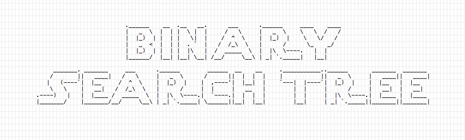
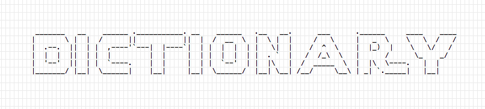
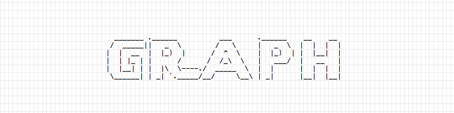
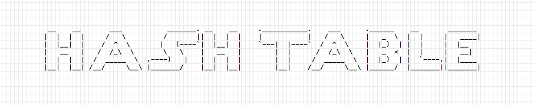
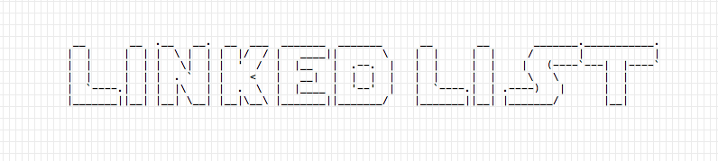
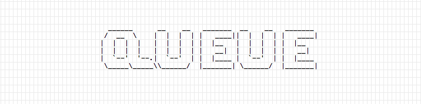
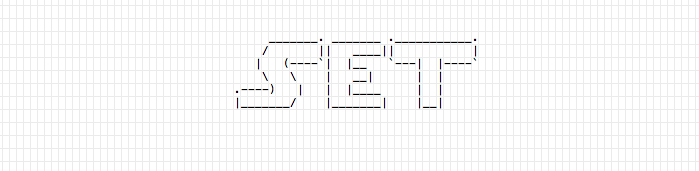
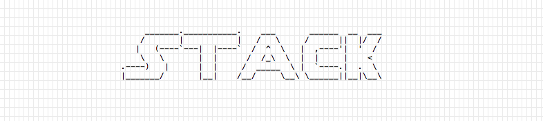

This week, in various articles on this blog, I posted an analysis and implementation of the classic data structures using Go.

Each data structure is described in a separate post, and this post acts as an index.

Data structures covered, in alphabetical order:

## [Binary Search Tree](/golang-data-structure-binary-search-tree)

## [Dictionary](/golang-data-structure-dictionary)

## [Graph](/golang-data-structure-graph)

## [Hash Table](/golang-data-structure-hashtable)

## [Linked List](/golang-data-structure-linked-list)

## [Queue](/golang-data-structure-queue)

## [Set](/golang-data-structure-set)

## [Stack](/golang-data-structure-stack)

