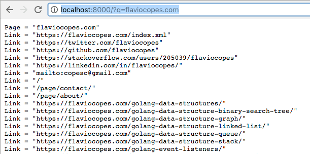

<!-- TOC -->

- [Intro](#intro)
- [Install](#install)
- [The Go official images](#the-go-official-images)
- [An example app](#an-example-app)
- [Moving the app to Docker](#moving-the-app-to-docker)
- [Trim the Docker image](#trim-the-docker-image)
- [Multi-stage builds](#multi-stage-builds)

<!-- /TOC -->

## Intro

If you've never heard about Docker, but that's unlikely, the first thing you should know is that Docker allows you to run applications in isolation and with a great separation of concerns, yet allows them to communicate and interact with the external world.

And you should know that everyone uses it, and every major cloud provider has a solution dedicated to running containers, so you should learn it!

## Install

Installation changes depending on your system, so check <https://www.docker.com/get-docker>.

I assume you already installed Docker and have the `docker` command available in your shell.

## The Go official images

Docker maintains a list of official images for many different languages, and Go is no exception, being it part of the original [official images launch](https://blog.docker.com/2014/09/docker-hub-official-repos-announcing-language-stacks/) back in 2014.

The official image repository can be found at <https://hub.docker.com/_/golang/>. There are many tags that identify both the Go version, and the operating system you want to fetch.

## An example app

As an example, I'm going to deploy a little Go app in a Docker container. It listens on port 8000, gets a webpage as a `q` query parameter, fetches it and prints the links it finds:

> findlinks.go

```go
package main

import (
	"fmt"
	"log"
	"net/http"

	"golang.org/x/net/html"
)

func main() {
	http.HandleFunc("/", handler)
	log.Fatal(http.ListenAndServe("0.0.0.0:8000", nil))
}

func handler(w http.ResponseWriter, r *http.Request) {
	url := r.URL.Query().Get("q")
	fmt.Fprintf(w, "Page = %q\n", url)
	if len(url) == 0 {
		return
	}
	page, err := parse("https://" + url)
	if err != nil {
		fmt.Printf("Error getting page %s %s\n", url, err)
		return
	}
	links := pageLinks(nil, page)
	for _, link := range links {
		fmt.Fprintf(w, "Link = %q\n", link)
	}
}

func parse(url string) (*html.Node, error) {
	fmt.Println(url)
	r, err := http.Get(url)
	if err != nil {
		return nil, fmt.Errorf("Cannot get page")
	}
	b, err := html.Parse(r.Body)
	if err != nil {
		return nil, fmt.Errorf("Cannot parse page")
	}
	return b, err
}

func pageLinks(links []string, n *html.Node) []string {
	if n.Type == html.ElementNode && n.Data == "a" {
		for _, a := range n.Attr {
			if a.Key == "href" {
				links = append(links, a.Val)
			}
		}
	}
	for c := n.FirstChild; c != nil; c = c.NextSibling {
		links = pageLinks(links, c)
	}
	return links
}
```

Example usage:



## Moving the app to Docker

I put the app on <https://github.com/flaviocopes/findlinks>.

Using `go get` I can easily download and install it, using `go get github.com/flaviocopes/findlinks`.

Running

```bash
docker run golang go get -v github.com/flaviocopes/findlinks
```

will first download the `golang` Docker image, if you don't have it already, then it will fetch the repository and will scan for additional dependencies not included in the standard library. In this case, `golang.org/x/net/html`.

```bash
$ docker run golang go get -v github.com/flaviocopes/findlinks
github.com/flaviocopes/findlinks (download)
Fetching https://golang.org/x/net/html?go-get=1
Parsing meta tags from https://golang.org/x/net/html?go-get=1 (status code 200)
get "golang.org/x/net/html": found meta tag main.metaImport{Prefix:"golang.org/x/net", VCS:"git", RepoRoot:"https://go.googlesource.com/net"} at https://golang.org/x/net/html?go-get=1
get "golang.org/x/net/html": verifying non-authoritative meta tag
Fetching https://golang.org/x/net?go-get=1
Parsing meta tags from https://golang.org/x/net?go-get=1 (status code 200)
golang.org/x/net (download)
golang.org/x/net/html/atom
golang.org/x/net/html
github.com/flaviocopes/findlinks
```

This command creates a container, and runs it. We can inspect it using `docker ps -l` (the `-l` option tells Docker to list the latest container ran):

```bash
CONTAINER ID        IMAGE               COMMAND                  CREATED             STATUS                     PORTS               NAMES
343d96441f16        golang              "go get -v github...."   3 minutes ago       Exited (0) 2 minutes ago                       mystifying_swanson
```

The container exited when the `go get` command completed.

Docker just built an on demand image and ran it; to run it again, we would need to repeat the process, but images help us: let's now create an image from this container, so we can run it later:

```bash
docker commit $(docker ps -lq) findlinks
```

The above command gets the last container ID using `docker ps -lq`, and commits the image.
The image has now been installed, as you can check using `docker images findlinks`:

```bash
$ docker images findlinks
REPOSITORY          TAG                 IMAGE ID            CREATED             SIZE
findlinks           latest              4e7ebb87d02e        11 seconds ago      720MB
```

We can run the `findlinks` command on our `findlinks` image with

```bash
docker run -p 8000:8000 findlinks findlinks
```

That's it! Our app will now respond on `http://192.168.99.100:8000/`, where `192.168.99.100` is the IP address of the Docker container.

You can test calling `http://192.168.99.100:8000/?q=flaviocopes.com`, which will print the same output we had when we run the app locally:

```text
Page = "flaviocopes.com"
Link = "https://flaviocopes.com/index.xml"
Link = "https://twitter.com/flaviocopes"
Link = "https://github.com/flaviocopes"
Link = "https://stackoverflow.com/users/205039/flaviocopes"
Link = "https://linkedin.com/in/flaviocopes/"
Link = "mailto:copesc@gmail.com"
Link = "/"
Link = "/page/contact/"
Link = "/page/about/"
Link = "https://flaviocopes.com/golang-tutorial-rest-api/"
Link = "https://flaviocopes.com/golang-environment-variables/"
Link = "https://flaviocopes.com/golang-sql-database/"
Link = "https://flaviocopes.com/golang-is-go-object-oriented/"
Link = "https://flaviocopes.com/golang-comparing-values/"
Link = "https://flaviocopes.com/golang-data-structures/"
Link = "https://flaviocopes.com/golang-data-structure-binary-search-tree/"
Link = "https://flaviocopes.com/golang-data-structure-graph/"
Link = "https://flaviocopes.com/golang-data-structure-linked-list/"
Link = "https://flaviocopes.com/golang-data-structure-queue/"
Link = "https://flaviocopes.com/golang-data-structure-stack/"
Link = "https://flaviocopes.com/golang-event-listeners/"
```

## Trim the Docker image

> This strategy is now deprecated in favor of [multi-stage builds](#multi-stage-builds)

The problem with the above result is, **the image is huge**: 720MB for this simple program is not really acceptable, keep in mind this is a very simple scenario. We might want to deploy thousands of instances of the application, and this size is not going to work.

Why is the image this big? Because what happens is that the Go app is compiled inside the container. So the image needs to have a Go compiler installed. And everything needed by the compiler of course, GCC, and a whole Linux distribution (Debian Jessie). It downloads Go and installs it, compiles the app and runs it.

It's all so fast we don't even realize. But we can do better. How? I apply what I learned on [Building Minimal Docker Containers for Go Applications](https://blog.codeship.com/building-minimal-docker-containers-for-go-applications/) by [Nick Gauthier](https://twitter.com/ngauthier)

We tell Docker to run the `golang:1.8.3` image and _statically compile_ our application, disabling CGO, which means the image doesn't even need the C libraries it normally needs to access when dynamically linked, using:

```bash
docker run --rm -it -v "$GOPATH":/gopath -v "$(pwd)":/app -e "GOPATH=/gopath" -w /app golang:1.8.3 sh -c 'CGO_ENABLED=0 go build -a --installsuffix cgo --ldflags="-s" -o findlinks'
```

We now have a `findlinks` binary in the folder:

```bash
$ ll
.rw-r--r--   77 flavio 17 Aug 18:57 Dockerfile
.rwxr-xr-x 4.2M flavio 17 Aug 19:13 findlinks
.rw-r--r-- 1.1k flavio 12 Aug 18:10 findlinks.go

$ file findlinks
findlinks: ELF 64-bit LSB executable, x86-64, version 1 (SYSV), statically linked, stripped
```

Notice that this of course is not the same file that I get if I `go build` on OSX, it's a linux-ready binary:

```bash
$ file findlinks
findlinks: Mach-O 64-bit executable x86_64
```

We then create a Dockerfile, telling Docker to use [iron/base](https://github.com/iron-io/dockers), a very light image:

```Dockerfile
FROM iron/base
WORKDIR /app
COPY findlinks /app/
ENTRYPOINT ["./findlinks"]
```

We can now build the image, tagging it `flaviocopes/golang-docker-example-findlinks`:

```bash
docker build -t flaviocopes/golang-docker-example-findlinks .
```

and run it:

```bash
docker run --rm -it -p 8000:8000 flaviocopes/golang-docker-example-findlinks
```

The output is the same as before, but this time the image is not 720MB, but just 11.1MB

```text
REPOSITORY                                    TAG                 IMAGE ID            CREATED             SIZE
flaviocopes/golang-docker-example-findlinks   latest              f32d2fd74638        14 minutes ago      11.1MB
findlinks                                     latest              c60f6792b9f3        20 minutes ago      720MB
```

## Multi-stage builds

> This section was added thanks to Reddit comments pointing me to multi-stage builds, a recent addition to `Docker 17.05`

[Multi-stage builds](https://docs.docker.com/engine/userguide/eng-image/multistage-build/) allow us to have a lightweight image very easily, without the need to compile the binary and then run it separately. This is the Dockerfile to put in the app:

```text
FROM golang:1.8.3 as builder
WORKDIR /go/src/github.com/flaviocopes/findlinks
RUN go get -d -v golang.org/x/net/html
COPY findlinks.go  .
RUN CGO_ENABLED=0 GOOS=linux go build -a -installsuffix cgo -o findlinks .

FROM alpine:latest
RUN apk --no-cache add ca-certificates
WORKDIR /root/
COPY --from=builder /go/src/github.com/flaviocopes/findlinks/findlinks .
CMD ["./findlinks"]
```

Run

```bash
$ docker build -t flaviocopes/golang-docker-example-findlinks .
```

which builds a lightweight (10.8MB) image:

```
$ docker images
REPOSITORY                                    TAG                 IMAGE ID            CREATED             SIZE
flaviocopes/golang-docker-example-findlinks   latest              aa2081ca7016        12 seconds ago      10.8MB
```

Run the image with

```
$ docker run --rm -it -p 8000:8000 flaviocopes/golang-docker-example-findlinks
```

