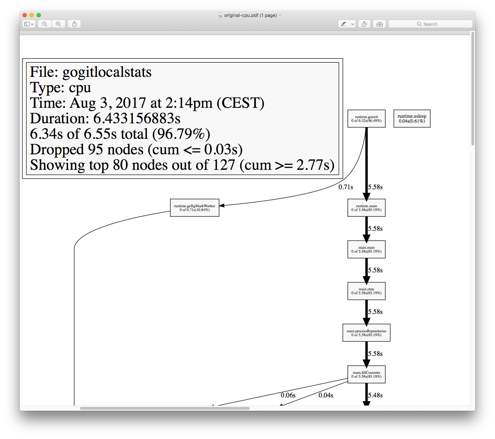
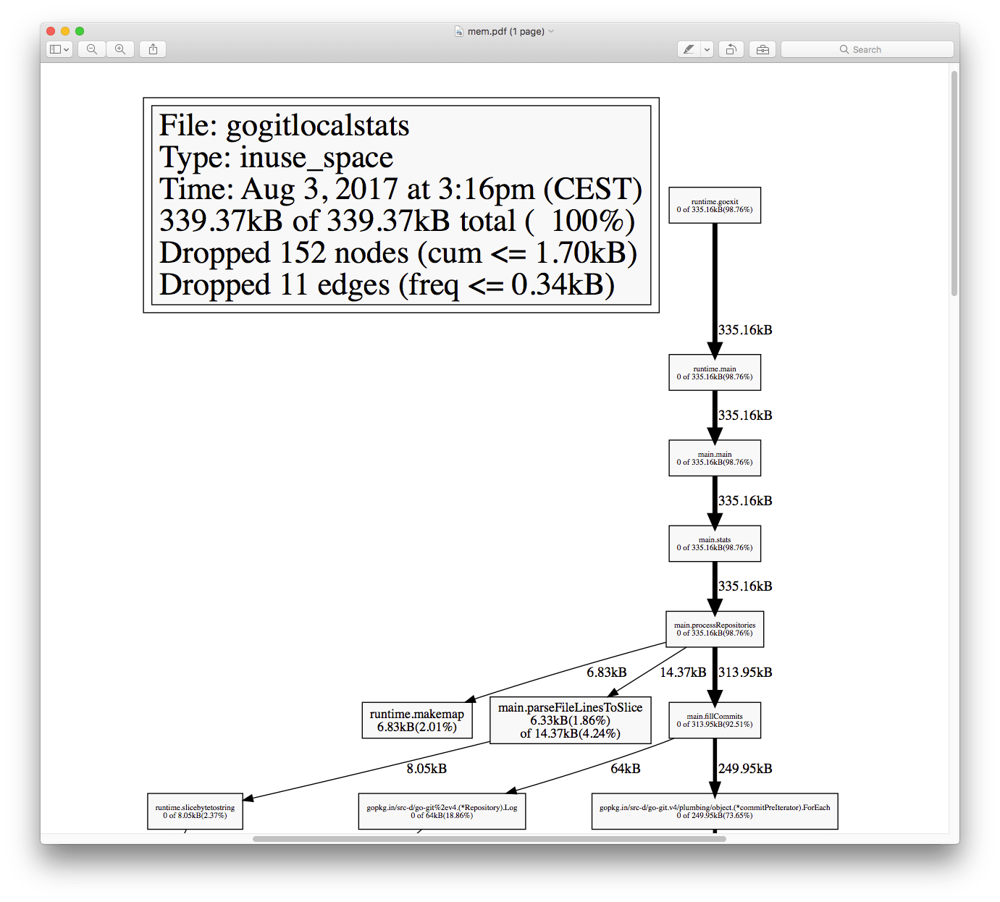

The Go ecosystem provides a very easy way to profile your applications.

I'll explain profiling using a package by Dave Cheney which makes programs very easy to debug, by adding a one-liner to our `main()`.

All you need to get started is follow these X easy steps.

## CPU Profiling

### Step #1: download `github.com/pkg/profile`

Can't be simpler than running

```bash
go get github.com/pkg/profile
```

and you're done.

### Step #2: add profiling into the `main()` function of your command

```go
package main

import (
    //...
	"github.com/pkg/profile"
)

func main() {
	// CPU profiling by default
	defer profile.Start().Stop()

    //...
}
```

### Step #3: build and run your program

This will generate a `*.pprof` file in a temp folder, and tell you where it's located (will be needed later)

```
2017/08/03 14:26:28 profile: cpu profiling enabled, /var/...../cpu.pprof
```

### Step #4: install `graphviz` if you don't have it installed yet

This is used to generate the graph on a pdf.
On a Mac, it's a simple `brew install graphviz`. Refer to <https://www.graphviz.org> for other platforms.

### Step #5: run `go tool pprof`

Pass your binary location, and the location of the `cpu.pprof` file as returned when running your program.

You can generate the analysis in various formats. The PDF one is pretty amazing:

```bash
go tool pprof --pdf ~/go/bin/yourbinary /var/path/to/cpu.pprof > file.pdf
```



You can generate other kind of visualizations as well, e.g. `txt`:

```bash
go tool pprof --txt ~/go/bin/yourbinary /var/path/to/cpu.pprof > file.txt
```

## Memory profiling

Memory profiling is essentially the same as CPU profiling, but instead of using the default configuration for `profile.Start()`, we pass a `profile.MemProfile` flag:

```go
defer profile.Start(profile.MemProfile).Stop()
```

thus the code becomes

```go
package main

import (
    //...
	"github.com/pkg/profile"
)

func main() {
	// Memory profiling
	defer profile.Start(profile.MemProfile).Stop()

    //...
}
```

and when running the program, it will generate a `mem.pprof` file instead of `cpu.pprof`.



## Read more about profiling Go apps

This is just a start. Read more at:

- <https://blog.golang.org/profiling-go-programs>
- Lower level: <https://golang.org/pkg/runtime/pprof/>
- More options for advanced usage of `github.com/pkg/profile` <http://godoc.org/github.com/pkg/profile>