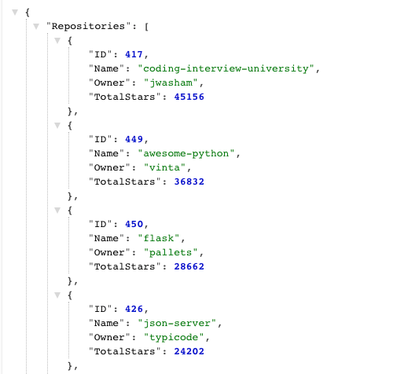
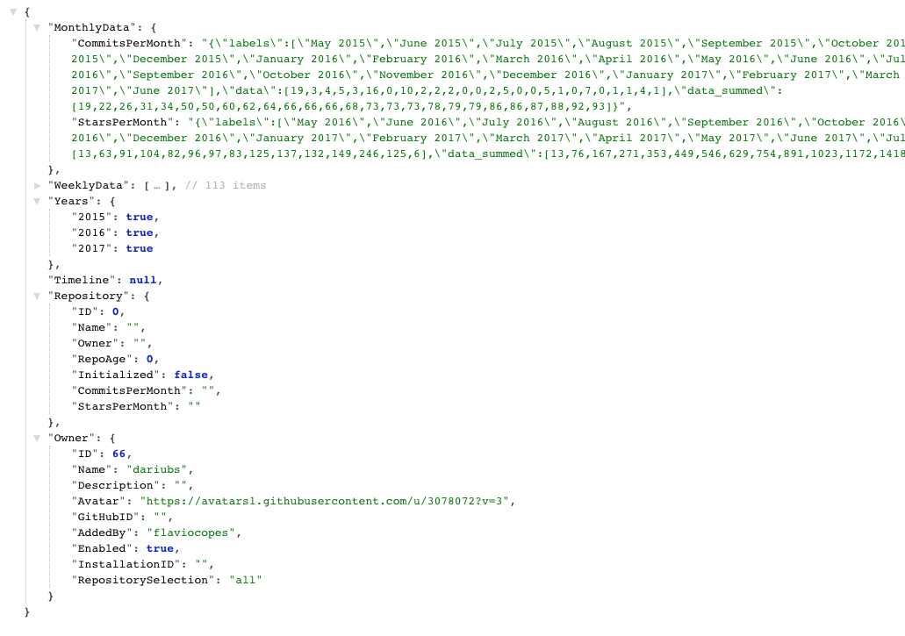
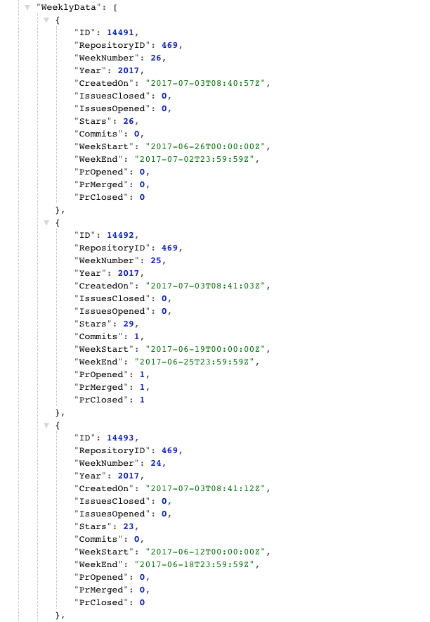
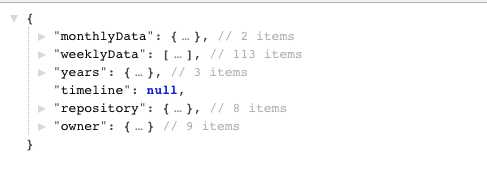

In this tutorial I'm going to illustrate how to serve a JSON API using Go. I'll create a basic backend for a Vue.js application that will serve data already present in a PostgreSQL database.

<!-- TOC -->

- [Introduction the problem I want to solve](#introduction-the-problem-i-want-to-solve)
- [The existing database structure](#the-existing-database-structure)
- [Simple HTTP response handler](#simple-http-response-handler)
- [Connect to PostgreSQL](#connect-to-postgresql)
- [Moving handlers to their own file](#moving-handlers-to-their-own-file)
- [Implementation of the `/api/index` endpoint](#implementation-of-the-apiindex-endpoint)
- [Implementation of the `/api/repo/` endpoint](#implementation-of-the-apirepo-endpoint)
- [Is this proper JSON?](#is-this-proper-json)
- [Wrapping up](#wrapping-up)

<!-- /TOC -->

## Introduction the problem I want to solve

I'll have a single page application written using [Vue](/vue-introduction/) in the browser. This app will list several Git repositories, and when clicking one of them it will show some details I elaborated elsewhere.

The API I'm going to build in this post is read-only (no POST requests).

It will have 2 endpoints:

- `/api/index` will list all the repositories
- `/api/repo/:owner/:name` will show the details of the repo identified by `owner` and `name`.

You can think of owner and name as the usual `github.com` URL structure: `github.com/owner/name`.

I'll hook Go to an existing PostgreSQL database and serve a response based on the parameters passed to the request.

## The existing database structure

The application relies on many tables. For this part, where we extract data from the database, we interact with

- `repositories`: lists the repositories information with some absolute numbers like the number of total stars
- `repositories_weekly_data`: stores what happened in a repo in a single week, aggregating numbers
- `repositories_historic_data`: stores commits and stars information, aggregated per month
- `repositories_timelines`: stores relevant events associated with each repo, like when it reached 10k stars or when it was first created

## Simple HTTP response handler

Let's start by writing a simple HTTP server that handles 2 routes:

```go
package main

import (
    "log"
    "net/http"
)

func main() {
    http.HandleFunc("/api/index", indexHandler)
    http.HandleFunc("/api/repo/", repoHandler)
    log.Fatal(http.ListenAndServe("localhost:8000", nil))
}

func indexHandler(w http.ResponseWriter, r *http.Request) {
    //...
}

func repoHandler(w http.ResponseWriter, r *http.Request) {
    //...
}
```

This code already takes care of parallel processing of requests.

## Connect to PostgreSQL

Let's add a PostgreSQL connection. Learn more about [using a SQL database in Go](/golang-sql-database/) if you are not familiar with the concepts.

I won't use any ORM or external libraries, just plain `database/sql` code.

The connection uses environment variables to get the credentials:

```bash
$ export DBHOST=localhost
$ export DBPORT=5432
$ export DBUSER=you
$ export DBPASS=pass
$ export DBNAME=dbname
```

(tip: if you have an empty password use `export DBPASS="\"\""`)

I introduce the `initDb()` function, which checks if those mandatory environment variables are set, and opens the connection to the database, panicking if something fails.

The `db` package variable contains the connection, and I keep it always open until the program exists.

```go
package main

import (
    "database/sql"
    "fmt"
    "log"
    "net/http"
    "os"

    _ "github.com/lib/pq"
)

var db *sql.DB

const (
    dbhost = "DBHOST"
    dbport = "DBPORT"
    dbuser = "DBUSER"
    dbpass = "DBPASS"
    dbname = "DBNAME"
)

func main() {
    initDb()
    defer db.Close()
    http.HandleFunc("/api/index", indexHandler)
    http.HandleFunc("/api/repo/", repoHandler)
    log.Fatal(http.ListenAndServe("localhost:8000", nil))
}

func indexHandler(w http.ResponseWriter, r *http.Request) {
    //...
}

func repoHandler(w http.ResponseWriter, r *http.Request) {
    //...
}

func initDb() {
    config := dbConfig()
    var err error
    psqlInfo := fmt.Sprintf("host=%s port=%s user=%s "+
        "password=%s dbname=%s sslmode=disable",
        config[dbhost], config[dbport],
        config[dbuser], config[dbpass], config[dbname])

    db, err = sql.Open("postgres", psqlInfo)
    if err != nil {
        panic(err)
    }
    err = db.Ping()
    if err != nil {
        panic(err)
    }
    fmt.Println("Successfully connected!")
}

func dbConfig() map[string]string {
    conf := make(map[string]string)
    host, ok := os.LookupEnv(dbhost)
    if !ok {
        panic("DBHOST environment variable required but not set")
    }
    port, ok := os.LookupEnv(dbport)
    if !ok {
        panic("DBPORT environment variable required but not set")
    }
    user, ok := os.LookupEnv(dbuser)
    if !ok {
        panic("DBUSER environment variable required but not set")
    }
    password, ok := os.LookupEnv(dbpass)
    if !ok {
        panic("DBPASS environment variable required but not set")
    }
    name, ok := os.LookupEnv(dbname)
    if !ok {
        panic("DBNAME environment variable required but not set")
    }
    conf[dbhost] = host
    conf[dbport] = port
    conf[dbuser] = user
    conf[dbpass] = password
    conf[dbname] = name
    return conf
}
```

## Moving handlers to their own file

Since the code will get complicated soon, I want to move the HTTP request handlers to their own file:

> `api/api.go`

```go
//...
import "github.com/flaviocopes/gitometer/api/handlers"
//...
http.HandleFunc("/api/index", handlers.Index)
http.HandleFunc("/api/repo/", handlers.Repo)
//...
```

> `api/index.go`

```go
package handlers

import (
    "net/http"
)

func indexHandler(w http.ResponseWriter, r *http.Request) {
    //....
}
```

> `api/repo.go`

```go
package handlers

import (
    "net/http"
)

func repoHandler(w http.ResponseWriter, r *http.Request) {
    //....
}
```

## Implementation of the `/api/index` endpoint

The `/api/index` endpoint lists all the repositories we have in the database. There is no pagination.

For each repository it returns data that we'll use to print an index of the repositores one can click the details and inspect:

- The **name**
- The **owner**
- The **number of stars** on GitHub

We need to do a query on the `repositories` table, which contains all the data we need, and add the data to the `repositories` struct, which will then be marshaled as JSON and returned to the client.

Here is the code:

```go
package main

import (
	"encoding/json"
	"fmt"
	"net/http"
)

// repository contains the details of a repository
type repositorySummary struct {
	ID         int
	Name       string
	Owner      string
	TotalStars int
}

type repositories struct {
	Repositories []repositorySummary
}

// indexHandler calls `queryRepos()` and marshals the result as JSON
func indexHandler(w http.ResponseWriter, req *http.Request) {
	repos := repositories{}

	err := queryRepos(&repos)
	if err != nil {
		http.Error(w, err.Error(), 500)
		return
	}

	out, err := json.Marshal(repos)
	if err != nil {
		http.Error(w, err.Error(), 500)
		return
	}

	fmt.Fprintf(w, string(out))
}

// queryRepos first fetches the repositories data from the db
func queryRepos(repos *repositories) error {
	rows, err := db.Query(`
		SELECT
			id,
			repository_owner,
			repository_name,
			total_stars
		FROM repositories
		ORDER BY total_stars DESC`)
	if err != nil {
		return err
	}
	defer rows.Close()
	for rows.Next() {
		repo := repositorySummary{}
		err = rows.Scan(
			&repo.ID,
			&repo.Owner,
			&repo.Name,
			&repo.TotalStars,
		)
		if err != nil {
			return err
		}
		repos.Repositories = append(repos.Repositories, repo)
	}
	err = rows.Err()
	if err != nil {
		return err
	}
	return nil
}
```

I can call the endpoint in the browser, and I'll get:



## Implementation of the `/api/repo/` endpoint

In addition to `/api/index`, the app responds to `/api/repo/:owner/:name` requests.

This means it discards any other format of URL request, like `/api/repo` or `/api/repo/:owner` or `/api/repo/1/2/3`. I just want 2 tokens, `owner` and `name`.

Terminating with `/` the first parameter of the `http.HandleFunc()` call causes the handler to be called with URLs starting with `/api/repo/`, not just `/api/repo/` like it does for `/api/index`.

This check is accomplished in `parseParams()`:

```go
// parseParams accepts a req and returns the `num` path tokens found after the `prefix`.
// returns an error if the number of tokens are less or more than expected
func parseParams(req *http.Request, prefix string, num int) ([]string, error) {
    url := strings.TrimPrefix(req.URL.Path, prefix)
    params := strings.Split(url, "/")
    if len(params) != num || len(params[0]) == 0 || len(params[1]) == 0 {
        return nil, fmt.Errorf("Bad format. Expecting exactly %d params", num)
    }
    return params, nil
}
```

Sample usage: `params, err := parseParams(req, "/api/repo/", 2)`.

The full code of the single repo endpoint handler is printed below. Most of it is building the structs that will host the data, and filling them with database calls:

```go
package main

import (
    "database/sql"
    "encoding/json"
    "fmt"
    "net/http"
    "strings"
)

// week represents the summary of a week of activity
// on a repository
type week struct {
    ID           int
    RepositoryID int
    WeekNumber   int
    Year         int
    CreatedOn    string
    IssuesClosed int
    IssuesOpened int
    Stars        int
    Commits      int
    WeekStart    string
    WeekEnd      string
    PrOpened     int
    PrMerged     int
    PrClosed     int
}

// timeline represents important events happened on a
// repository, which will be displayed on the repo timeline
type timeline struct {
    ID           int
    RepositoryID int
    Title        string
    Description  string
    Emoji        string
    Date         string
}

// repository contains the details of a repository
type repository struct {
    ID              int
    Name            string
    Owner           string
    RepoAge         int
    Initialized     bool
    CommitsPerMonth string
    StarsPerMonth   string
    TotalStars      int
}

// owner contains the details of an owner or a repo
type owner struct {
    ID                  int
    Name                string
    Description         string
    Avatar              string
    GitHubID            string
    AddedBy             string
    Enabled             bool
    InstallationID      string
    RepositorySelection string
}

// repoData contains the aggregate repository data returned
// by the API call
type repoData struct {
    MonthlyData monthlyData
    WeeklyData  []week
    Years       map[int]bool
    Timeline    []timeline
    Repository  repository
    Owner       owner
}

// monthlyData contains the monthly activity of a repo
type monthlyData struct {
    CommitsPerMonth string
    StarsPerMonth   string
}

// Error handling types

type errRepoNotInitialized string

func (e errRepoNotInitialized) Error() string {
    return string(e)
}

type errRepoNotFound string

func (e errRepoNotFound) Error() string {
    return string(e)
}

// parseParams accepts a req and returns the `num` path tokens found after the `prefix`.
// returns an error if the number of tokens are less or more than expected
func parseParams(req *http.Request, prefix string, num int) ([]string, error) {
    url := strings.TrimPrefix(req.URL.Path, prefix)
    params := strings.Split(url, "/")
    if len(params) != num || len(params[0]) == 0 || len(params[1]) == 0 {
        return nil, fmt.Errorf("Bad format. Expecting exactly %d params", num)
    }
    return params, nil
}

// repoHandler processes the response by parsing the params, then calling
// `query()`, and marshaling the result in JSON format, sending it to
// `http.ResponseWriter`.
func repoHandler(w http.ResponseWriter, req *http.Request) {
    repo := repository{}
    params, err := parseParams(req, "/api/repo/", 2)
    if err != nil {
        http.Error(w, err.Error(), http.StatusUnauthorized)
        return
    }
    repo.Owner = params[0]
    repo.Name = params[1]

    data, err := queryRepo(&repo)
    if err != nil {
        switch err.(type) {
        case errRepoNotFound:
            http.Error(w, err.Error(), 404)
        case errRepoNotInitialized:
            http.Error(w, err.Error(), 401)
        default:
            http.Error(w, err.Error(), 500)
        }
        return
    }

    out, err := json.Marshal(data)
    if err != nil {
        http.Error(w, err.Error(), 500)
        return
    }

    fmt.Fprintf(w, string(out))
}

// queryRepo first fetches the repository, and if nothing is wrong
// it returns the result of fetchData()
func queryRepo(repo *repository) (*repoData, error) {
    err := fetchRepo(repo)
    if err != nil {
        return nil, err
    }

    return fetchData(repo)
}

// fetchData calls utility functions to collect data from
// the database, builds and returns the `RepoData` value
func fetchData(repo *repository) (*repoData, error) {
    data := repoData{}
    err := fetchMonthlyData(repo, &data)
    if err != nil {
        return nil, err
    }
    err = fetchWeeklyData(repo, &data)
    if err != nil {
        return nil, err
    }
    err = fetchYearlyData(repo, &data)
    if err != nil {
        return nil, err
    }
    err = fetchTimelineData(repo, &data)
    if err != nil {
        return nil, err
    }
    err = fetchOwnerData(repo, &data)
    if err != nil {
        return nil, err
    }
    return &data, nil
}

// fetchRepo given a Repository value with name and owner of the repo
// fetches more details from the database and fills the value with more
// data
func fetchRepo(repo *repository) error {
    if len(repo.Name) == 0 {
        return fmt.Errorf("Repository name not correctly set")
    }
    if len(repo.Owner) == 0 {
        return fmt.Errorf("Repository owner not correctly set")
    }
    sqlStatement := `
        SELECT
            id,
            initialized,
            repository_created_months_ago
        FROM repositories
        WHERE repository_owner=$1 and repository_name=$2
        LIMIT 1;`
    row := db.QueryRow(sqlStatement, repo.Owner, repo.Name)
    err := row.Scan(&repo.ID, &repo.Initialized, &repo.RepoAge)
    if err != nil {
        switch err {
        case sql.ErrNoRows:
            //locally handle SQL error, abstract for caller
            return errRepoNotFound("Repository not found")
        default:
            return err
        }
    }
    if !repo.Initialized {
        return errRepoNotInitialized("Repository not initialized")
    }
    if repo.RepoAge < 3 {
        return errRepoNotInitialized("Repository not initialized")
    }
    return nil
}

// fetchOwnerData given a Repository object with the `Owner` value
// it fetches information about it from the database
func fetchOwnerData(repo *repository, data *repoData) error {
    if len(repo.Owner) == 0 {
        return fmt.Errorf("Repository owner not correctly set")
    }
    sqlStatement := `
        SELECT
            id,
            name,
            COALESCE(description, ''),
            COALESCE(avatar_url, ''),
            COALESCE(github_id, ''),
            added_by,
            enabled,
            COALESCE(installation_id, ''),
            repository_selection
        FROM organizations
        WHERE name=$1
        ORDER BY id DESC LIMIT 1;`
    row := db.QueryRow(sqlStatement, repo.Owner)
    err := row.Scan(&data.Owner.ID,
        &data.Owner.Name,
        &data.Owner.Description,
        &data.Owner.Avatar,
        &data.Owner.GitHubID,
        &data.Owner.AddedBy,
        &data.Owner.Enabled,
        &data.Owner.InstallationID,
        &data.Owner.RepositorySelection)
    if err != nil {
        return err
    }
    return nil
}

// fetchMonthlyData given a repository ID, it fetches the monthly
// data information
func fetchMonthlyData(repo *repository, data *repoData) error {
    if repo.ID == 0 {
        return fmt.Errorf("Repository ID not correctly set")
    }
    data.MonthlyData = monthlyData{}
    sqlStatement := `
        SELECT
            commits_per_month,
            stars_per_month
        FROM repositories_historic_data
        WHERE repository_id=$1
        ORDER BY id DESC LIMIT 1;`
    row := db.QueryRow(sqlStatement, repo.ID)
    err := row.Scan(
        &data.MonthlyData.CommitsPerMonth,
        &data.MonthlyData.StarsPerMonth)
    if err != nil {
        return err
    }

    return nil
}

// fetchWeeklyData given a repository ID, it fetches the weekly
// data information
func fetchWeeklyData(repo *repository, data *repoData) error {
    if repo.ID == 0 {
        return fmt.Errorf("Repository ID not correctly set")
    }
    rows, err := db.Query(`
        SELECT
            id,
            repository_id,
            week_number,
            year,
            created_on,
            issues_closed,
            issues_opened,
            stars,
            commits,
            week_start,
            week_end,
            pr_opened,
            pr_merged,
            pr_closed
        FROM repositories_weekly_data
        WHERE repository_id=$1
        ORDER BY id ASC`, repo.ID)
    if err != nil {
        return err
    }
    defer rows.Close()
    for rows.Next() {
        week := week{}
        err = rows.Scan(
            &week.ID,
            &week.RepositoryID,
            &week.WeekNumber,
            &week.Year,
            &week.CreatedOn,
            &week.IssuesClosed,
            &week.IssuesOpened,
            &week.Stars,
            &week.Commits,
            &week.WeekStart,
            &week.WeekEnd,
            &week.PrOpened,
            &week.PrMerged,
            &week.PrClosed)
        if err != nil {
            return err
        }
        data.WeeklyData = append(data.WeeklyData, week)
    }
    err = rows.Err()
    if err != nil {
        return err
    }
    return nil
}

// fetchYearlyData returns the list of years for which we have weekly data
// available
func fetchYearlyData(repo *repository, data *repoData) error {
    if data.WeeklyData == nil {
        return fmt.Errorf("Repository weekly data not correctly set")
    }
    data.Years = make(map[int]bool)
    for i := 0; i < len(data.WeeklyData); i++ {
        year := data.WeeklyData[i].Year
        data.Years[year] = true
    }
    return nil
}

// fetchTimelineData returns all the timeline data we have in the db about
// the repo
func fetchTimelineData(repo *repository, data *repoData) error {
    if repo.ID == 0 {
        return fmt.Errorf("Repository ID not correctly set")
    }
    rows, err := db.Query(`
        SELECT
            id,
            repository_id,
            title,
            description,
            emoji,
            date
        FROM repositories_timelines
        WHERE repository_id=$1
        ORDER BY date ASC`, repo.ID)
    if err != nil {
        return err
    }
    defer rows.Close()
    for rows.Next() {
        timeline := timeline{}
        err = rows.Scan(
            &timeline.ID,
            &timeline.RepositoryID,
            &timeline.Title,
            &timeline.Description,
            &timeline.Emoji,
            &timeline.Date)
        if err != nil {
            return err
        }
        data.Timeline = append(data.Timeline, timeline)
    }
    err = rows.Err()
    if err != nil {
        return err
    }
    return nil
}
```

And here is the output of calling `/api/repo/dariubs/GoBooks`:



The weeks element contains a lot of data which we'll use in our frontend:



## Is this proper JSON?

Generating capitalized properties in JSON does not look like "proper JSON". But it's perfectly valid. **There is no standard naming of keys in JSON**, and our format is called _UpperCamelCase_, also known as _PascalCase_.

But many style guides want `camelCase`, which starts with a lower letter. Or maybe you have a standard of using `snake_case`.

In this scenario you might want to use **struct tags** (here is a [detailed Go tags introduction](/go-tags/)):

```go
type repoData struct {
	MonthlyData monthlyData  `json:"monthlyData"`
	WeeklyData  []week       `json:"weeklyData"`
	Years       map[int]bool `json:"years"`
	Timeline    []timeline   `json:"timeline"`
	Repository  repository   `json:"repository"`
	Owner       owner        `json:"owner"`
}
```

and the JSON will be changed to your needs:



## Wrapping up

The basic API client is ready. We can run it with `go build; ./api`

Of course this is just the starting point, we still have lots to do to make this a proper API endpoint, but we're on a good track.

Where to go from here?

- Testing the API
- Adding authentication
- Adding rate limiting
- Adding API version control
