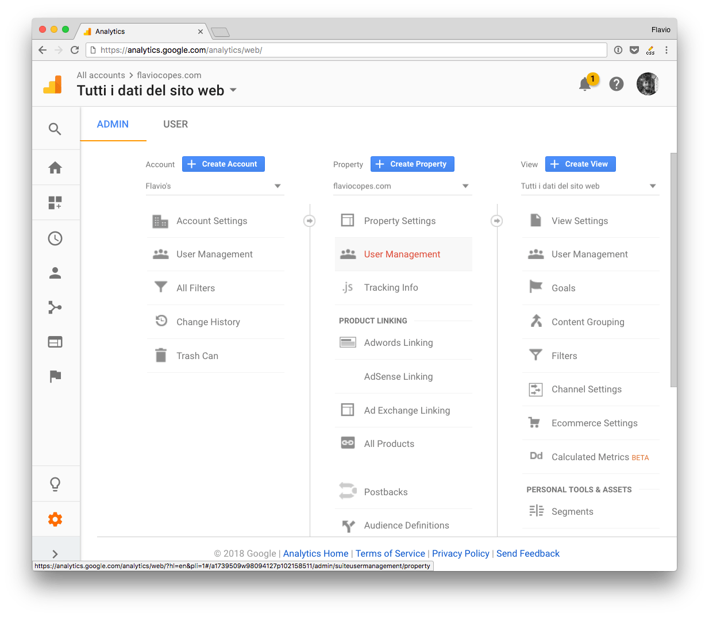
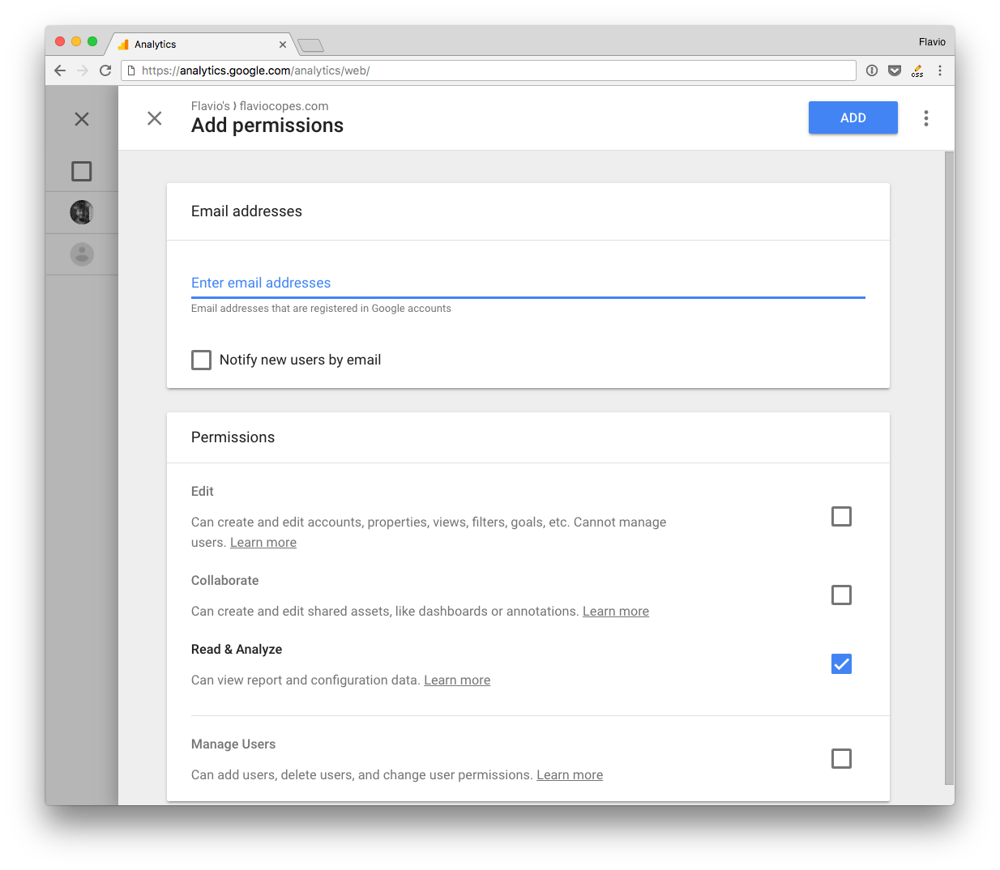
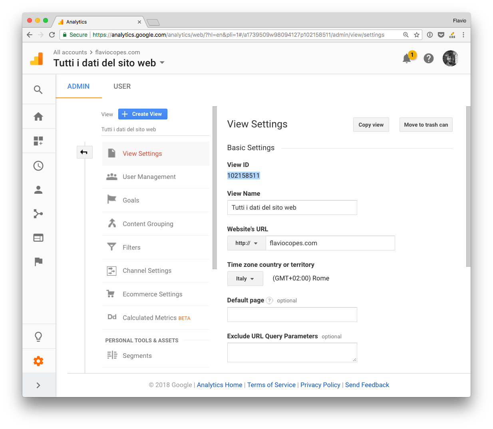

> Note: I just noticed uBlock Origin blocks the images on this post, because they have the `analytics` word in the path. So make sure you disable it for this page, to see the images 🖼. I don't have ads. You can still follow along without them, but it's better with them of course :)

In this post I'm going to show some examples of using the Google Analytics API with [Node.js](/nodejs/).

<!-- TOC -->

- [Environment variables](#Environment-variables)
- [Add the user to Google Analytics](#Add-the-user-to-Google-Analytics)
- [Import the Google library](#Import-the-Google-library)
- [Define the scope](#Define-the-scope)
- [The Google Analytics Reporting API](#The-Google-Analytics-Reporting-API)
- [Create the JWT](#Create-the-JWT)
- [Perform a request](#Perform-a-request)
- [Metrics](#Metrics)
- [Common code](#Common-code)
- [Get the number of today sessions](#Get-the-number-of-today-sessions)
- [Get the number of today sessions coming from organic sources (Search Engines)](#Get-the-number-of-today-sessions-coming-from-organic-sources-Search-Engines)
- [Get the number of yesterday sessions](#Get-the-number-of-yesterday-sessions)
- [Get the number of sessions in the last 30 days](#Get-the-number-of-sessions-in-the-last-30-days)
- [Get the browsers used in the last 30 days](#Get-the-browsers-used-in-the-last-30-days)
- [Get the number of visitors using Chrome](#Get-the-number-of-visitors-using-Chrome)
- [Get the sessions by traffic source](#Get-the-sessions-by-traffic-source)
- [The Google Analytics Real Time API](#The-Google-Analytics-Real-Time-API)

<!-- /TOC -->

Google offers a great npm package: [`googleapis`](https://www.npmjs.com/package/googleapis). We're going to use that as the base building block of our API interaction.

Authentication is a big part of interacting with an API. Check out this post on [how to authenticate to the Google APIs](/google-api-authentication/). In this article I'm going to assume you read that, and you know how to perform a [JWT](/jwt/) authentication.

## Environment variables

Once you download the [JSON](/json/) Key file from Google, put the `client_email` and `private_key` values as environment variables, so that they will be accessible through

- `process.env.CLIENT_EMAIL`
- `process.env.PRIVATE_KEY`

## Add the user to Google Analytics

Since we're using the Service to Service API in these examples, you need to add the `client_email` value to your Google Analytics profile. Go to the Admin panel and click **User Management**, either on a property or on a view.



And add the email you found in the `client_email` key in the JSON file:



## Import the Google library

```js
const { google } = require('googleapis')
```

Remember the `{}` around the `google` object, as we need to destructure it from the `googleapis` library (otherwise we'd need to call `google.google` and it's ugly)

## Define the scope

This line sets the scope:

```js
const scopes = 'https://www.googleapis.com/auth/analytics.readonly'
```

Google Analytics API defines several scopes:

- `https://www.googleapis.com/auth/analytics.readonly` to view the data
- `https://www.googleapis.com/auth/analytics`	to view and manage the data
- `https://www.googleapis.com/auth/analytics.edit` to edit the management entities
- `https://www.googleapis.com/auth/analytics.manage.users` to manage the account users and permissions
- `https://www.googleapis.com/auth/analytics.manage.users.readonly` to view the users and their permissions
- `https://www.googleapis.com/auth/analytics.provision`	to create new Google Analytics accounts

You should always pick the scope that grants the least amount of power.

Since we want to only view the reports now, we pick `https://www.googleapis.com/auth/analytics.readonly` instead of `https://www.googleapis.com/auth/analytics`.

## The Google Analytics Reporting API

Note: you can also use the **Google Analytics Reporting API** to access those permissions.

It is a trimmed-down version of the Google Analytics API, offering just the scope `https://www.googleapis.com/auth/analytics.readonly` and `https://www.googleapis.com/auth/analytics`.

The API is slightly different than the Analytics API however in how it's used and in which methods it exposes, so we'll skip that.

## Create the JWT

```js
const jwt = new google.auth.JWT(process.env.CLIENT_EMAIL, null, process.env.PRIVATE_KEY, scopes)
```

## Perform a request

Check this code:

```js
const { google } = require('googleapis')
const scopes = 'https://www.googleapis.com/auth/analytics.readonly'
const jwt = new google.auth.JWT(process.env.CLIENT_EMAIL, null, process.env.PRIVATE_KEY, scopes)

const view_id = 'XXXXX'

async function getData() {
  const response = await jwt.authorize()
  const result = await google.analytics('v3').data.ga.get({
    'auth': jwt,
    'ids': 'ga:' + view_id,
    'start-date': '30daysAgo',
    'end-date': 'today',
    'metrics': 'ga:pageviews'
  })

  console.dir(result)
}

getData()
```

It performs a request to the Google Analytics API to fetch the **pageviews number in the last 30 days**.

`view_id` contains the ID of the **view**. Not your Google Analytics code, but the view ID. You can get that from the admin panel, by clicking **View Settings** on the view you want to access:



You pass this object to the request:

```js
{
  'auth': jwt,
  'ids': 'ga:' + view_id,
  'start-date': '30daysAgo',
  'end-date': 'today',
  'metrics': 'ga:pageviews'
}
```

In addition to the jwt object and the view id, we have 3 parameters.

- `metrics`: tells the API **what we want to get**
- `start-date`: defines the starting date for the report
- `end-date`: defines the end date for the report

This request is very simple and returns the number of pageviews occurring in the specified time period.

The returned result will be something like:

```js
{
  status: 200,
  statusText: 'OK',
  headers: {...},
  config: {...},
  request: {...},
  data: {
    kind: 'analytics#gaData',
    id: 'https://www.googleapis.com/analytics/v3/data/ga?ids=ga:XXXXXXXXXXXXXXXXXX&metrics=ga:pageviews&start-date=30daysAgo&end-date=today',
    query:  {
      'start-date': '30daysAgo',
      'end-date': 'today',
      ids: 'ga:XXXXXXXXXXXXXXXXXX',
      metrics: [ 'ga:pageviews' ],
      'start-index': 1,
      'max-results': 1000
    },
    itemsPerPage: 1000,
    totalResults: 1,
    selfLink: 'https://www.googleapis.com/analytics/v3/data/ga?ids=ga:XXXXXXXXXXXXXXXXXX&metrics=ga:pageviews&start-date=30daysAgo&end-date=today',
    profileInfo: {
      profileId: 'XXXXXXXXXXXXXXXXXX',
      accountId: 'XXXXXXXXXXXXXXXXXX',
      webPropertyId: 'UA-XXXXXXXXXXX--XX',
      internalWebPropertyId: 'XXXXXXXXXXXXXXXXXX',
      profileName: 'XXXXXXXXXXXXXXXXXX',
      tableId: 'ga:XXXXXXXXXXXXXXXXXX'
    },
    containsSampledData: false,
    columnHeaders: [
      {
        name: 'ga:pageviews',
        columnType: 'METRIC',
        dataType: 'INTEGER'
      }
    ],
    totalsForAllResults: { 'ga:pageviews': '3000' },
    rows: [ [ '114426' ] ] }
}
```

With this You can access the pageviews count in `response.data.rows[0][0]`.

## Metrics

This example was simple. We just asked for this data:

```js
{
  'start-date': '30daysAgo',
  'end-date': 'today',
  'metrics': 'ga:pageviews'
}
```

There is a whole lot of data we can use.

The [Dimensions & Metrics Explorer](https://developers.google.com/analytics/devguides/reporting/core/dimsmets) is an awesome tool to discover all the options.

Those terms are two concepts of Google Analytics.

**Dimensions** are attributes, like City, Country or Page, the referral path or the session duration.

**Metrics** are quantitative measurements, like the number of users or the number of sessions.

Some examples of metrics:

- get the pageviews `ga:pageviews`
- get the unique users `ga:users`
- get the sessions `ga:sessions`
- get the organic searches `ga:organicSearches`

Let's build some examples with those metrics.

## Common code

Here is the common code used in the examples below. Put the snippet in the `authorize()` callback.

```js
'use strict'

const { google } = require('googleapis')

const scopes = 'https://www.googleapis.com/auth/analytics.readonly'
const jwt = new google.auth.JWT(process.env.CLIENT_EMAIL, null, process.env.PRIVATE_KEY, scopes)

async function getData() {
  const defaults = {
    'auth': jwt,
    'ids': 'ga:' + process.env.VIEW_ID,
  }
  const response = await jwt.authorize()

  /* custom code goes here, using `response` */
}

getData()
```

The defaults object will be reused in the examples using the [**spread operator**](/javascript-spread-operator/), which is a handy way of handling defaults values in JavaScript.

## Get the number of today sessions

```js
const result = await google.analytics('v3').data.ga.get({
  ...defaults,
  'start-date': 'today',
  'end-date': 'today',
  'metrics': 'ga:sessions'
})

console.dir(result.data.rows[0][0])
```

## Get the number of today sessions coming from organic sources (Search Engines)

Add the `filters` property:

```js
const result = await google.analytics('v3').data.ga.get({
  ...defaults,
  'start-date': 'today',
  'end-date': 'today',
  'metrics': 'ga:sessions',
  'filters': 'ga:medium==organic',
})
```

## Get the number of yesterday sessions

```js
const result = await google.analytics('v3').data.ga.get({
  ...defaults,
  'start-date': 'yesterday',
  'end-date': 'yesterday',
  'metrics': 'ga:sessions'
})

console.dir(result.data.rows[0][0])
```

## Get the number of sessions in the last 30 days

```js
const result = await google.analytics('v3').data.ga.get({
  ...defaults,
  'start-date': '30daysAgo',
  'end-date': 'today',
  'metrics': 'ga:sessions'
})

console.dir(result.data.rows[0][0])
```

## Get the browsers used in the last 30 days

```js
const result = await google.analytics('v3').data.ga.get({
  ...defaults,
  'start-date': '30daysAgo',
  'end-date': 'today',
  'dimensions': 'ga:browser',
  'metrics': 'ga:sessions'
})

console.dir(result.data.rows.sort((a, b) => b[1] - a[1]))
```

```js
[
  [ 'Chrome', '994' ],
  [ 'Safari', '548' ],
  [ 'Firefox', '442' ],
  [ 'Android Webview', '113' ],
  [ 'Opera', '56' ],
  [ 'Safari (in-app)', '41' ],
  [ 'Edge', '36' ],
  [ 'Internet Explorer', '4' ]
]
```

## Get the number of visitors using Chrome

```js
const result = await google.analytics('v3').data.ga.get({
  ...defaults,
  'start-date': '30daysAgo',
  'end-date': 'today',
  'dimensions': 'ga:browser',
  'metrics': 'ga:sessions',
  'filters': 'ga:browser==Chrome',
})

console.dir(result.data.rows[0][1])
```

## Get the sessions by traffic source

```js
const result = await google.analytics('v3').data.ga.get({
  ...defaults,
  'start-date': '30daysAgo',
  'end-date': 'today',
  'dimensions': 'ga:source',
  'metrics': 'ga:sessions'
})

console.dir(result.data.rows.sort((a, b) => b[1] - a[1]))
```

```js
[
  [ 'google', '1343' ],
  [ '(direct)', '731' ],
  [ 'medium.com', '624' ],
  [ 't.co', '987' ],
  [ 'reddit.com', '65' ]
]
```

## The Google Analytics Real Time API

The Google Analytics Real Time API is [May 2018] in private beta, and it's not publicly accessible. [Check this page](https://developers.google.com/analytics/devguides/reporting/realtime/v3/reference/).