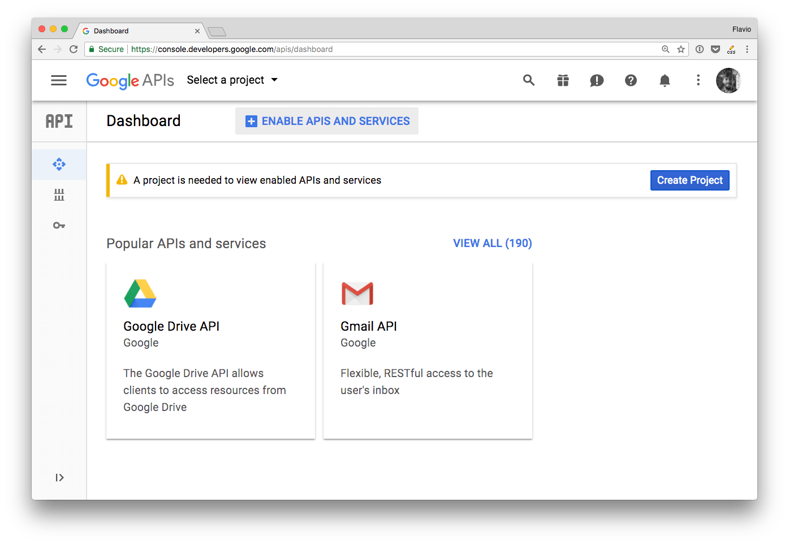
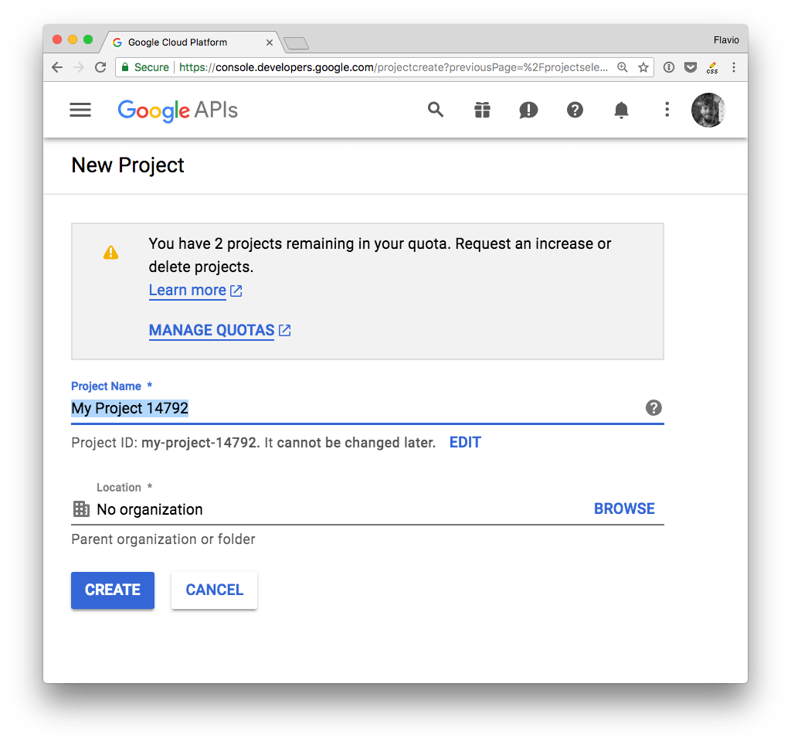
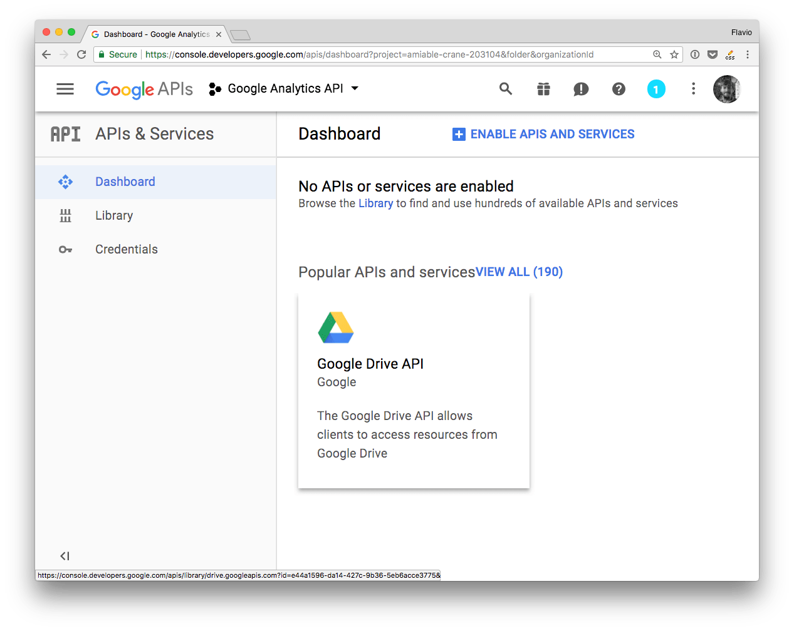
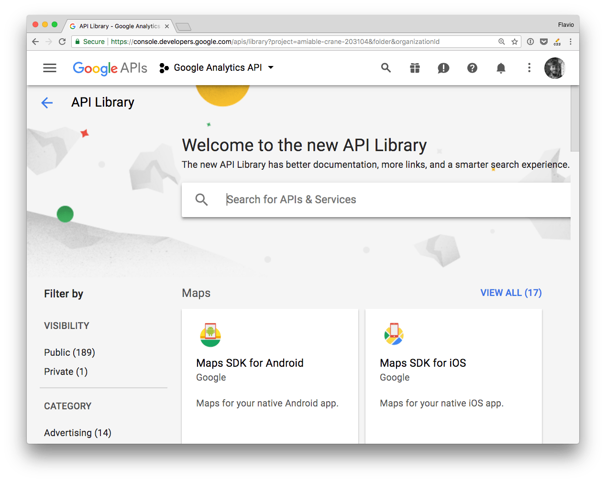
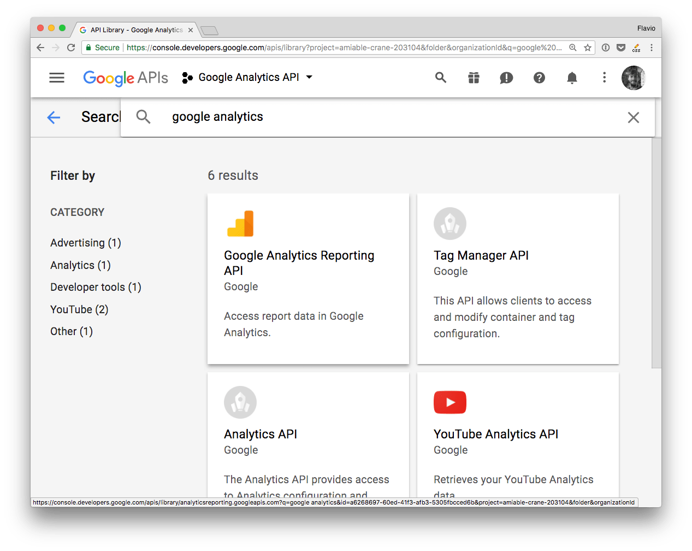
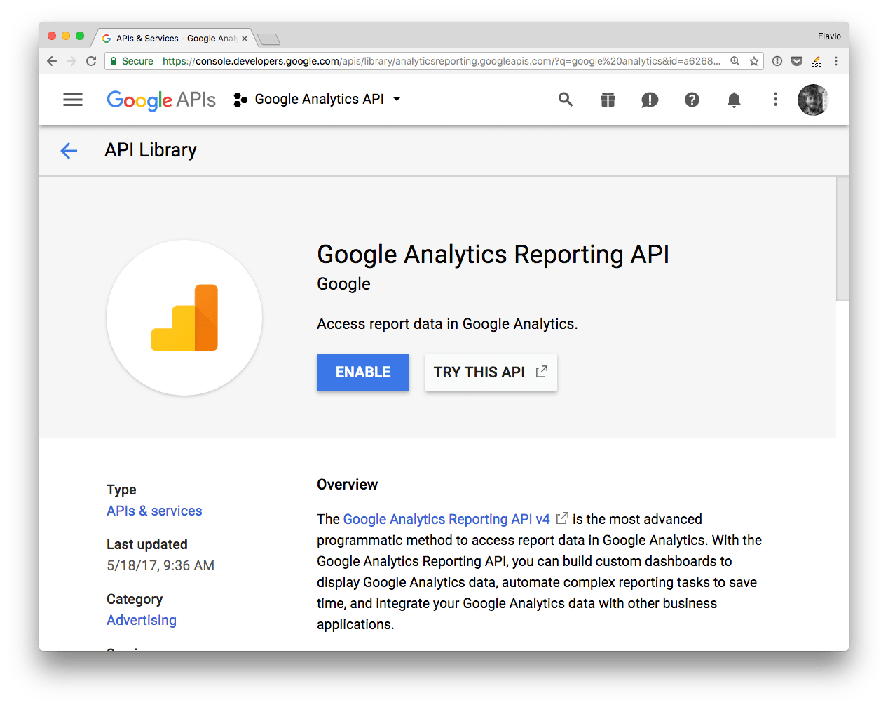
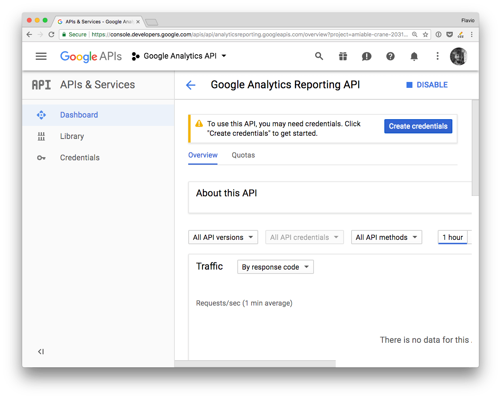
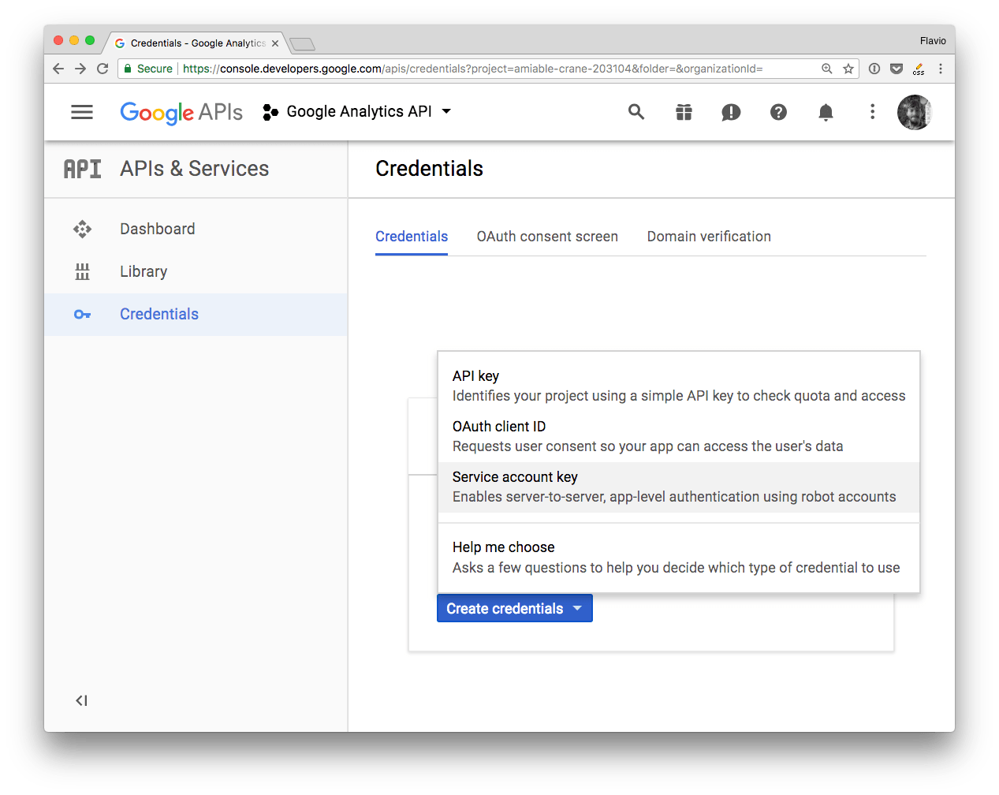
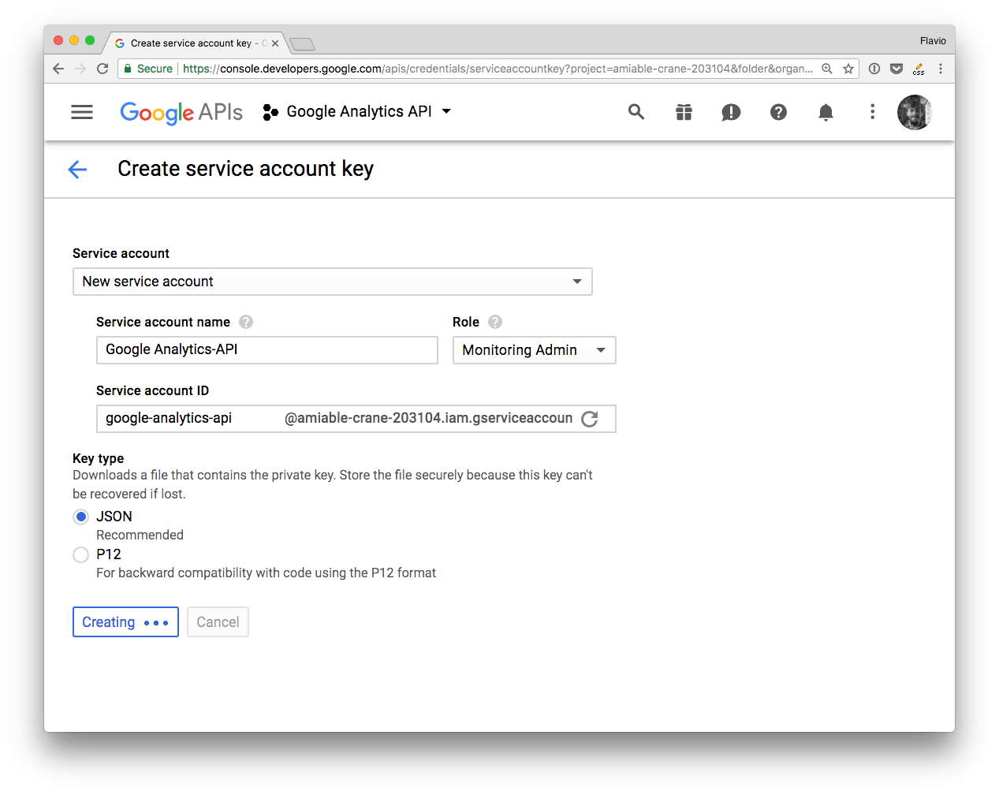
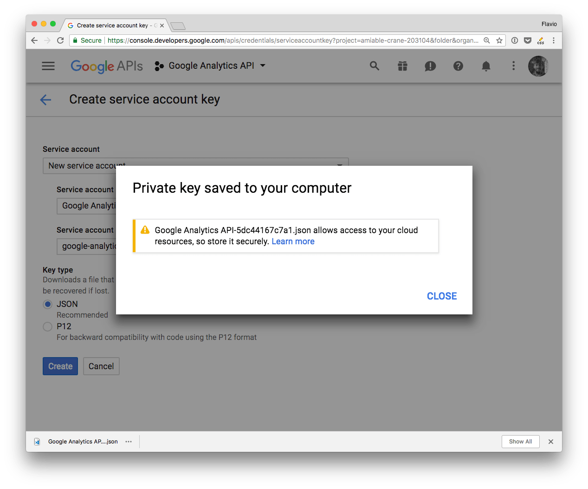

This article explains how to use the Google Developers Console to authenticate to any of the Google APIs.

The Developers Console can be complicated to get right, and it's one of the reasons I sometimes have resistance into using one of the Google APIs.

Let's see how that works, in a very simple way.

This guide assumes you already have a Google account.

<!-- TOC -->

- [Create a new Google API Project](#Create-a-new-Google-API-Project)
- [Create the Authentication Credentials](#Create-the-Authentication-Credentials)
- [Service to Service API](#Service-to-Service-API)
- [Using the JSON Key File](#Using-the-JSON-Key-File)
- [Use environment variables](#Use-environment-variables)
- [Access other APIs](#Access-other-APIs)

<!-- /TOC -->

## Create a new Google API Project

Create a new project, if you haven't done it yet.



From the dashboard click **Create a new project**.



Give it a name, and you'll be redirected to the project dashboard:



Add an API by clicking **Enable APIs and services**.



From the list, search the API you're interested in



and enable it



That's it!



The project is now ready, you can go on and create the authentication credentials.

## Create the Authentication Credentials

There are 3 ways to authenticate with the Google APIs:

- **OAuth 2**
- **Service to Service**
- **API key**

API key is less secure and restricted in scope and usage by Google.

OAuth 2 is meant to let your app make requests on behalf of a user, and as such the process is more complicated than needed, and requires exposing URLs to handle callbacks. Way too complex for simple uses.

In a Service to Service authentication model, the application directly talks to the Google API, using a service account, by using a JSON Web Token.

This is the simplest method, especially if you're building a prototype or an application that talks from your server (like a Node.js app) to the Google APIs. This is the one method I'll talk about for the test of the article.

## Service to Service API

To use this method you need to first generate a **JSON Key File** through the Google Developers Console.

> There is another option which involves downloading a `.p12` file and then converting it to a `pem` file using the `openssl` command. It's no longer recommended by Google, **just use JSON**.

From a project dashboard, click **Create credentials**, and choose **Service Account Key**:



Fill the form and choose a "JSON" key type:



That's it! Google sent you a JSON file:



This is the content of this JSON file, called **JSON Key File**:

```json
{
  "type": "service_account",
  "project_id": "...",
  "private_key_id": "...",
  "private_key": "...",
  "client_email": "...",
  "client_id": "...",
  "auth_uri": "https://accounts.google.com/o/oauth2/auth",
  "token_uri": "https://accounts.google.com/o/oauth2/token",
  "auth_provider_x509_cert_url": "https://www.googleapis.com/oauth2/v1/certs",
  "client_x509_cert_url": "..."
}
```

## Using the JSON Key File

The simplest way is to put the JSON file somewhere reachable by your program, on the filesystem.

For example I have a test app under `~/dev/test`, so I put the JSON file into that folder, and renamed it to `auth.json`. Then inside a Node.js app make sure the GOOGLE_APPLICATION_CREDENTIALS environment variable points to that file location on the filesystem.

You create a [JSON Web Token](/jwt/) using the properties contained in the file:

```js
const jwt = new google.auth.JWT(key.client_email, null, key.private_key, scopes)
```

and you pass that to any API request you make.

This is an example of how to use it with the Google Analytics API. `process.env.GOOGLE_APPLICATION_CREDENTIALS` is better be set outside the program, but I added it in the source for clarity:

```js
'use strict'

const { google } = require('googleapis')

const key = require('./auth.json')
const scopes = 'https://www.googleapis.com/auth/analytics.readonly'
const jwt = new google.auth.JWT(key.client_email, null, key.private_key, scopes)
const view_id = 'XXXXXXX'

process.env.GOOGLE_APPLICATION_CREDENTIALS = './auth.json'

jwt.authorize((err, response) => {
  google.analytics('v3').data.ga.get(
    {
      auth: jwt,
      ids: 'ga:' + view_id,
      'start-date': '30daysAgo',
      'end-date': 'today',
      metrics: 'ga:pageviews'
    },
    (err, result) => {
      console.log(err, result)
    }
  )
})
```

## Use environment variables

This is not ideal in many situations where having your private information on the filesystem is either not practical or not secure. For example if you're using Heroku, it's best to avoid putting the authentication credentials in the repository, and instead set them through the interface or console Heroku provides.

Or it's the case of using it on [Glitch](/glitch/) prototypes, where environment variables are hidden to everyone except you.

In this case the best thing is to use environment variables, and store the content you need from the JSON file. In the following example, all we need are the `client_email` and `private_key` variables set in the JSON, so we can extract those and set them as environment variables, to keep them private.

```js
'use strict'

const { google } = require('googleapis')

const scopes = 'https://www.googleapis.com/auth/analytics.readonly'
const jwt = new google.auth.JWT(
  process.env.CLIENT_EMAIL,
  null,
  process.env.PRIVATE_KEY,
  scopes
)
const view_id = 'XXXXXXX'

jwt.authorize((err, response) => {
  google.analytics('v3').data.ga.get(
    {
      auth: jwt,
      ids: 'ga:' + view_id,
      'start-date': '30daysAgo',
      'end-date': 'today',
      metrics: 'ga:pageviews'
    },
    (err, result) => {
      console.log(err, result)
    }
  )
})
```

## Access other APIs

I used Google Analytics in the examples.

The `google` object makes it reachable at `google.analytics('v3')`.

`v3` is the API version.

Other APIs are reachable using a similar way:

- `google.urlshortener('v1')`
- `google.drive('v2')`
