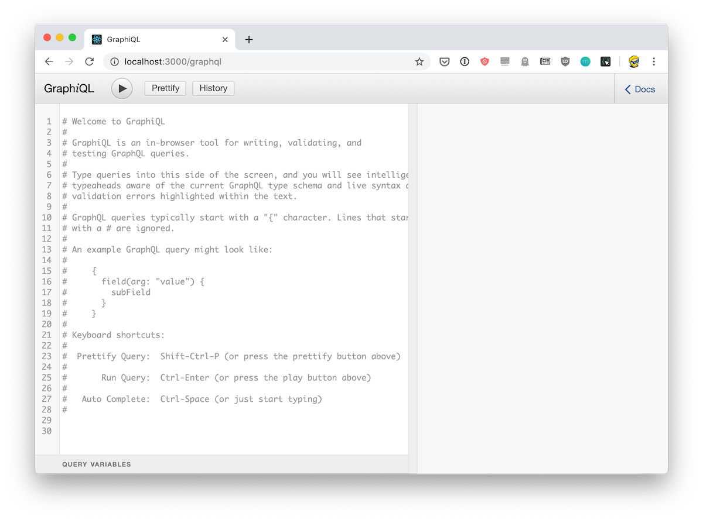
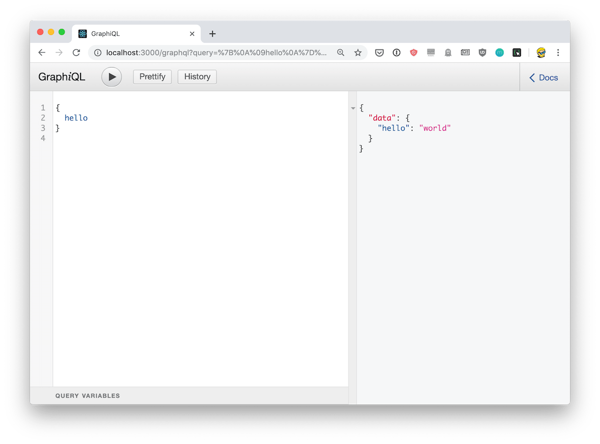

Start by creating a new Node.js project, if you haven't one already set up:

```sh
npm init --y
```

This command creates the `package.json` file we need to work with `npm`.

Install the npm packages `express`, `graphql` and [`express-graphql`](https://github.com/graphql/express-graphql):

```sh
npm install express graphql express-graphql
```

Create an `app.js` file, and let's start with the initializing the [Express](/express/) server:

```js
const express = require('express')

const app = express()

app.listen(3000, () => {
  console.log('App listening on port 3000')
})
```

Now we add `express-graphql`. This is a [middleware](/express-middleware/), and we apply it to just a route, the `/graphql` route:

```js
const express = require('express')
const graphqlHTTP = require('express-graphql')

const app = express()

app.use('/graphql', graphqlHTTP())

app.listen(3000, () => {
  console.log('App listening on port 3000')
})
```

We must pass an object which contains the `schema` property, which must contain a **schema** definition.

We must define a schema first!

Create a `schema.js` file, and in there we first require `graphql`, then using the **object destructuring syntax** we get the `GraphQLSchema`, `GraphQLObjectType` and `GraphQLString` objects we'll soon need to use:

```js
const graphql = require('graphql')
const { GraphQLSchema, GraphQLObjectType, GraphQLString } = graphql
```

Then we define the schema value by initializing a new `GraphQLSchema` instance, passing an object which contains a `query` property. This property is an instance of a `GraphQLObjectType` object:

```js
const schema = new GraphQLSchema({
  query: new GraphQLObjectType({
		//...
  })
})

module.exports = schema
```

Inside this new object we must specify a `name`, and a `fields` parameters. This last property is an object which contains a set of properties, one for each field of our schema. In this example we set up an `hello` field:

```js
const schema = new GraphQLSchema({
  query: new GraphQLObjectType({
    name: 'RootQueryType',
    fields: {
      hello: {
        type: GraphQLString,
        resolve() {
          return 'world'
        }
      }
    }
  })
})
```

The `resolve()` method returns the string `world`, which means that when we will ask for the `hello` field, we'll get that string back.

Here is the full `schema.js` file content:

```js
const graphql = require('graphql')
const { GraphQLSchema, GraphQLObjectType, GraphQLString } = graphql

const schema = new GraphQLSchema({
  query: new GraphQLObjectType({
    name: 'RootQueryType',
    fields: {
      hello: {
        type: GraphQLString,
        resolve() {
          return 'world'
        }
      }
    }
  })
})

module.exports = schema
```

Now let's go back to our `app.js` file.

This is what we had:

```js
const express = require('express')
const graphqlHTTP = require('express-graphql')

const app = express()

app.use('/graphql', graphqlHTTP())

app.listen(3000, () => {
  console.log('App listening on port 3000')
})
```

We now require the `schema.js` file:

```js
const schema = require('./schema.js')
```

and we add that in an object we pass to the `graphqlHTTP()` constructor:

```js
app.use('/graphql', graphqlHTTP({
  schema: schema
}))
```

Ok!

We can now test this and see if it works. We can use **GraphiQL**, a great tool to test our GraphQL API.

It's already installed and to enable that, we need to pass another property to the `graphqlHTTP` constructor:

```js
app.use('/graphql', graphqlHTTP({
  schema: schema,
  graphiql: true
}))
```

Now after you run `node app.js`, accessing the `http://localhost:3000/graphql` URL with the browser you'll see GraphiQL in action:



And you can test the first API call, passing this query:

```js
{
	hello
}
```

This is the result:



Let's now build a more complex schema.

One that has nested types.

An example I have in mind is a blog post.

A blog post has a title, a description, and it also has an author. The author has a name.

Let's figure this out.

First we add the set of posts and authors:

```js
const posts = [
  {
    title: 'First post',
    description: 'Content of the first post',
    author: 'Flavio'
  },
  {
    title: 'Second post',
    description: 'Content of the second post',
    author: 'Roger'
  }
]

const authors = {
  'Flavio': {
    name: 'Flavio',
    age: 36
  },
  'Roger': {
    name: 'Roger',
    age: 7
  }
}
```

This is where we'll get the data from.

Next, we define 3 `GraphQLObjectType` instances:

- `authorType`, which defines the author data
- `postType`, which defines the post data
- `queryType`, the main one

Let's start with the author. An author has a name and an age.

We use the `GraphQLInt` type, which we must add to the require:

```js
const { GraphQLSchema, GraphQLObjectType, GraphQLString, GraphQLInt } = graphql

//...

const authorType =  new GraphQLObjectType({
  name: 'Author',
  fields: {
    name: {
      type: GraphQLString
    },
    age: {
      type: GraphQLInt
    }
  }
})
```

Next is `postType`. A post has a title, a description (both strings) and an author. An author is of type `authorType`, which we just defined, and it has a resolver.

We get the author name from the `source` parameter, which is the params passed to the post object, and we lookup the author data based on that. We return it.

```js
const postType =  new GraphQLObjectType({
  name: 'Post',
  fields: {
    title: {
      type: GraphQLString
    },
    description: {
      type: GraphQLString
    },
    author: {
      type: authorType,
      resolve: (source, params) => {
        return authors[source.author]
      }
    }
  }
})
```

> Note that a resolver function can be async, so you can use async/await to lookup resources from a database or the network.

Next up is queryType, the root type we'll add to the schema. In there, we define 2 fields:

- `post` a single blog post, identified by an id
- `posts` the list of posts

both of them have a resolver function to lookup the data in the `posts` array:

```js
const queryType =  new GraphQLObjectType({
  name: 'Query',
  fields: {
    post: {
      type: postType,
      args: {
        id: { type: GraphQLInt }
      },
      resolve: (source, {id}) => {
        return posts[id]
      }
    },
    posts: {
      type: new GraphQLList(postType),
      resolve: () => {
        return posts
      }
    }
  }
})
```

Notice the new `GraphQLList` type, which we use to wrap `postType` to mean that it's a list of `postType` objects. We must require it on top:

```js
const { GraphQLSchema, GraphQLObjectType, GraphQLString, GraphQLList, GraphQLInt } = graphql
```

That's it. We need to add it to our `schema` and we are set:

```js
const schema = new GraphQLSchema({
  query: queryType
})
```

Here's the full code:

```js
const graphql = require('graphql')
const { GraphQLSchema, GraphQLObjectType, GraphQLString, GraphQLList, GraphQLInt } = graphql

const posts = [
  {
    title: 'First post',
    description: 'Content of the first post',
    author: 'Flavio'
  },
  {
    title: 'Second post',
    description: 'Content of the second post',
    author: 'Roger'
  }
]

const authors = {
  'Flavio': {
    name: 'Flavio',
    age: 36
  },
  'Roger': {
    name: 'Roger',
    age: 7
  }
}


const authorType =  new GraphQLObjectType({
  name: 'Author',
  fields: {
    name: {
      type: GraphQLString
    },
    age: {
      type: GraphQLInt
    }
  }
})

const postType =  new GraphQLObjectType({
  name: 'Post',
  fields: {
    title: {
      type: GraphQLString
    },
    description: {
      type: GraphQLString
    },
    author: {
      type: authorType,
      resolve: (source, params) => {
        return authors[source.author]
      }
    }
  }
})

const queryType =  new GraphQLObjectType({
  name: 'Query',
  fields: {
    post: {
      type: postType,
      args: {
        id: { type: GraphQLInt }
      },
      resolve: (source, {id}) => {
        return posts[id]
      }
    },
    posts: {
      type: new GraphQLList(postType),
      resolve: () => {
        return posts
      }
    }
  }
})

const schema = new GraphQLSchema({
  query: queryType
})

module.exports = schema
```

See the complete code on Glitch:

<!-- Copy and Paste Me -->
<div class="glitch-embed-wrap" style="height: 420px; width: 100%;">
  <iframe
    allow="geolocation; microphone; camera; midi; vr; encrypted-media"
    src="https://glitch.com/embed/#!/embed/graphql-server-express?path=schema.js&previewSize=0"
    alt="graphql-server-express on Glitch"
    style="height: 100%; width: 100%; border: 0;">
  </iframe>
</div>