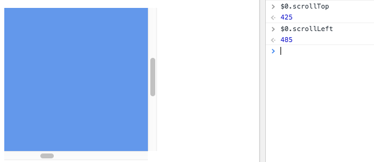

How can you do that?

Once you have the element, you can inspect its  `scrollLeft` and `scrollTop` properties.

The `0, 0` position is always found in the top left corner, so any scrolling is relative to that.

Example:

```js
const container = document.querySelector('. container')
container.scrollTop
container.scrollLeft
```

Those properties are read/write, so you can also **set** the scroll position:

```js
const container = document.querySelector('. container')
container.scrollTop = 1000
container.scrollLeft = 1000
```

