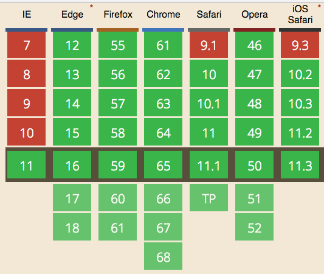

Say you have a number like **`10`**, and it represents the price of something.

You want to transform it to **`$10,00`**.

If the number has more than 3 digits however it should be displayed differently, for example **`1000`** should be displayed as **`$1.000,00`**

This is in USD, however.

**Different countries have different conventions to display values**.

JavaScript makes it very easy for us with the [_ECMAScript Internationalization API_](https://hacks.mozilla.org/2014/12/introducing-the-javascript-internationalization-api/), a relatively recent browser API that provides a lot of internationalization features, like dates and time formatting.

It is very well supported:



```js
const formatter = new Intl.NumberFormat('en-US', {
  style: 'currency',
  currency: 'USD',
  minimumFractionDigits: 2
})

formatter.format(1000) // "$1,000.00"
formatter.format(10) // "$10.00"
formatter.format(123233000) // "$123,233,000.00"
```

The `minimumFractionDigits` property sets the fraction part to be always at least 2 digits. You can check which other parameters you can use in [the NumberFormat MDN page](https://developer.mozilla.org/en-US/docs/Web/JavaScript/Reference/Global_Objects/NumberFormat).

This example creates a number formatter for the Euro currency, for the Italian country:

```js
const formatter = new Intl.NumberFormat('it-IT', {
  style: 'currency',
  currency: 'EUR'
})
```
