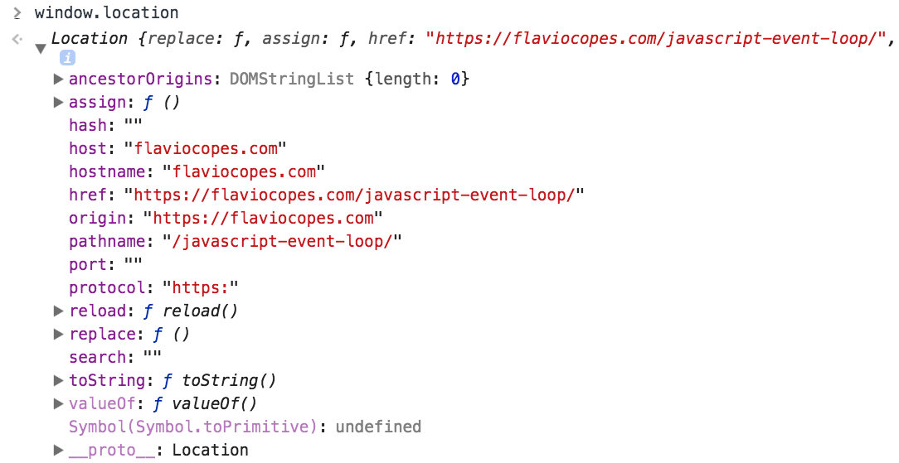

To get the current URL of the page you opened in the browser using JavaScript you can rely on the `location` property exposed by the browser on the `window` object:

```js
window.location
```

Since `window` is the global object in the browser, the property can be referenced as

```js
location
```

This is a [Location](https://developer.mozilla.org/en-US/docs/Web/API/Location) object which has many properties on its own:



The current page URL is exposed in

```js
location.href
```

Other properties of `location` provide useful information:

| Code                | Description                                      |
| ------------------- | ------------------------------------------------ |
| `location.hostname` | the host name                                    |
| `location.origin`   | the origin                                       |
| `location.hash`     | the hash, the part that follow the hash # symbol |
| `location.pathname` | the path                                         |
| `location.port`     | the port                                         |
| `location.protocol` | the protocol                                     |
| `location.search`   | the query string                                 |
