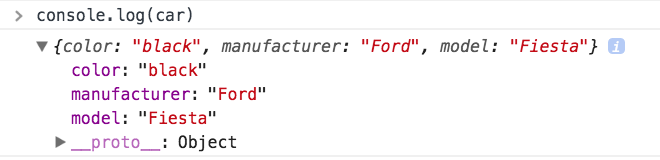
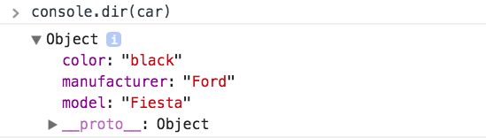
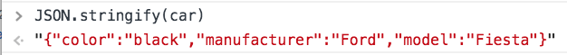
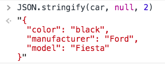
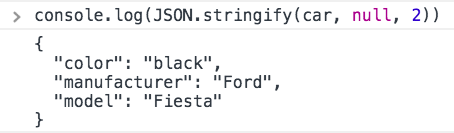
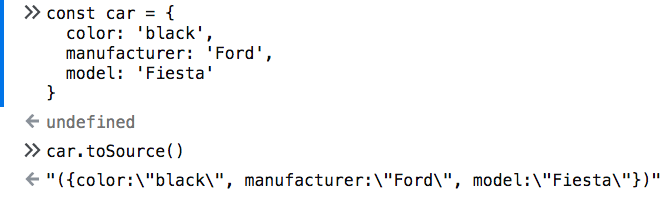
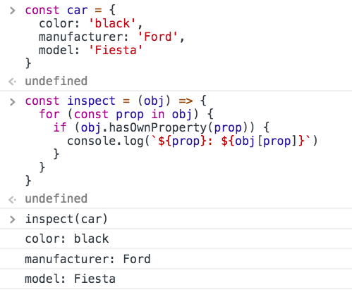
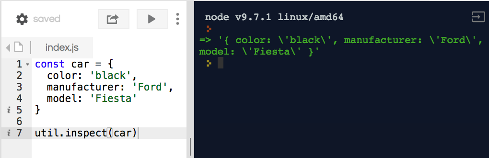
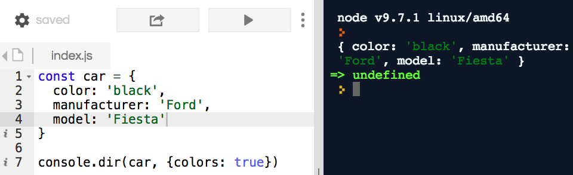

JavaScript offers many ways to inspect the content of a variable. In particular, let's find out **how to print the content of an object**.

<!-- TOC -->

- [The Console API](#the-console-api)
  - [`console.log`](#consolelog)
  - [`console.dir`](#consoledir)
- [`JSON.stringify()`](#jsonstringify)
- [`toSource()`](#tosource)
- [Iterate the properties using a loop](#iterate-the-properties-using-a-loop)
- [How to inspect in Node.js](#how-to-inspect-in-node)

<!-- /TOC -->

Let's say we have this object `car`, but we don't know its content, and we want to inspect it:

```js
const car = {
  color: 'black',
  manufacturer: 'Ford',
  model: 'Fiesta'
}
```

## The Console API

Using the [Console API](/console-api/) you can print any object to the console. This will work on any browser.

### `console.log`

```js
console.log(car)
```



### `console.dir`

```js
console.dir(car)
```



This works exactly like

```js
console.log('%O', car)
```

## `JSON.stringify()`

This will print the object as a string representation:

```js
JSON.stringify(car)
```



By adding these parameters:

```js
JSON.stringify(car, null, 2)
```

you can make it print more nicely. The last number determines the amount of spaces in indentation:



`JSON.stringify()` has the advantage of working outside of the console, as you can print the object in the screen. Or, you can combine it with the Console API to print this in the console:

```js
console.log(JSON.stringify(car, null, 2))
```



## `toSource()`

Similar to JSON.stringify, toSource() is a method available on most types, _only in Firefox_ (and browsers based on it):



Worth mentioning, but not being a standard, and only being implemented in Firefox, makes JSON.stringify a better solution.

## Iterate the properties using a loop

The `for...in` loop is handy, as it prints the object properties:

```js
const inspect = obj => {
  for (const prop in obj) {
    if (obj.hasOwnProperty(prop)) {
      console.log(`${prop}: ${obj[prop]}`)
    }
  }
}

inspect(car)
```



I use `hasOwnProperty()` to avoid printing inherited properties.

You can decide what to do in the loop, here we print the properties names and values to the console using `console.log`, but you can adding them to a string and then print them on the page.

## How to inspect in Node.js

The inspect() method exposed by the `util` package works great in Node.js:

```js
util.inspect(car)
```



But, a much better presentation is provided by `console.dir()`, with the `colors` property enabled:

```js
console.dir(car, { colors: true })
```


