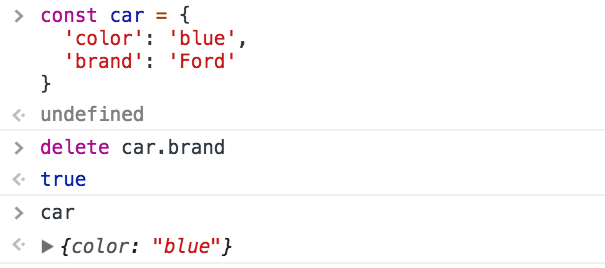
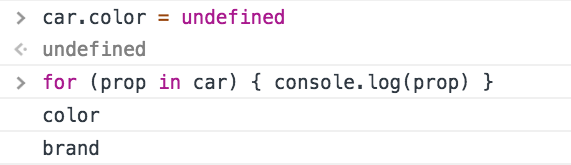
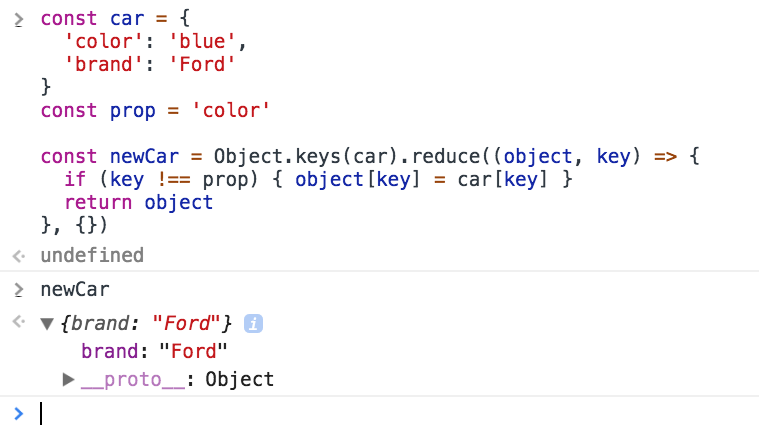

The semantically correct way to remove a property from an object is to use the `delete` keyword.

Given the object

```js
const car = {
  color: 'blue',
  brand: 'Ford'
}
```

you can delete a property from this object using

```js
delete car.brand
```



It works also expressed as:

```js
delete car['brand']
delete car.brand
delete newCar['brand']
```

## Setting a property to undefined

If you need to perform this operation in a very optimized way, for example when you're operating on a large number of objects in loops, another option is to set the property to `undefined`.

Due to its nature, the performance of `delete` is a [lot slower](https://jsperf.com/delete-vs-undefined-vs-null/16) than a simple reassignment to `undefined`, more than 50x times slower.

However, keep in mind that the property is not deleted from the object. Its value is wiped, but it's still there if you iterate the object:



Using `delete` is still very fast, you should only look into this kind of performance issues if you have a very good reason to do so, otherwise it's always preferred to have a more clear semantic and functionality.

## Remove a property without mutating the object

If mutability is a concern, you can create a completely new object by copying all the properties from the old, except the one you want to remove:

```js
const car = {
  color: 'blue',
  brand: 'Ford'
}
const prop = 'color'

const newCar = Object.keys(car).reduce((object, key) => {
  if (key !== prop) {
    object[key] = car[key]
  }
  return object
}, {})
```

(see [`Object.keys()`](/javascript-object-keys/))


