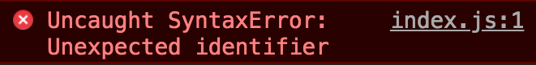

If you are using the `import` statement to import different files in your JavaScript application, you might find the browser giving you this error: *Unexpected Identifier*.



Why? And how can you make ES6 modules work in browsers?

You just have to do one tiny change: instead of loading your main entry point JavaScript file using

```html
<script src="index.js"></script>
```

add `type="module"`:

```html
<script type="module" src="index.js"></script>
```

and things should now work fine.