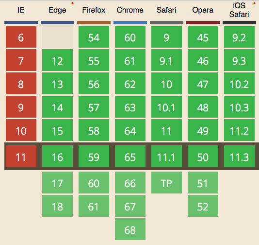

Checking if a string contains a substring is one of the most common tasks in any programming language.

<div class="rwd-video">
<iframe width="560" height="315" src="https://www.youtube.com/embed/0VZPmuqLrn8" frameborder="0" allow="accelerometer; autoplay; encrypted-media; gyroscope; picture-in-picture" allowfullscreen></iframe>
</div>
<br>

JavaScript offers different ways to perform this operation.

The most simple one, and also the canonical one going forward, is using the `includes()` method on a string:

```js
'a nice string'.includes('nice') //true
```

This method was introduced in [ES6/ES2015](/es6/).

It's supported in all modern browsers except Internet Explorer:



To use it on all browsers, use [Polyfill.io](https://polyfill.io/) or another dedicated polyfill.

`includes()` also accepts an optional second parameter, an integer which indicates the position where to start searching for:

```js
'a nice string'.includes('nice') //true
'a nice string'.includes('nice', 3) //false
'a nice string'.includes('nice', 2) //true
```

## Pre-ES6 alternative to includes(): `indexOf()`

Pre-ES6, the common way to check if a string contains a substring was to use `indexOf`, which is a string method that return -1 if the string does not contain the substring. If the substring is found, it returns the index of the character that starts the string.

Like `includes()`, the second parameters sets the starting point:

```js
'a nice string'.indexOf('nice') !== -1 //true
'a nice string'.indexOf('nice', 3) !== -1 //false
'a nice string'.indexOf('nice', 2) !== -1 //true
```
