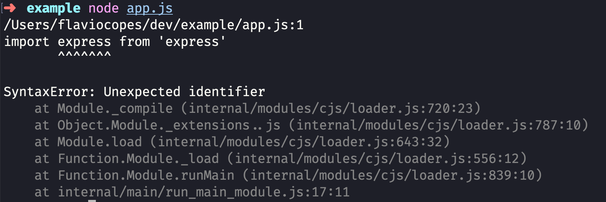

Many tutorials now use the `import XXX from 'XXX'` ([ES Modules](/es-modules/)) syntax instead of `const XXX = require('XXX')` ([CommonJS](/commonjs/)) syntax.

If you add that to your Node.js app, it won't work. You'll get an error like this:



> `unexpected identifier..`

One of the solutions to this is to use [Babel](/babel/). If you already have a Babel setup for your project, this should already be working for you.

But you shouldn't need Babel any more now because Node has experimental support for ES Modules, and since it's experimental, to enable it you must do 3 things.

First, install the latest version of Node.js. It has the latest and greatest features.

Second, add the `"type": "module"` line in your `package.json` file.

Third, use the `--experimental-modules` flag when invoking `nodejs`:

```sh
node --experimental-modules app.js
```

You should be good to go!

An alternative is to avoid adding the `"type": "module"` line in your `package.json` file and instead rename your `app.js` file (or whatever) to `app.mjs`. I prefer the first option.

Note that now the `require()` syntax will stop working.

For older Node.js versions that might not support this flag, I recommend checking out the [`esm` npm module](https://www.npmjs.com/package/esm).