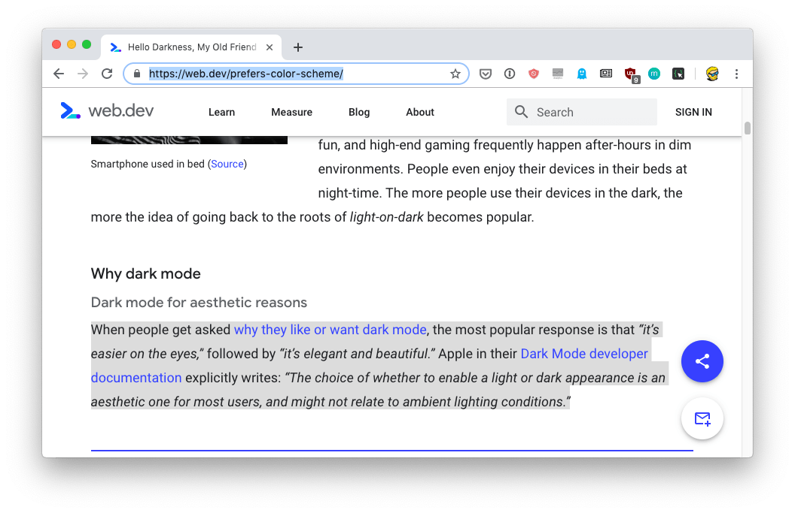
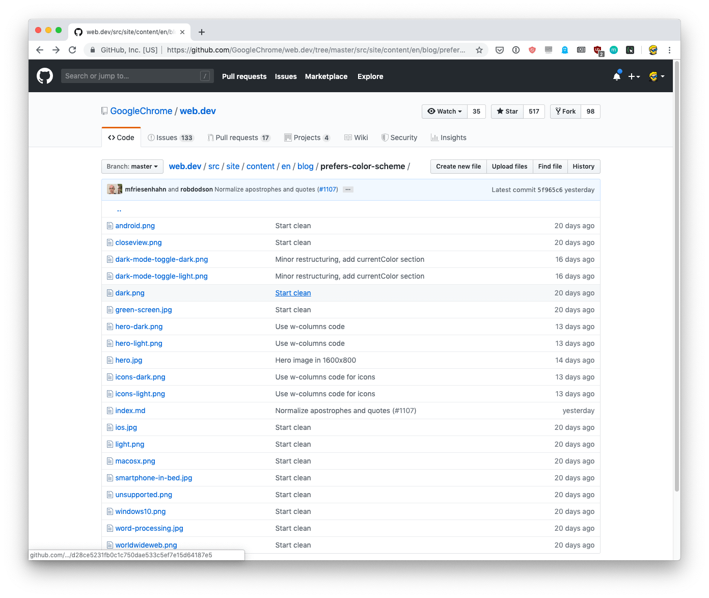
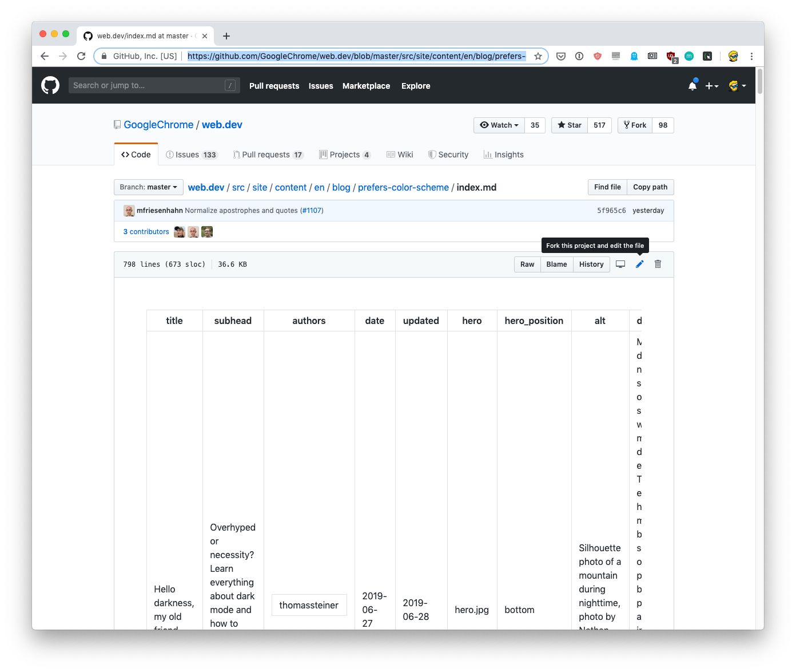
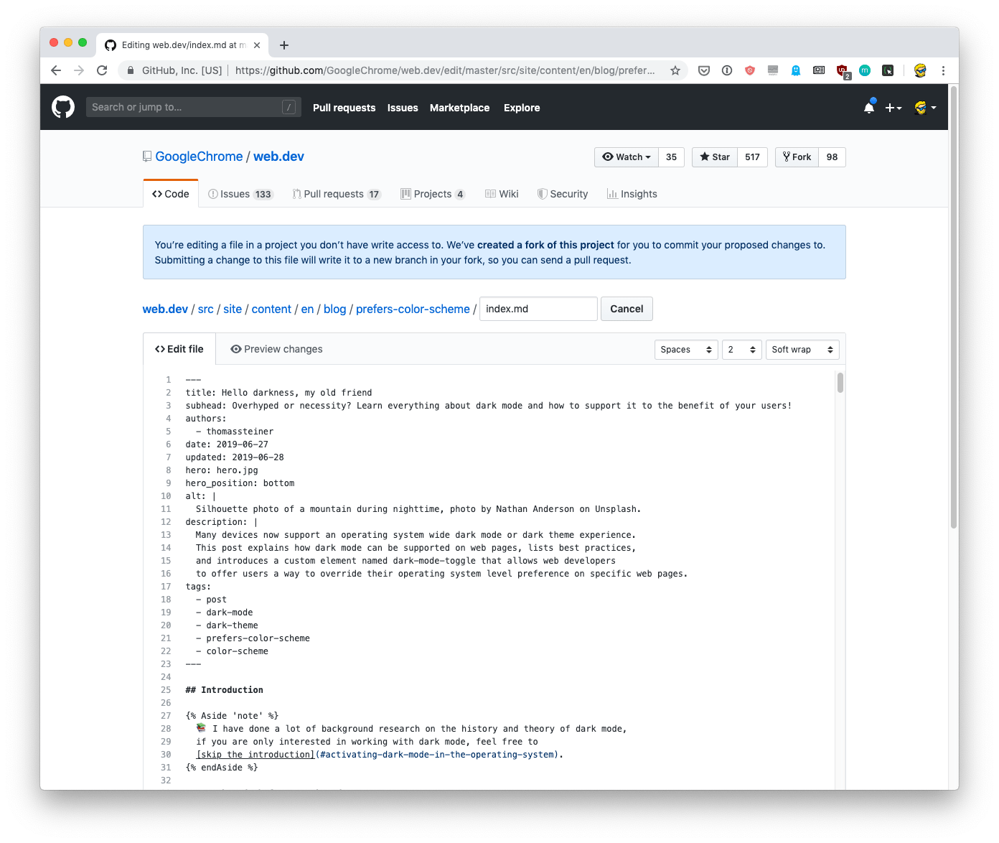
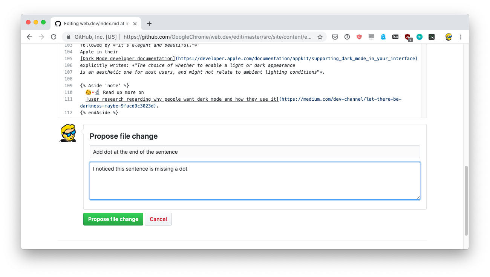
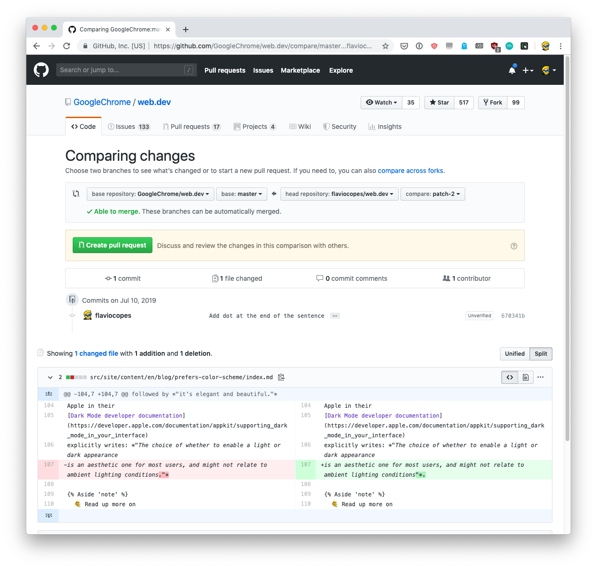
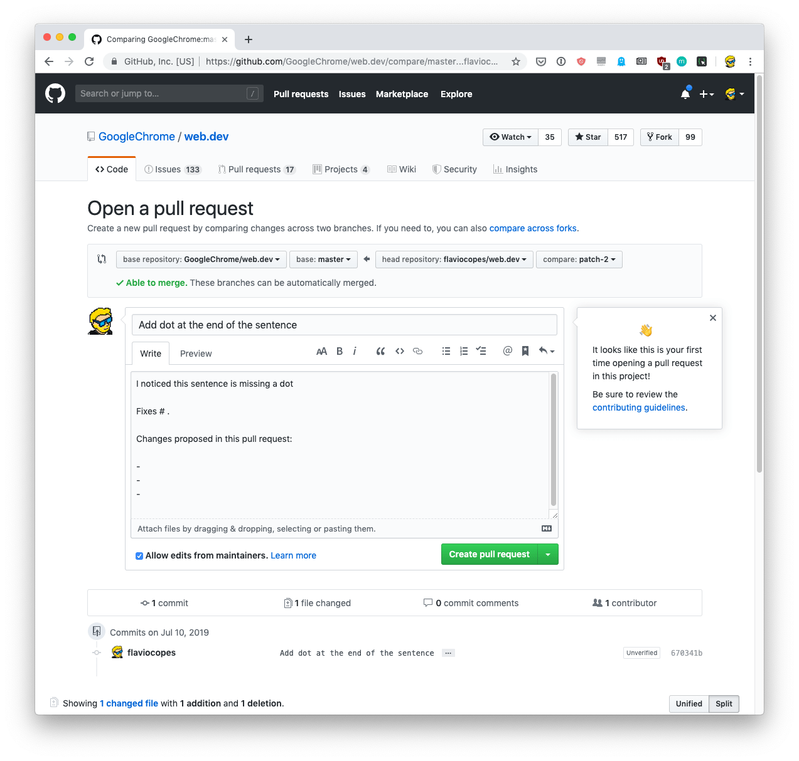
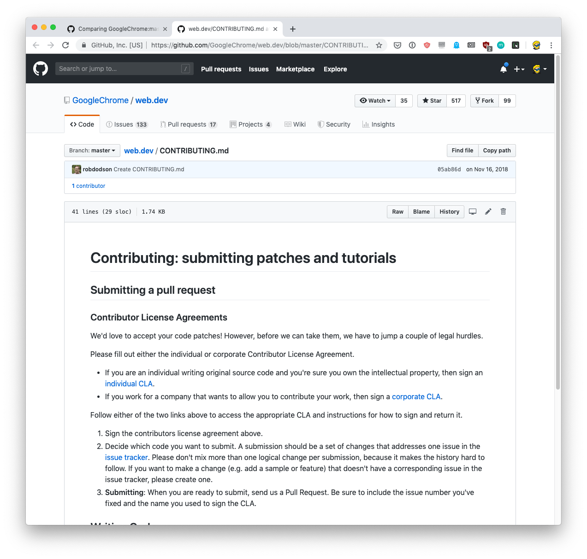
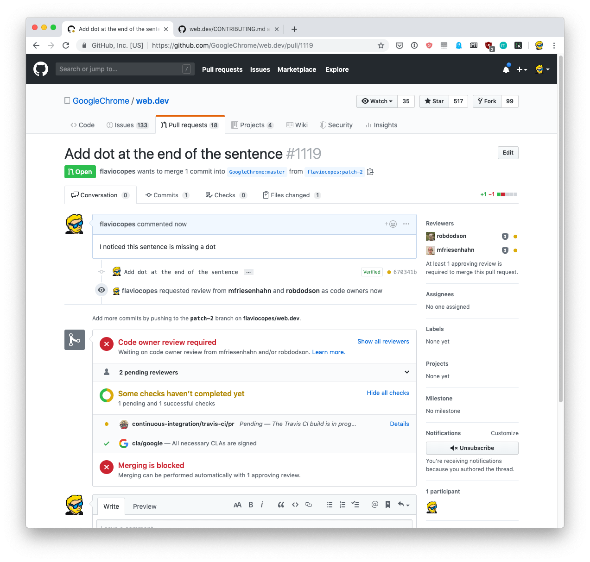

Many tutorials exist about this topic but they make things overly complicated by assuming one has to contribute **code** to a project. So there's all the [git](/git/) setup before that.

What if you just need to edit a file, maybe the project README to fix a typo?

You don't need to know how to code or how to use Git to do that. But once you start doing Pull Requests, you can do many more things and collaborate on projects with other people! And maybe this will push you to also contribute code later on.

I assume you already have a (free) [GitHub](/github/) account. If you don't, then go to [github.com](https://github.com) and get one.

Let me show you the process.

I went to this page [https://web.dev/prefers-color-scheme/](https://web.dev/prefers-color-scheme/) and I found a possible typo. This line is missing a dot at the end.

> I'm not a grammar nazi, this is just for the sake of finding an example 😄

I know that site is hosted on GitHub, and that exact article is hosted here: [https://github.com/GoogleChrome/web.dev/tree/master/src/site/content/en/blog/prefers-color-scheme](https://github.com/GoogleChrome/web.dev/tree/master/src/site/content/en/blog/prefers-color-scheme)

I open the index.md file [https://github.com/GoogleChrome/web.dev/blob/master/src/site/content/en/blog/prefers-color-scheme/index.md](https://github.com/GoogleChrome/web.dev/blob/master/src/site/content/en/blog/prefers-color-scheme/index.md) directly on GitHub and I press the pencil icon in the file toolbar. Hovering it says "Fork this project and edit the file".

This brings up an editor view with this information:

> You’re editing a file in a project you don’t have write access to. Submitting a change to this file will write it to a new branch in your fork flaviocopes/web.dev, so you can send a pull request.

I can go and add that dot, then at the form at the bottom  I explain the changes I made:

I pressed the "Propose File Change" button and a compare view showed up.

There I can review the changes I made, to make sure all is fine, and finally I can click the "Create Pull Request" button. Currently the changes have been made to *your fork* of the project, which was made automatically by GitHub when you clicked the pencil icon.

At the top of this view you can see that I'm about to submit a PR to the `GoogleChrome/web.dev` project from my form `flaviocopes/web.dev`, from my branch `patch-2` to their `master` branch.

Pressing the "Create Pull Request" button shows another form where I can write a detailed description for the Pull Request.

Pull Requests can contain many different changes, so in theory you could have lots of files edited in the same PR, this is why you can add a summary.

This repository has a template for the PR text, to help the team manage it. Our PR is very simple so I remove the template and just paste the content from the commit message from before.

Notice the hint on the right? They tell me the project has a CONTRIBUTING.md file, which explains how to contribute and the guidelines. Pretty cool.

Seems we need to sign a CLA (Contributor License Agreement) to complete our PR. I already signed a Google CLA in the past so this step is clear for me, but you might need to fix that. Most projects don't really need it.

I clicked "Create pull request" and the PR is now sent!

Now it's up to the project maintainers to step in and accept it, you just need to wait for an email telling you that it's been merged, or any comments other people had.

[... a couple hours passed by...]

I got an email back, the PR was rejected because that dot was actually in the correct place! (I didn't know that).

But anyway here's a thing I wanted to add: don't be angry or upset if a PR you submit is not accepted. The maintainers of the project work on it for months or years and they know better than you about what's better for it.

Plus, especially with code, views might be very very different and a PR you think is great might not be welcome.

It's also best to ask before working on a substantial PR, to see if it's something the project actually needs.

But this is a topic on its own.
