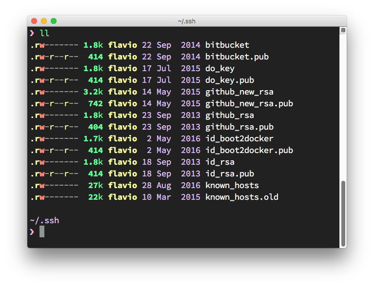
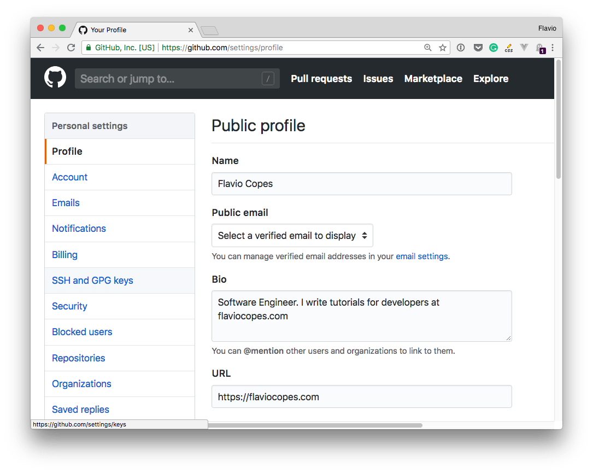
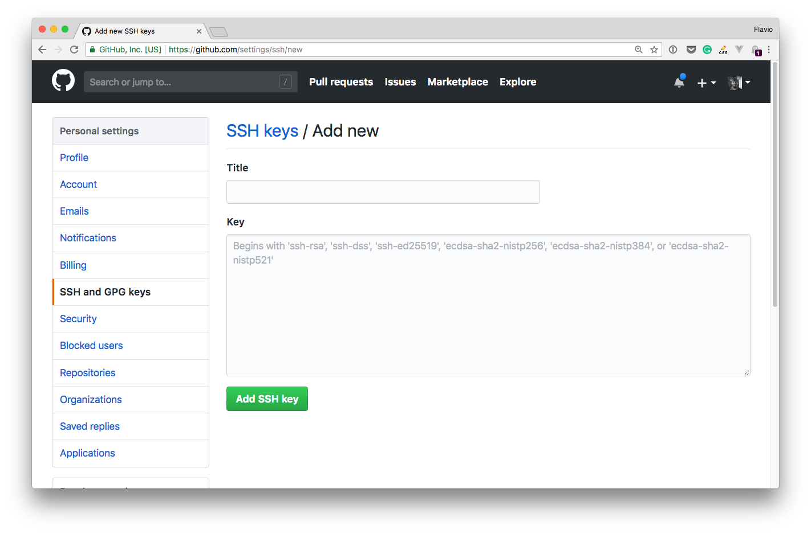

When working with Git using the command line, the most common way to handle authentication is through the use of SSH keys.

Most GUI-based clients like GitHub Desktop will handle this for you, but sometimes you need the command line, and so it's very useful to have a SSH key setup in place.

Also, sometimes you'll need an SSH key to do useful things like pulling a repository on a remote server.

## Keys on your computer

SSH keys are stored in the `~/.ssh` folder.

You can have more than one key in there, because SSH keys are used for things other than Git.

You can list all your SSH keys by typing

```bash
ls -al ~/.ssh
```

If you have existing keys you'll notice that they sit in pairs, one file and another similarly named ending with `.pub`:



The `.pub` file contains the public key, while the other file contains the private key which should never be shared anywhere.

You should never share the private key anywhere. If you lose the private key, you'll have to regenerate a new private/public key pair, as the authentication cannot be successfully completed without the private key part.

## Generating a new key

You generate a new SSH key using the command `ssh-keygen`, which is available on all macOS, Linux and modern Windows computers with the Linux subsystem or the [Git for Windows](https://gitforwindows.org/) package.

Here's the command you use:

```bash
ssh-keygen -t rsa -b 4096 -C "your_email@example.com"
```

The last part, which in this example is filled with an email address, is a comment. You can enter any email you want, it does not have to be your GitHub account or it can even be a random string. It can be useful to know who generated the key if there is potential for ambiguity.

The key generation program will ask you where you want to save the key. If this is the first key, you are suggested to use `id_rsa` as the filename, but you'd better choose a file name that remembers you the service you are generating it for, like `github_rsa`.

You can optionally add a password. I highly recommend setting the password. macOS will store the password in the Keychain so you don't have to repeat it every time.

## Add the key to GitHub

I show the process for GitHub, but it's the same kind of process that every Git platform uses, with small differences.

In the GitHub settings you'll find the "SSH and GPG keys" menu:



Clicking it reveals your current setup:


As you can see up here I defined 3 SSH keys, one I use locally on my mac, and 2 I use on the remote servers to pull the website code.

Pressing "New SSH key" lets you add a new one:



You set the title to be something meaningful, which you'll remember 2 years+ from now.

The key is the one you generated before.

You can open the `.pub` file of the key, copy its content and paste it in this box.

You can do so using any CLI command like `cat id_rsa.pub` and you copy/paste the whole key code with the mouse.

Once you save that string to GitHub (or any other service, as the concept is the same for everyone), your Git client will have the credentials it needs to communicate with the remove server, and you should be good to go!

## Using multiple keys

It's recommended to use a different SSH key for every service you intend to use.

This makes it very easy to invalidate a key on a specific service without having to change it on all the services you use if you decide to renew it, either because compromised/publicly exposed or for some other reason.
