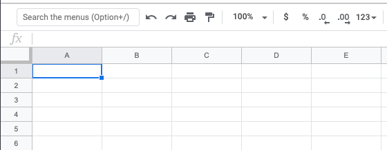
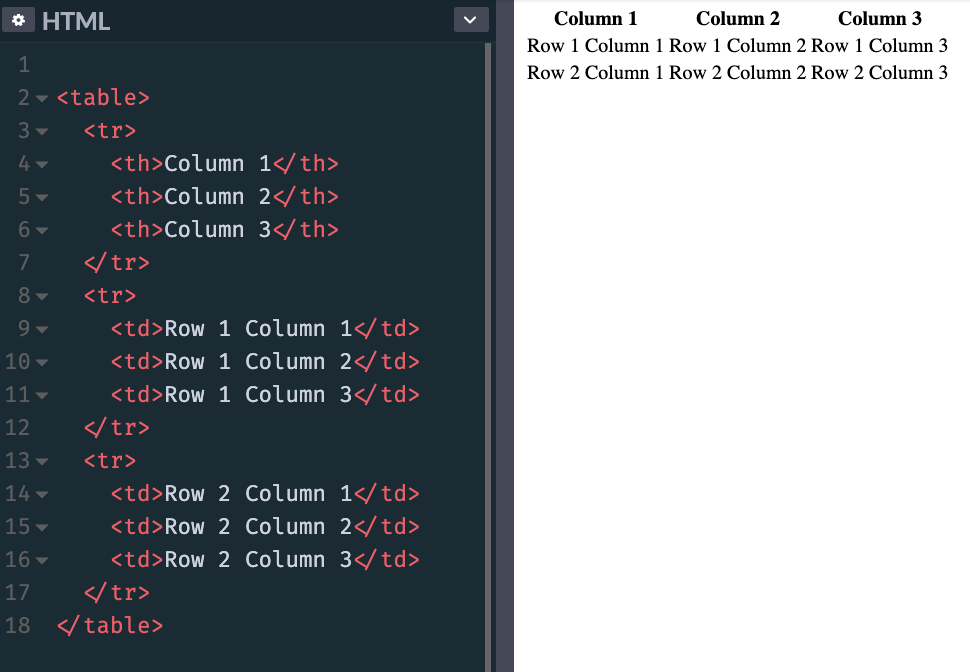
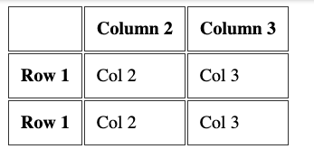

In the early days of the web tables were a very important part of building layouts.

Later on they were replaced by CSS and its layout capabilities, and today we have powerful tools like CSS Flexbox and CSS Grid to build layouts. Tables are now used just for, guess what, building tables!

### The `table` tag

You define a table using the `table` tag:

```html
<table>

</table>
```

Inside the table we'll define the data. We reason in terms of rows, which means we add rows into a table (not columns). We'll define columns inside a row.

### Rows

A row is added using the `tr` tag, and that's the only thing we can add into a `table` element:

```html
<table>
  <tr></tr>
  <tr></tr>
  <tr></tr>
</table>
```

This is a table with 3 rows.

The first row _can_ take the role of the header.

### Column headers

The table header contains the name of a column, typically in a bold font.

Think about an Excel / Google Sheets document. The top `A-B-C-D...` header.



We define the header using the `th` tag:

```html
<table>
  <tr>
    <th>Column 1</th>
    <th>Column 2</th>
    <th>Column 3</th>
  </tr>
  <tr></tr>
  <tr></tr>
</table>
```

### The table content

The content of the table is defined using `td` tags, inside the other `tr` elements:

```html
<table>
  <tr>
    <th>Column 1</th>
    <th>Column 2</th>
    <th>Column 3</th>
  </tr>
  <tr>
    <td>Row 1 Column 1</td>
    <td>Row 1 Column 2</td>
    <td>Row 1 Column 3</td>
  </tr>
  <tr>
    <td>Row 2 Column 1</td>
    <td>Row 2 Column 2</td>
    <td>Row 2 Column 3</td>
  </tr>
</table>
```

This is how browsers render it, if you don't add any CSS styling:



Adding this CSS:

```css
th, td {
  padding: 10px;
  border: 1px solid #333;
}
```

makes the table look more like a proper table:


### Span columns and rows

A row can decide to span over 2 or more columns, using the `colspan` attribute:

```html
<table>
  <tr>
    <th>Column 1</th>
    <th>Column 2</th>
    <th>Column 3</th>
  </tr>
  <tr>
    <td colspan="2">Row 1 Columns 1-2</td>
    <td>Row 1 Column 3</td>
  </tr>
  <tr>
    <td colspan="3">Row 2 Columns 1-3</td>
  </tr>
</table>
```


Or it can span over 2 or more rows, using the `rowspan` attribute:

```html
<table>
  <tr>
    <th>Column 1</th>
    <th>Column 2</th>
    <th>Column 3</th>
  </tr>
  <tr>
    <td colspan="2" rowspan="2">Rows 1-2 Columns 1-2</td>
    <td>Row 1 Column 3</td>
  </tr>
  <tr>
    <td>Row 2 Column 3</td>
  </tr>
</table>
```


### Row headings

Before I explained how you can have columns headings, using the `th` tag inside the first `tr` tag of the table.

You can add a `th` tag as the first element inside a `tr` that's not the first `tr` of the table, to have row headings:

```html
<table>
  <tr>
    <th></th>
    <th>Column 2</th>
    <th>Column 3</th>
  </tr>
  <tr>
    <th>Row 1</th>
    <td>Col 2</td>
    <td>Col 3</td>
  </tr>
  <tr>
    <th>Row 1</th>
    <td>Col 2</td>
    <td>Col 3</td>
  </tr>
</table>
```



### More tags to organize the table

You can add 3 more tags into a table, to have it more organized.

This is best when using big tables. And to properly define a header and a footer, too.

Those tags are

- `thead`
- `tbody`
- `tfoot`

They wrap the `tr` tags to clearly define the difference sections of the table. Here's an example usage:

```html
<table>
  <thead>
    <tr>
      <th></th>
      <th>Column 2</th>
      <th>Column 3</th>
    </tr>
  </thead>
  <tbody>
    <tr>
      <th>Row 1</th>
      <td>Col 2</td>
      <td>Col 3</td>
    </tr>
    <tr>
      <th>Row 2</th>
      <td>Col 2</td>
      <td>Col 3</td>
    </tr>
  </tbody>
  <tfoot>
    <tr>
      <td></td>
      <td>Footer of Col 1</td>
      <td>Footer of Col 2</td>
    </tr>
  </tfoot>
</table>
```


## Table caption

A table should have a `caption` tag that describes its content. That tag should be put immediately after the opening `table` tag:

```html
<table>
  <caption>Dogs age</caption>
  <tr>
    <th>Dog</th>
    <th>Age</th>
  </tr>
  <tr>
    <td>Roger</td>
    <td>7</td>
  </tr>
</table>
```