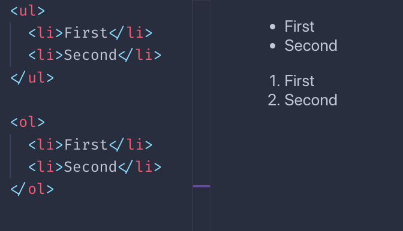
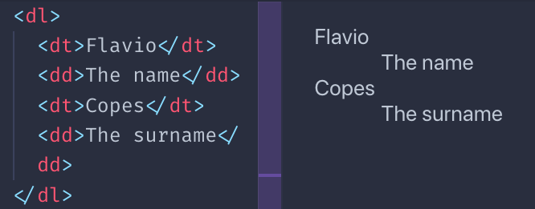

## The `p` tag

This tag defines a paragraph of text.

```html
<p>Some text</p>
```

It's a block element.

Inside it, we can add any inline element we like, like `span` or `a`.

We cannot add block elements.

We cannot nest `p` elements one into another.

By default browsers style a paragraph with a margin on top and at the bottom. `16px` in Chrome, but the exact value might vary between browsers.

This causes two consecutive paragraphs to be spaced, replicating what we think of a "paragraph" in printed text.

## The `span` tag

This is an inline tag that can be used to create a section in a paragraph that can be targeted using CSS:

```html
<p>A part of the text <span>and here another part</span></p>
```

## The `br` tag

This tag represents a line break. It's an inline element, and does not need a closing tag.

We use it to create a new line inside a `p` tag, without creating a new paragraph.

And compared to creating a new paragraph, it does not add additional spacing.

```html
<p>Some text<br>A new line</p>
```

## The heading tags

HTML provides us 6 heading tags. From most important to least important, we have `h1`, `h2`, `h3`, `h4`, `h5`, `h6`.

Typically a page will have one `h1` element, which is the page title. Then you might have one or more `h2` elements depending on the page content.

Headings, especially the heading organization, are also essential for SEO, and search engines use them in various ways.

The browser by default will render the `h1` tag bigger, and will make the elements size smaller as the number near `h` increases:


All headings are block elements. They cannot contain other elements, just text.

## The `strong` tag

This tag is used to mark the text inside it as *strong*. This is pretty important, it's not a visual hint, but a semantic hint. Depending on the medium used, its interpretation will vary.

Browsers by default make the text in this tag **bold**.

## The `em` tag

This tag is used to mark the text inside it as *emphasized*. Like with `strong`, it's not a visual hint but a semantic hint.

Browsers by default make the text in this **italic**.

## Quotes
The `blockquote` HTML tag is useful to insert citations in the text.

Browsers by default apply a margin to the `blockquote` element. Chrome applies a 40px left and right margin, and a 10px top and bottom margin.

The `q` HTML tag is used for inline quotes.

## Horizontal line

Not really based on text, but the `hr` tag is often used inside a page. It means `horizontal rule`, and it adds an horizontal line in the page.

Useful to separate sections in the page.

## Code blocks

The `code` tag is especially useful to show code, because browsers give it a monospaced font.

That's typically the only thing that browsers do. This is the CSS applied by Chrome:

```css
code {
    font-family: monospace;
}
```

This tag is typically wrapped in a `pre` tag, because the `code` element ignores whitespace and line breaks. Like the `p` tag.

Chrome gives `pre` this default styling:

```css
pre {
    display: block;
    font-family: monospace;
    white-space: pre;
    margin: 1em 0px;
}
```

which prevents white space collapsing and makes it a block element.

## Lists

We have 3 types of lists:

- unordered lists
- ordered lists
- definition lists

Unordered lists are created using the `ul` tag. Each item in the list is created with the `li` tag:

```html
<ul>
	<li>First</li>
	<li>Second</li>
</ul>
```

Ordered lists are similar, just made with the `ol` tag:

```html
<ol>
	<li>First</li>
	<li>Second</li>
</ol>
```

The difference between the two is that ordered lists have a number before each item:



Definition lists are a bit different. You have a term, and its definition:

```html
<dl>
	<dt>Flavio</dt>
	<dd>The name</dd>
	<dt>Copes</dt>
	<dd>The surname</dd>
</dl>
```

This is how browsers typically render them:



I must say you rarely see them in the wild, for sure not much as `ul` and `ol`, but sometimes they might be u seful.

## Other text tags

There is a number of tags with presentational purposes:

- the `mark` tag
- the `ins` tag
- the `del` tag
- the `sup` tag
- the `sub` tag
- the `small` tag
- the `i` tag
- the `b` tag

This is an example of the visual rendering of them which is applied by default by browsers:


You might wonder, how is `b` different than `strong`? And how `i` is different than `em`?

The difference lies in the semantic meaning. While `b` and `i` are a direct hint at the browser to make a piece of text bold or italic, `strong` and `em` give the text a special meaning, and it's up to the browser to give the styling. Which happens to be exactly the same as `b` and `i`, by default. Although you can change that using CSS.

There are a number of other, less used tags related to text. I just mentioned the ones that I see used the most.