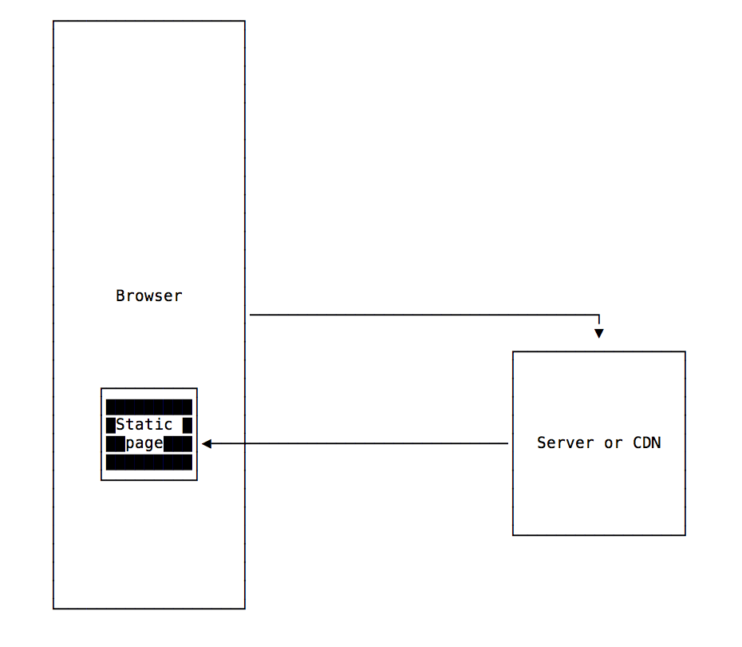

You surely came across the term **JAMstack** in the last couple years.

It defines a group of technologies used together to achieve a goal, like *LAMP* and *MEAN* if you are familiar with does.

What does JAMstack mean?

JAM stands for **J**avaScript, **A**PI, **M**arkup.

It describes a trend in creating Web Applications and Web Sites that have those key characteristics:

- There is a "dumb" web server (or [CDN](/cdn/)) sending the HTML needed to run the app, typically generated using a static site generator. The HTML is not generated
- The app can load some JavaScript that receives data from an API. Page interactions like navigation can cause getting more data from an API. Authentication is also done through an API.

This new approach is a new kind way, compared to

- traditional websites where the content is already provided in the app (like for static sites)
- CMS-based websites that load the information from a database in the backend
- server-rendered applications using any kind of backend language

It's also different than client-side rendered websites (for example built with React) with a server-side rendered part. The JAMstack does not involve server rendering at all.

## What are the advantages of using the JAMstack?

- It's FAST. The HTML is already generated and the web server must just serve it, without involving any kind of backend operation like looking up data from a database or generating the pages HTML for each request. It can be easily served through a CDN (Content Delivery Network).
- It's EFFICIENT. Since there is no backend, there are no bottlenecks (e.g. no database).
- It's CHEAPER, since serving the resources through a CDN is way less costly than serving them through a backend server
- It's more SECURE, since the backend is exposed only through an API

The traditional approach of server-rendering websites application dynamically, like it happens with WordPress, Laravel and Rails, is being superseded in many cases by a lighter approach.

A typical WordPress site can make 30-100 requests to a database for every page load, depending on the amount of plugins installed. Unless heavily cached, you can recognize a WordPress site when it gets popular on Hacker News, Reddit or any other big site because you get a blank page - which means something crashed on the server, as the site cannot support all that traffic. Many times this is a lost opportunity, because when the site is at its peak in popularity, it does not work.

Serving a static HTML page instead of much, much more efficient than that, and dynamic data can still be fetched when needed, using separate API calls once the HTML is loaded.

## What are some technologies that can be used to build JAMstack apps?

- [Gatsby](https://www.gatsbyjs.org/)
- [Next.js](/nextjs/)
- [Nuxt](https://nuxtjs.org/)
- [Hugo](https://gohugo.io/)

and more.

## What can JAMstack be used for?

Many apps can fall under the JAMstack umbrella, and the possibilities are endless, ranging from simple blogs to e-commerce websites (for example with [Snipcart](https://snipcart.com)) to more complex Web Apps.

My blog falls under the JAMstack umbrella. All the HTML is generated at deploy time, and there is nothing else going on.
