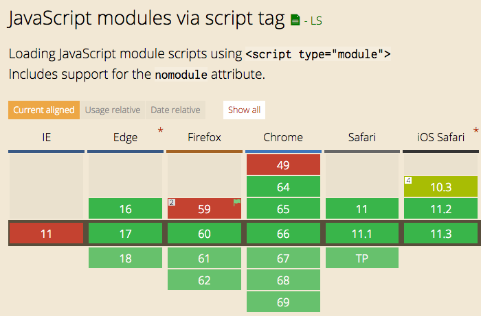

<!-- TOC -->

- [Introduction to ES Modules](#introduction-to-es-modules)
- [The ES Modules Syntax](#the-es-modules-syntax)
- [Other import/export options](#other-importexport-options)
- [CORS](#cors)
- [What about browsers that do not support modules?](#what-about-browsers-that-do-not-support-modules)
- [Conclusion](#conclusion)

<!-- /TOC -->

## Introduction to ES Modules

ES Modules is the ECMAScript standard for working with modules.

While [Node.js](https://flaviocopes.com/nodejs/) has been using the CommonJS standard for years, the browser never had a module system, as every major decision such as a module system must be first standardized by ECMAScript and then implemented by the browser.

This standardization process completed with [ES6](https://flaviocopes.com/es6/) and browsers started implementing this standard trying to keep everything well aligned, working all in the same way, and now ES Modules are supported in Chrome, Safari, Edge and Firefox (since version 60).

Modules are very cool, because they let you encapsulate all sorts of functionality, and expose this functionality to other JavaScript files, as libraries.



## The ES Modules Syntax

The syntax to import a module is:

```js
import package from 'module-name'
```

while CommonJS uses

```js
const package = require('module-name')
```

A module is a JavaScript file that **exports** one or more values (objects, functions or variables), using the `export` keyword. For example, this module exports a function that returns a string uppercase:

> uppercase.js

```js
export default str => str.toUpperCase()
```

In this example, the module defines a single, **default export**, so it can be an anonymous function. Otherwise it would need a name to distinguish it from other exports.

Now, **any other JavaScript module** can import the functionality offered by uppercase.js by importing it.

An HTML page can add a module by using a `<script>` tag with the special `type="module"` attribute:

```html
<script type="module" src="index.js"></script>
```

> Note: this module import behaves like a `defer` script load. See [efficiently load JavaScript with defer and async](https://flaviocopes.com/javascript-async-defer/)

It's important to note that any script loaded with `type="module"` is loaded in [strict mode](https://flaviocopes.com/javascript-strict-mode/).

In this example, the `uppercase.js` module defines a **default export**, so when we import it, we can assign it a name we prefer:

```js
import toUpperCase from './uppercase.js'
```

and we can use it:

```js
toUpperCase('test') //'TEST'
```

You can also use an absolute path for the module import, to reference modules defined on another domain:

```js
import toUpperCase from 'https://flavio-es-modules-example.glitch.me/uppercase.js'
```

This is also valid import syntax:

```js
import { toUpperCase } from '/uppercase.js'
import { toUpperCase } from '../uppercase.js'
```

This is not:

```js
import { toUpperCase } from 'uppercase.js'
import { toUpperCase } from 'utils/uppercase.js'
```

It's either absolute, or has a `./` or `/` before the name.

## Other import/export options

We saw this example above:

```js
export default str => str.toUpperCase()
```

This creates one default export. In a file however you can export more than one thing, by using this syntax:

```js
const a = 1
const b = 2
const c = 3

export { a, b, c }
```

Another module can import all those exports using

```js
import * from 'module'
```

You can import just a few of those exports, using the [destructuring assignment](https://flaviocopes.com/es6/#destructuring-assignments):

```js
import { a } from 'module'
import { a, b } from 'module'
```

You can rename any import, for convenience, using `as`:

```js
import { a, b as two } from 'module'
```

You can import the default export, and any non-default export by name, like in this common React import:

```js
import React, { Component } from 'react'
```

You can see an ES Modules example here: <https://glitch.com/edit/#!/flavio-es-modules-example?path=index.html>

## CORS

Modules are fetched using [CORS](https://flaviocopes.com/cors/). This means that if you reference scripts from other domains, they must have a valid CORS header that allows cross-site loading (like `Access-Control-Allow-Origin: *`)

## What about browsers that do not support modules?

Use a combination of `type="module"` and `nomodule`:

```html
<script type="module" src="module.js"></script>
<script nomodule src="fallback.js"></script>
```

## Conclusion

ES Modules are one of the biggest features introduced in modern browsers. They are part of ES6 but the road to implement them has been long.

We can now use them! But we must also remember that having more than a few modules is going to have a performance hit on our pages, as it's one more step that the browser must perform at runtime.

[Webpack](https://flaviocopes.com/webpack/) is probably going to still be a huge player even if ES Modules land in the browser, but having such a feature directly built in the language is huge for a unification of how modules work client-side and on Node.js as well.
