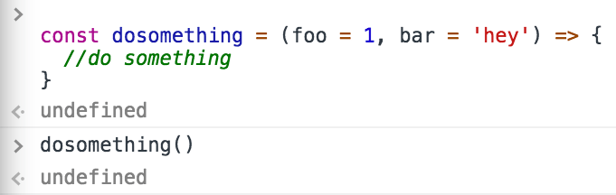
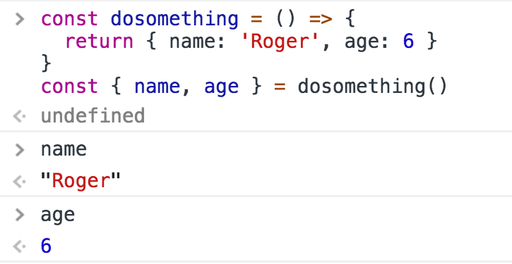
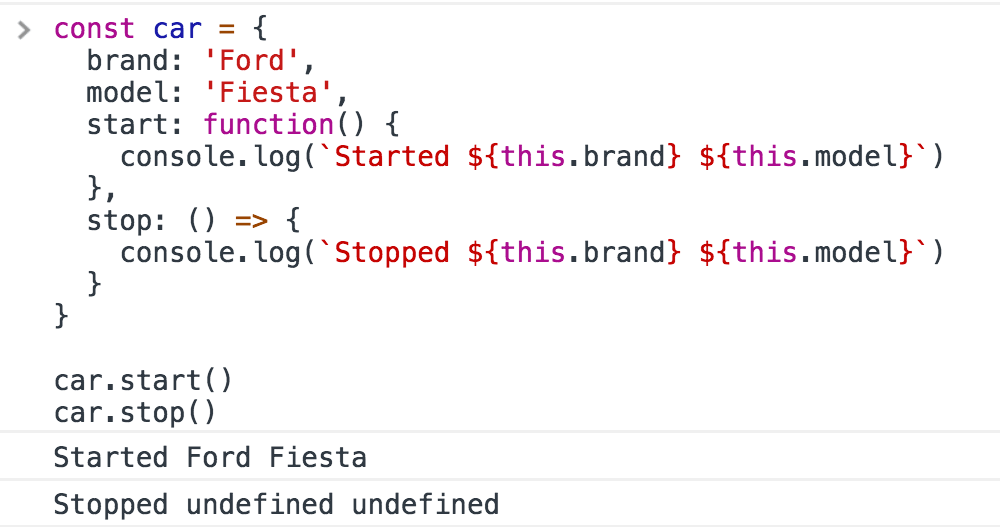
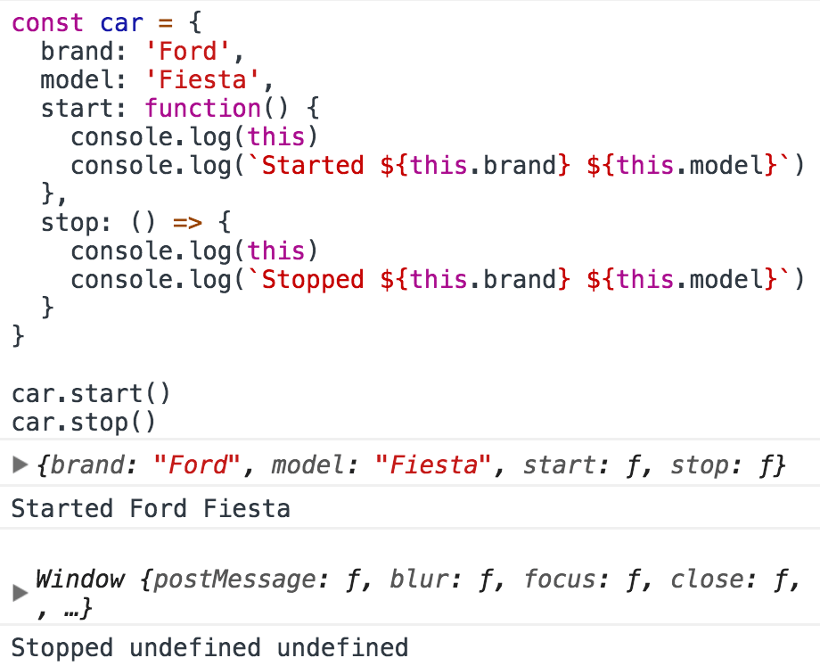
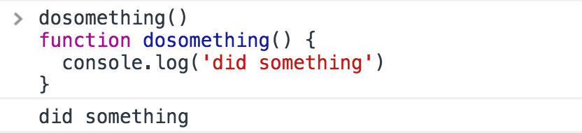
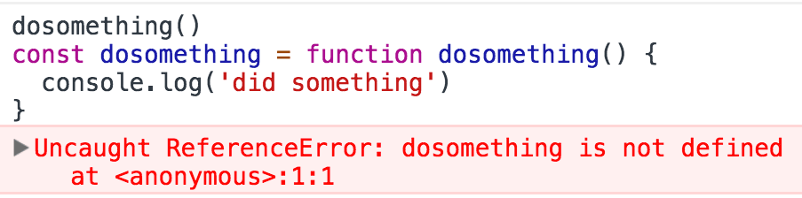
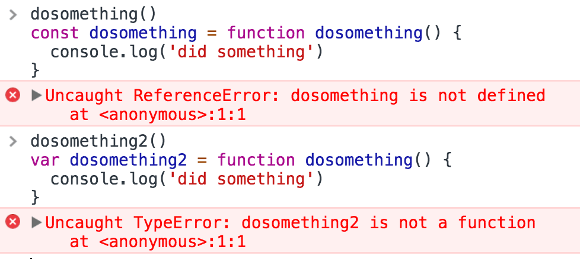

<!-- TOC -->

- [Introduction](#introduction)
- [Syntax](#syntax)
- [Parameters](#parameters)
- [Return values](#return-values)
- [Nested functions](#nested-functions)
- [Object Methods](#object-methods)
- [`this` in Arrow Functions](#this-in-arrow-functions)
- [IIFE, Immediately Invocated Function Expressions](#iife-immediately-invocated-function-expressions)
- [Function Hoisting](#function-hoisting)

<!-- /TOC -->

## Introduction

Everything in JavaScript happens in functions.

A function is a block of code, self contained, that can be defined once and run any times you want.

A function can optionally accept parameters, and returns one value.

Functions in JavaScript are **objects**, a special kind of objects: **function objects**. Their superpower lies in the fact that they can be invoked.

In addition, functions are said to be **first class functions** because they can be assigned to a value, and they can be passed as arguments and used as a return value.

## Syntax

Let's start with the "old", pre-ES6/ES2015 syntax. Here's a **function declaration**:

> I use `foo` and `bar` as *random names*. Enter any kind of name to replace them.

```js
function dosomething(foo) {
  // do something
}
```

(now, in post ES6/ES2015 world, referred as a **regular function**)

Functions can be assigned to variables (this is called a **function expression**):

```js
const dosomething = function(foo) {
  // do something
}
```

**Named function expressions** are similar, but play nicer with the stack call trace, which is useful when an error occurs - it holds the name of the function:

```js
const dosomething = function dosomething(foo) {
  // do something
}
```

ES6/ES2015 introduced **arrow functions**, which are especially nice to use when working with inline functions, as parameters or callbacks:

```js
const dosomething = foo => {
  //do something
}
```

Arrow functions have an important difference from the other function definitions above, we'll see which one later as it's an advanced topic.

## Parameters

A function can have one or more parameters.

```js
const dosomething = () => {
  //do something
}

const dosomethingElse = foo => {
  //do something
}

const dosomethingElseAgain = (foo, bar) => {
  //do something
}
```

Starting with ES6/ES2015, functions can have default values for the parameters:

```js
const dosomething = (foo = 1, bar = 'hey') => {
  //do something
}
```

This allows you to call a function without filling all the parameters:

```js
dosomething(3)
dosomething()
```

ES2018 introduced trailing commas for parameters, a feature that helps reducing bugs due to missing commas when moving around parameters (e.g. moving the last in the middle):

```js
const dosomething = (foo = 1, bar = 'hey') => {
  //do something
}

dosomething(2, 'ho!')
```

You can wrap all your arguments in an array, and use the [**spread operator**](/javascript-spread-operator/) operator when calling the function:

```js
const dosomething = (foo = 1, bar = 'hey') => {
  //do something
}
const args = [2, 'ho!']
dosomething(...args)
```

With many parameters, remembering the order can be difficult. Using objects, destructuring allows to keep the parameter names:

```js
const dosomething = ({ foo = 1, bar = 'hey' }) => {
  //do something
  console.log(foo) // 2
  console.log(bar) // 'ho!'
}
const args = { foo: 2, bar: 'ho!' }
dosomething(args)
```

## Return values

Every function returns a value, which by default is `undefined`.



Any function is terminated when its lines of code end, or when the execution flow finds a `return` keyword.

When JavaScript encounters this keyword it exits the function execution and gives control back to its caller.

If you pass a value, that value is returned as the result of the function:

```js
const dosomething = () => {
  return 'test'
}
const result = dosomething() // result === 'test'
```

You can only return one value.

To _simulate_ returning multiple values, you can return an **object literal**, or an **array**, and use a [destructuring assignment](/es6/#destructuring-assignments) when calling the function.

Using arrays:


Using objects:



## Nested functions


Functions can be defined inside other functions:

```js
const dosomething = () => {
  const dosomethingelse = () => {
    //some code here
  }
  dosomethingelse()
  return 'test'
}
```

The nested function is scoped to the outside function, and cannot be called from the outside.

This means that `dosomethingelse()` is not reachable from outside `dosomething()`:

```js
const dosomething = () => {
  const dosomethingelse = () => {
    //some code here
  }
  dosomethingelse()
  return 'test'
}

dosomethingelse() //ReferenceError: dosomethingelse is not defined
```

This is very useful because we can create encapsulated code that is limited in its scope by the outer function it's defined in.

We could have 2 function define a function with the same name, inside them:

```js
const bark = () => {
  const dosomethingelse = () => {
    //some code here
  }
  dosomethingelse()
  return 'test'
}


const sleep = () => {
  const dosomethingelse = () => {
    //some code here
  }
  dosomethingelse()
  return 'test'
}
```

and most importantly you don't have to *think* about overwriting existing functions and variables defined inside other functions.

## Object Methods

When used as object properties, functions are called methods:

```js
const car = {
  brand: 'Ford',
  model: 'Fiesta',
  start: function() {
    console.log(`Started`)
  }
}

car.start()
```

## `this` in Arrow Functions

There's an important behavior of Arrow Functions vs regular Functions when used as object methods. Consider this example:

```js
const car = {
  brand: 'Ford',
  model: 'Fiesta',
  start: function() {
    console.log(`Started ${this.brand} ${this.model}`)
  },
  stop: () => {
    console.log(`Stopped ${this.brand} ${this.model}`)
  }
}
```

The `stop()` method does not work as you would expect.



This is because the handling of `this` is different in the two functions declarations style. `this` in the arrow function refers to the enclosing function context, which in this case is the `window` object:



`this`, which refers to the host object using `function()`

This implies that **arrow functions are not suitable to be used for object methods** and constructors (arrow function constructors will actually raise a `TypeError` when called).

## IIFE, Immediately Invocated Function Expressions

An IIFE is a function that's immediately executed right after its declaration:

```js
;(function dosomething() {
  console.log('executed')
})()
```

You can assign the result to a variable:

```js
const something = (function dosomething() {
  return 'something'
})()
```

They are very handy, as you don't need to separately call the function after its definition.

[See my post dedicated to them](/javascript-iife/).

## Function Hoisting

JavaScript before executing your code reorders it according to some rules.

Functions in particular are moved at the top of their scope. This is why it's legal to write

```js
dosomething()
function dosomething() {
  console.log('did something')
}
```



Internally, JavaScript moves the function before its call, along with all the other functions found in the same scope:

```js
function dosomething() {
  console.log('did something')
}
dosomething()
```

Now, if you use named function expressions, since you're using [variables](/javascript-variables/) something different happens. The variable declaration is hoisted, but not the value, so not the function.

```js
dosomething()
const dosomething = function dosomething() {
  console.log('did something')
}
```

Not going to work:



This is because what happens internally is:

```js
const dosomething
dosomething()
dosomething = function dosomething() {
  console.log('did something')
}
```

The same happens for `let` declarations. `var` declarations do not work either, but with a different error:



This is because `var` declarations are hoisted and initialized with `undefined` as a value, while `const` and `let` are hoisted but not initialized.
