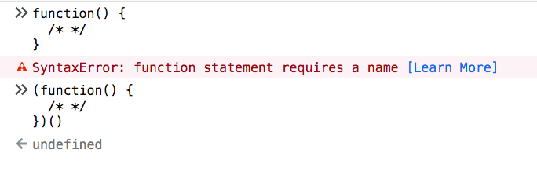

An **Immediately-invoked Function Expression** (IIFE for friends) is a way to execute functions immediately, as soon as they are created.

IIFEs are very useful because **they don't pollute the global object**, and they are a simple way to **isolate variables declarations**.

This is the syntax that defines an IIFE:

```js
(function() {
  /* */
})()
```

IIFEs can be defined with arrow functions as well:

```js
(() => {
  /* */
})()
```

We basically have a function defined inside parentheses, and then we append `()` to execute that function: `(/* function */)()`.

Those wrapping parentheses are actually what make our function, internally, be considered an expression. Otherwise, the function declaration would be invalid, because we didn't specify any name:



Function declarations want a name, while function expressions do not require it.

You could also put the invoking parentheses _inside_ the expression parentheses, there is no difference, just a styling preference:

```js
(function() {
  /* */
}())

(() => {
  /* */
}())
```

## Alternative syntax using unary operators

There is some weirder syntax that you can use to create an IIFE, but it's very rarely used in the real world, and it relies on using _any_ unary operator:

```js
-(function() {
  /* */
})() +
  (function() {
    /* */
  })()

~(function() {
  /* */
})()

!(function() {
  /* */
})()
```

(does not work with arrow functions)

## Named IIFE

An IIFE can also be named regular functions (not arrow functions). This does not change the fact that the function does not "leak" to the global scope, and it cannot be invoked again after its execution:

```js
(function doSomething() {
  /* */
})()
```

## IIFEs starting with a semicolon

You might see this in the wild:

```js
;(function() {
  /* */
})()
```

This prevents issues when blindly concatenating two JavaScript files. Since JavaScript does not require semicolons, you might concatenate with a file with some statements in its last line that causes a syntax error.

This problem is essentially solved with "smart" code bundlers like [webpack](/webpack/).
