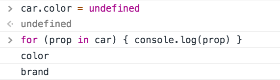
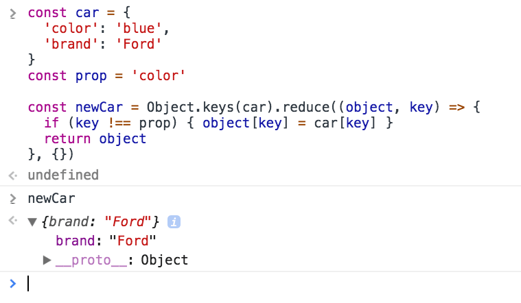

[JavaScript Objects](/javascript-object/) have properties, which are composed by a label associated with a value.

The object literal syntax we saw:

```js
const car = {

}
```

lets us define properties like this:

```js
const car = {
  color: 'blue'
}
```

here we have a `car` object with a property named `color`, with value `blue`.

Labels can be any string. Notice that I didn't use quotes around `color`, but if I wanted to include a character not valid as a variable name in the property name, I would have had to:

```js
const car = {
  color: 'blue',
  'the color': 'blue'
}
```

This means spaces, hyphens, and more special characters.

As you see, we separate each property with a comma.

## Retrieving the value of a property

We can retrieve the value of a property using 2 different syntaxes.

The first is **dot notation**:

```js
car.color //'blue'
```

The second, which is mandatory for properties with invalid names, is to use square brackets:

```js
car['the color'] //'blue'
```

If you access an unexisting property, you get `undefined`:

```js
car.brand //undefined
```

A nice way to check for a property value but default to a predefined value is to use the `||` operator:

```js
const brand = car.brand || 'ford'
```

As said, objects can have nested objects as properties:

```js
const car = {
  brand: {
    name: 'Ford'
  },
  color: 'blue'
}
```

You can access the brand name using

```js
car.brand.name
```

or

```js
car['brand']['name']
```

or even mixing:

```js
car.brand['name']
car['brand'].name
```

## Setting the value of a property

As you saw above you can set the value of a property when you define the object.

But you can always update it later on:

```js
const car = {
  color: 'blue'
}

car.color = 'yellow'
car['color'] = 'red'
```

And you can also add new properties to an object:

```js
car.model = 'Fiesta'

car.model //'Fiesta'
```

## How to remove a property

Given the object

```js
const car = {
  color: 'blue',
  brand: 'Ford'
}
```

you can delete a property from this object using

```js
delete car.brand
```


It works also expressed as:

```js
delete car['brand']
delete car.brand
delete newCar['brand']
```

## Setting a property to undefined

If you need to perform this operation in a very optimized way, for example, when you're operating on a large number of objects in loops, another option is to set the property to `undefined`.

Due to its nature, the performance of `delete` is a [lot slower](https://jsperf.com/delete-vs-undefined-vs-null/16) than a simple reassignment to `undefined`, more than 50x times slower.

However, keep in mind that the property is not deleted from the object. Its value is wiped, but it's still there if you iterate the object:



Using `delete` is still very fast, you should only look into this kind of performance issues if you have a very good reason to do so, otherwise it's always preferred to have a more clear semantic and functionality.

## Remove a property without mutating the object

If mutability is a concern, you can create a completely new object by copying all the properties from the old, except the one you want to remove:

```js
const car = {
  color: 'blue',
  brand: 'Ford'
}
const prop = 'color'

const newCar = Object.keys(car).reduce((object, key) => {
  if (key !== prop) {
    object[key] = car[key]
  }
  return object
}, {})
```



## How to count the number of properties in a JavaScript object

Use the `Object.keys()` method, passing the object you want to inspect, to get an array of all the (own) enumerable properties of the object.

Then calculate the length of that array by checking the `length` property:

```js
const car = {
  color: 'Blue',
  brand: 'Ford',
  model: 'Fiesta'
}

Object.keys(car).length
```

I said enumerable properties. This means their internal enumerable flag is set to true, which is the default. [Check MDN](https://developer.mozilla.org/en-US/docs/Web/JavaScript/Enumerability_and_ownership_of_properties) for more info on this subject.

## How to check if a JavaScript object property is undefined

In a JavaScript program, the correct way to check if an object property is undefined is to use the `typeof` operator.

`typeof` returns a string that tells the type of the operand. It is used without parentheses, passing it any value you want to check:

```js
const list = []
const count = 2

typeof list //"object"
typeof count //"number"
typeof "test" //"string"

typeof color //"undefined"
```

If the value is not defined, `typeof` returns the 'undefined' **string**.

Now suppose you have a `car` object, with just one property:

```js
const car = {
  model: 'Fiesta'
}
```

This is how you check if the `color` property is defined on this object:

```js
if (typeof car.color === 'undefined') {
  // color is undefined
}
```

### Dynamic properties

When defining a property, its label can be an expression if wrapped in square brackets:

```js
const car = {
  ['c' + 'o' + 'lor']: 'blue'
}

car.color //'blue'
```

### Simpler syntax to include variables as object properties

Instead of doing

```js
const something = 'y'
const x = {
  something: something
}
```

you can do this simplified way:

```js
const something = 'y'
const x = {
  something
}
```
