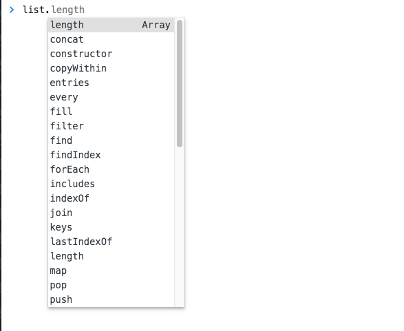

JavaScript is quite unique in the popular programming languages landscape because of its usage of prototypal inheritance.

While most object-oriented languages use a class-based inheritance model, JavaScript is based on the **prototype inheritance model**.

What does this mean?

Every single JavaScript object has a property, called `prototype`, which points to a different object.

This different object is the **object prototype**.

Our object uses that object prototype to inherit properties and methods.

Say you have an object created using the object literal syntax:

```js
const car = {}
```

or one created with the `new Object` syntax:

```js
const car = new Object()
```

in any case, the prototype of `car` is `Object`:

If you initialize an array, which is an object:

```js
const list = []
//or
const list = new Array()
```

the prototype is `Array`.

You can verify this by checking with the [`Object.getPrototypeOf()`](/javascript-object-getprototypeof/) and the `Object.prototype.isPrototypeOf()` methods:

```js
const car = {}
const list = []

Object.getPrototypeOf(car) === Object.prototype
Object.prototype.isPrototypeOf(car)

Object.getPrototypeOf(list) === Array.prototype
Array.prototype.isPrototypeOf(list)
```

All the properties and methods of the prototype are available to the object that has that prototype:



`Object.prototype` is the base prototype of all the objects:

```js
Object.getPrototypeOf(Array.prototype) == Object.prototype
```

If you wonder what's the prototype of the Object.prototype, there is no prototype: it's `null`. It's a special snowflake ❄️.

The above example you saw is an example of the **prototype chain** at work.

I can make an object that extends Array and any object I instantiate using it, will have Array and Object in its prototype chain and inherit properties and methods from all the ancestors.

In addition to using the `new` operator to create an object, or using the literals syntax for objects and arrays, you can instantiate an object using `Object.create()`.

The first argument passed is the object used as prototype:

```js
const car = Object.create({})
const list = Object.create(Array)
```

Pay attention because you can instantiate an array using

```js
const list = Object.create(Array.prototype)
```

and in this case `Array.isPrototypeOf(list)` is false, while `Array.prototype.isPrototypeOf(list)` is true.
