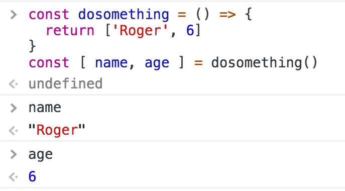

Every function returns a value, which by default is `undefined`.


Any function is terminated when its lines of code end, or when the execution flow finds a `return` keyword.

When JavaScript encounters this keyword it exits the function execution and gives control back to its caller.

If you pass a value, that value is returned as the result of the function:

```js
const dosomething = () => {
  return 'test'
}
const result = dosomething() // result === 'test'
```

You can only return one value.

To _simulate_ returning multiple values, you can return an **object literal**, or an **array**, and use a destructuring assignment when calling the function.

Using arrays:



Using objects:


