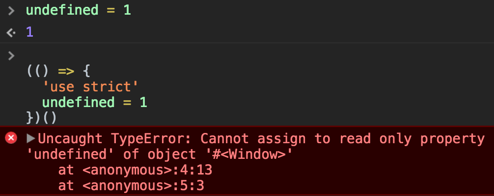
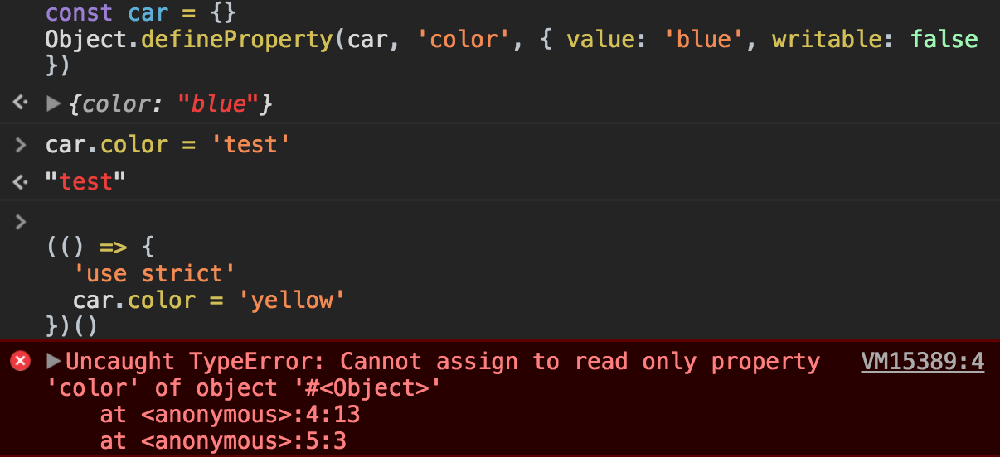

Strict Mode is an [ES5](/ecmascript/) feature, and it's a way to make JavaScript behave in a **better way**.

And in a **different way**, as enabling Strict Mode changes the semantics of the JavaScript language.

It's really important to know the main differences between JavaScript code in strict mode, and "normal" JavaScript, which is often referred as **sloppy mode**.

Strict Mode mostly removes functionality that was possible in ES3, and deprecated since ES5 (but not removed because of backwards compatibility requirements)

## How to enable Strict Mode

Strict mode is optional. As with every breaking change in JavaScript, we can't change how the language behaves by default, because that would break gazillions of JavaScript around, and JavaScript puts a lot of effort into making sure 1996 JavaScript code still works today. It's a key of its success.

So we have the `'use strict'` directive we need to use to enable Strict Mode.

You can put it at the beginning of a file, to apply it to all the code contained in the file:

```js
'use strict'

const name = 'Flavio'
const hello = () => 'hey'

//...
```

You can also enable Strict Mode for an individual function, by putting `'use strict'` at the beginning of the function body:

```js
function hello() {
  'use strict'

  return 'hey'
}
```

This is useful when operating on legacy code, where you don't have the time to test or the confidence to enable strict mode on the whole file.

## What changes in Strict Mode

### Accidental global variables

If you assign a value to an undeclared variable, JavaScript by default creates that variable on the global object:

```js
;(function() {
  variable = 'hey'
})()(() => {
  name = 'Flavio'
})()

variable //'hey'
name //'Flavio'
```

Turning on Strict Mode, an error is raised if you try to do what we did above:

```js
;(function() {
  'use strict'
  variable = 'hey'
})()(() => {
  'use strict'
  myname = 'Flavio'
})()
```


### Assignment errors

JavaScript silently fails some conversion errors.

In Strict Mode, those silent errors now raise issues:

```js
const undefined = 1(() => {
  'use strict'
  undefined = 1
})()
```



The same applies to Infinity, NaN, `eval`, `arguments` and more.

In JavaScript you can define a property of an object to be not writable, by using

```js
const car = {}
Object.defineProperty(car, 'color', { value: 'blue', writable: false })
```

In strict mode, you can't override this value, while in sloppy mode that's possible:



The same works for getters:

```js
const car = {
  get color() {
    return 'blue'
  }
}
car.color = 'red'(
  //ok

  () => {
    'use strict'
    car.color = 'yellow' //TypeError: Cannot set property color of #<Object> which has only a getter
  }
)()
```

Sloppy mode allows to extend a non-extensible object:

```js
const car = { color: 'blue' }
Object.preventExtensions(car)
car.model = 'Fiesta'(
  //ok

  () => {
    'use strict'
    car.owner = 'Flavio' //TypeError: Cannot add property owner, object is not extensible
  }
)()
```

(see [`Object.preventExtensions()`](/javascript-object-preventextensions/))

Also, sloppy mode allows to set properties on primitive values, without failing, but also without doing nothing at all:

```js
true.false = ''(
  //''
  1
).name =
  'xxx' //'xxx'
var test = 'test' //undefined
test.testing = true //true
test.testing //undefined
```

Strict mode fails in all those cases:

```js
;(() => {
  'use strict'
  true.false = ''(
    //TypeError: Cannot create property 'false' on boolean 'true'
    1
  ).name =
    'xxx' //TypeError: Cannot create property 'name' on number '1'
  'test'.testing = true //TypeError: Cannot create property 'testing' on string 'test'
})()
```

### Deletion errors

In sloppy mode, if you try to delete a property that you cannot delete, JavaScript returns false, while in Strict Mode, it raises a TypeError:

```js
delete Object.prototype(
  //false

  () => {
    'use strict'
    delete Object.prototype //TypeError: Cannot delete property 'prototype' of function Object() { [native code] }
  }
)()
```

### Function arguments with the same name

In normal functions, you can have duplicate parameter names:

```js
(function(a, a, b) {
  console.log(a, b)
})(1, 2, 3)
//2 3


(function(a, a, b) {
  'use strict'
  console.log(a, b)
})(1, 2, 3)
//Uncaught SyntaxError: Duplicate parameter name not allowed in this context
```

Note that arrow functions always raise a `SyntaxError` in this case:

```js
((a, a, b) => {
  console.log(a, b)
})(1, 2, 3)
//Uncaught SyntaxError: Duplicate parameter name not allowed in this context
```

### Octal syntax

Octal syntax in Strict Mode is disabled. By default, prepending a `0` to a number compatible with the octal numeric format makes it (sometimes confusingly) interpreted as an octal number:

```js
(() => {
  console.log(010)
})()
//8

(() => {
  'use strict'
  console.log(010)
})()
//Uncaught SyntaxError: Octal literals are not allowed in strict mode.
```

You can still enable octal numbers in Strict Mode using the `0oXX` syntax:

```js
;(() => {
  'use strict'
  console.log(0o10)
})()
//8
```

### Removed `with`

Strict Mode disables the `with` keyword, to remove some edge cases and allow more optimization at the compiler level.
