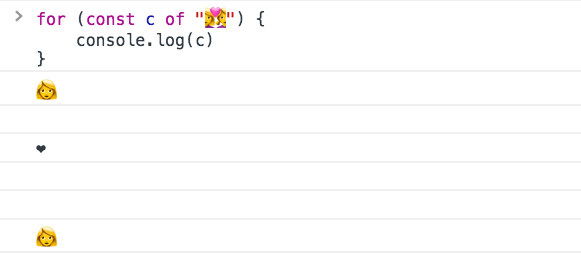

<!-- TOC -->

- [Unicode encoding of source files](#unicode-encoding-of-source-files)
- [How JavaScript uses Unicode internally](#how-javascript-uses-unicode-internally)
- [Using Unicode in a string](#using-unicode-in-a-string)
- [Normalization](#normalization)
- [Emojis](#emojis)
- [Get the proper length of a string](#get-the-proper-length-of-a-string)
- [ES6 Unicode code point escapes](#es6-unicode-code-point-escapes)
- [Encoding ASCII chars](#encoding-ascii-chars)

<!-- /TOC -->

## Unicode encoding of source files

If not specified otherwise, the browser assumes the source code of any program to be written in the local charset, which varies by country and might give unexpected issues. For this reason, it's important to set the charset of any JavaScript document.

How do you specify another encoding, in particular UTF-8, the most common file encoding on the web?

If the file contains a [BOM](https://en.wikipedia.org/wiki/Byte_order_mark) character, that has priority on determining the encoding. You can read many different opinions online, some say a BOM in UTF-8 is discouraged, and some editors won't even add it.

This is what the [Unicode](/unicode/) standard says:

> ... Use of a BOM is neither required nor recommended for UTF-8, but may be encountered in contexts where UTF-8 data is converted from other encoding forms that use a BOM or where the BOM is used as a UTF-8 signature.

This is what the W3C says:

> In HTML5 browsers are required to recognize the UTF-8 BOM and use it to detect the encoding of the page, and recent versions of major browsers handle the BOM as expected when used for UTF-8 encoded pages. -- <https://www.w3.org/International/questions/qa-byte-order-mark>

If the file is fetched using HTTP (or HTTPS), the **Content-Type header** can specify the encoding:

```
Content-Type: application/javascript; charset=utf-8
```

If this is not set, the fallback is to check the `charset` attribute of the `script` tag:

```html
<script src="./app.js" charset="utf-8">
```

If this is not set, the document charset meta tag is used:

```html
...
<head>
  <meta charset="utf-8">
</head>
...
```

The charset attribute in both cases is case insensitive ([see the spec](https://www.w3.org/TR/REC-html40/charset.html#doc-char-set))

All this is defined in [RFC 4329 "Scripting Media Types"](https://tools.ietf.org/html/rfc4329).

Public libraries should generally avoid using characters outside the ASCII set in their code, to avoid it being loaded by users with an encoding that is different than their original one, and thus create issues.

## How JavaScript uses Unicode internally

While a JavaScript source file can have any kind of encoding, JavaScript will then convert it internally to UTF-16 before executing it.

JavaScript strings are all UTF-16 sequences, as the ECMAScript standard says:

> When a String contains actual textual data, each element is considered to be a single UTF-16 code unit.

## Using Unicode in a string

A unicode sequence can be added inside any string using the format `\uXXXX`:

```js
const s1 = '\u00E9' //é
```

A sequence can be created by combining two unicode sequences:

```js
const s2 = '\u0065\u0301' //é
```

Notice that while both generate an accented e, they are two different strings, and s2 is considered to be 2 characters long:

```js
s1.length //1
s2.length //2
```

And when you try to select that character in a text editor, you need to go through it 2 times, as the first time you press the arrow key to select it, it just selects half element.

You can write a string combining a unicode character with a plain char, as internally it's actually the same thing:

```js
const s3 = 'e\u0301' //é
s3.length === 2 //true
s2 === s3 //true
s1 !== s3 //true
```

## Normalization

[Unicode normalization](/unicode/#normalization) is the process of removing ambiguities in how a character can be represented, to aid in comparing strings, for example.

Like in the example above:

```js
const s1 = '\u00E9' //é
const s3 = 'e\u0301' //é
s1 !== s3
```

ES6/ES2015 introduced the normalize() method on the String prototype, so we can do:

```js
s1.normalize() === s3.normalize() //true
```

## Emojis

Emojis are fun, and they are Unicode characters, and as such they are perfectly valid to be used in strings:

```js
const s4 = '🐶'
```

Emojis are part of the astral planes, outside of the first Basic Multilingual Plane (BMP), and since those points outside BMP cannot be represented in 16 bits, JavaScript needs to use a combination of 2 characters to represent them

The 🐶 symbol, which is `U+1F436`, is traditionally encoded as `\uD83D\uDC36` (called surrogate pair). There is a formula to calculate this, but it's a rather advanced topic.

Some emojis are also created by combining together other emojis. You can find those by looking at this list <https://unicode.org/emoji/charts/full-emoji-list.html> and notice the ones that have more than one item in the unicode symbol column.

👩‍❤️‍👩 is created combining 👩 (`\uD83D\uDC69`), ❤️‍ (`\u200D\u2764\uFE0F\u200D`) and another 👩 (`\uD83D\uDC69`) in a single string: `\uD83D\uDC69\u200D\u2764\uFE0F\u200D\uD83D\uDC69`

There is no way to make this emoji be counted as 1 character.

## Get the proper length of a string

If you try to perform

```js
'👩‍❤️‍👩'.length
```

You'll get 8 in return, as length counts the single Unicode code points.

Also, iterating over it is kind of funny:



And curiously, pasting this emoji in a password field it's counted 8 times, possibly making it a valid password in some systems.

How to get the "real" length of a string containing unicode characters?

One easy way in ES6+ is to use the [**spread operator**](/javascript-spread-operator/):

```js
;[...'🐶'].length //1
```

You can also use the [Punycode library](https://github.com/bestiejs/punycode.js) by Mathias Bynens:

```js
require('punycode').ucs2.decode('🐶').length //1
```

(Punycode is also great to convert Unicode to ASCII)

Note that emojis that are built by combining other emojis will still give a bad count:

```js
require('punycode').ucs2.decode('👩‍❤️‍👩').length //6
[...'👩‍❤️‍👩'].length //6
```

If the string has **combining marks** however, this still will not give the right count. Check this Glitch <https://glitch.com/edit/#!/node-unicode-ignore-marks-in-length> as an example.

<!-- Copy and Paste Me -->
<div class="glitch-embed-wrap" style="height: 553px; width: 100%;">
  <iframe src="https://glitch.com/embed/#!/embed/node-unicode-ignore-marks-in-length?path=server.js&previewSize=0&previewFirst=true&sidebarCollapsed=true" alt="node-unicode-ignore-marks-in-length on glitch" style="height: 100%; width: 100%; border: 0;"></iframe>
</div>

(you can generate your own weird text with marks here: <https://lingojam.com/WeirdTextGenerator>)

Length is not the only thing to pay attention. Also [reversing a string](https://mathiasbynens.be/notes/javascript-unicode#reversing-string) is error prone if not handled correctly.

## ES6 Unicode code point escapes

ES6/ES2015 introduced a way to represent Unicode points in the astral planes (any Unicode code point requiring more than 4 chars), by wrapping the code in graph parentheses:

```js
'\u{XXXXX}'
```

The dog 🐶 symbol, which is `U+1F436`, can be represented as `\u{1F436}` instead of having to combine two unrelated Unicode code points, like we showed before: `\uD83D\uDC36`.

But `length` calculation still does not work correctly, because internally it's converted to the surrogate pair shown above.

## Encoding ASCII chars

The first 128 characters can be encoded using the special escaping character `\x`, which only accepts 2 characters:

```js
'\x61' // a
'\x2A' // *
```

This will only work from `\x00` to `\xFF`, which is the set of ASCII characters.
