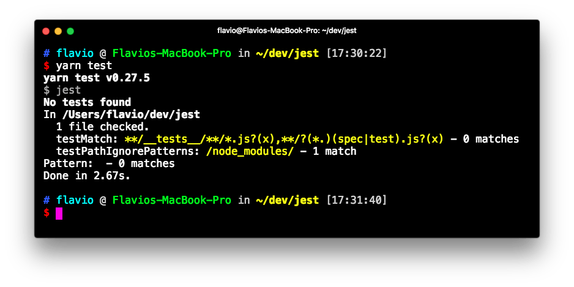
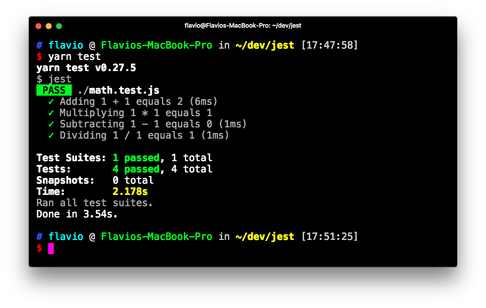
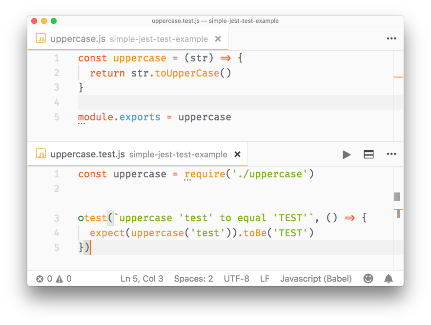
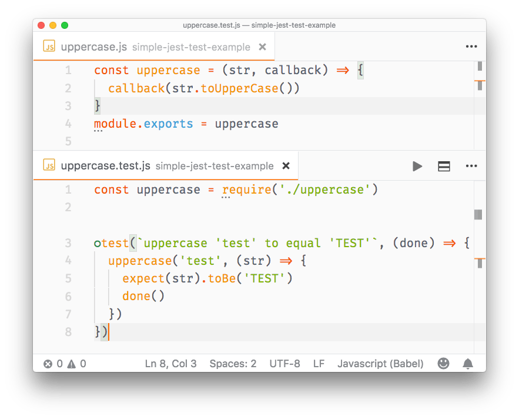
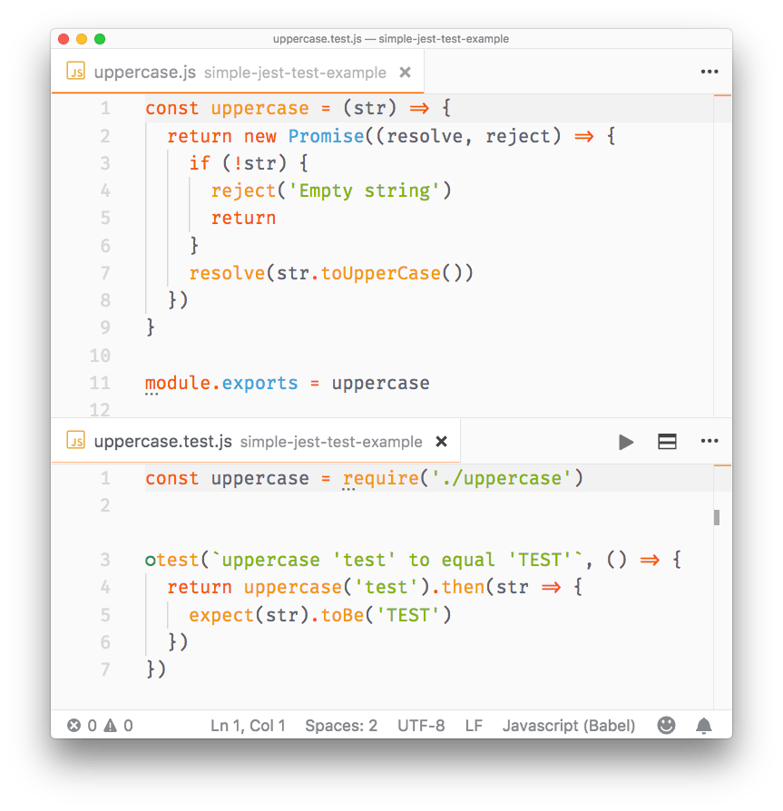
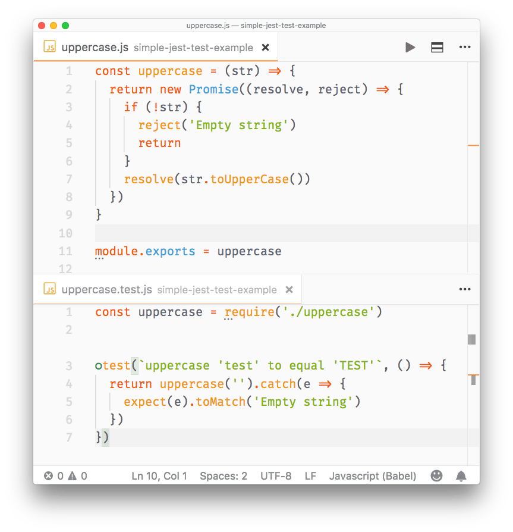
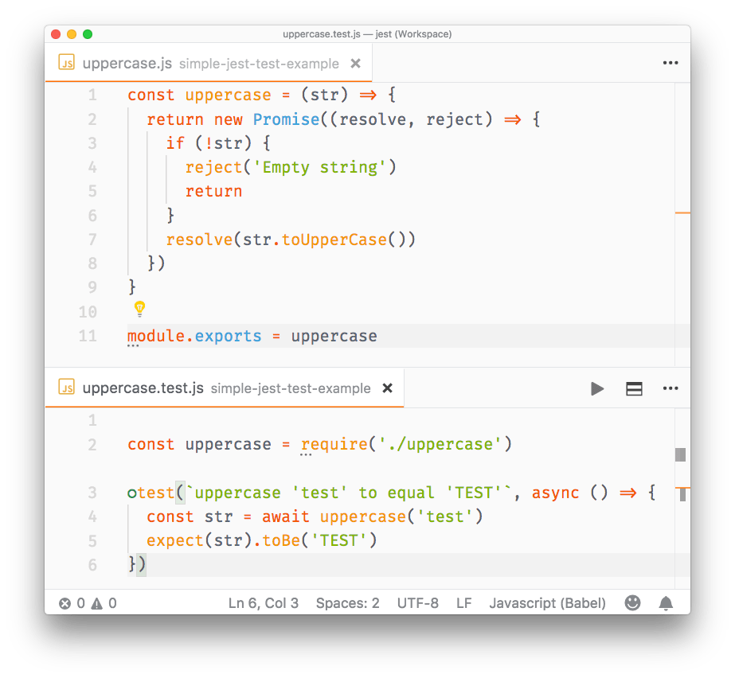
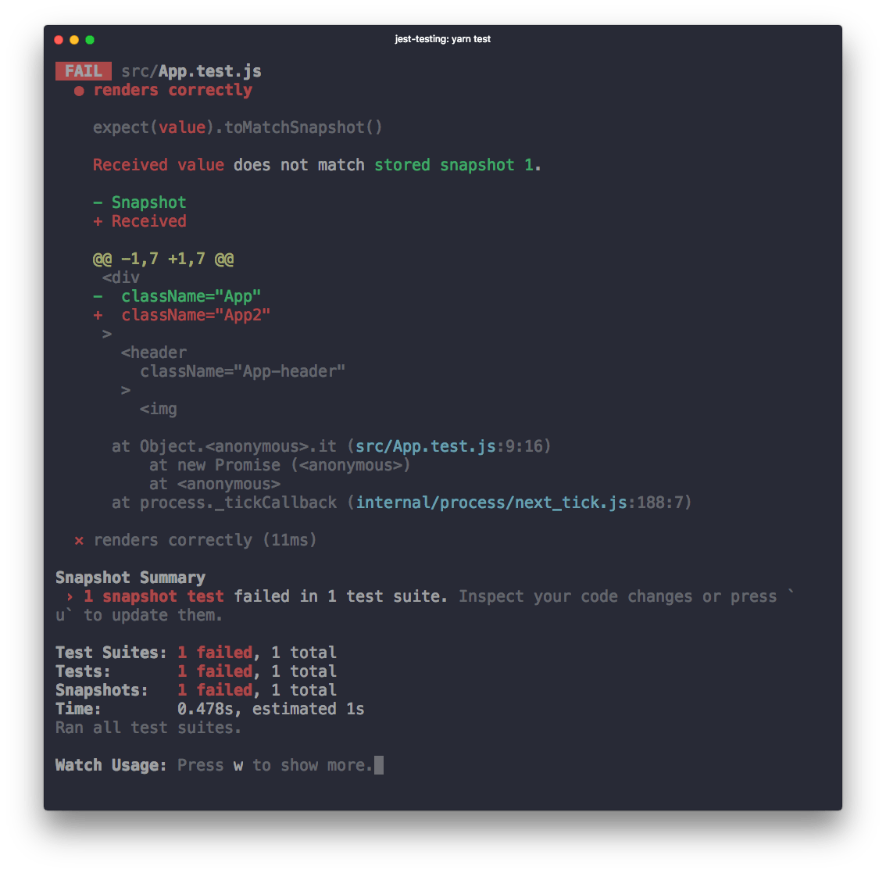

<!-- TOC -->

- [Introduction to Jest](#introduction-to-jest)
- [Installation](#installation)
- [Create the first Jest test](#create-the-first-jest-test)
- [Run Jest with VS Code](#run-jest-with-vs-code)
- [Matchers](#matchers)
- [Setup](#setup)
- [Teardown](#teardown)
- [Group tests using describe()](#group-tests-using-describe)
- [Testing asynchronous code](#testing-asynchronous-code)
  - [Callbacks](#callbacks)
  - [Promises](#promises)
  - [Async/await](#asyncawait)
- [Mocking](#mocking)
  - [Spy packages without affecting the functions code](#spy-packages-without-affecting-the-functions-code)
  - [Mock an entire package](#mock-an-entire-package)
  - [Mock a single function](#mock-a-single-function)
  - [Pre-built mocks](#pre-built-mocks)
- [Snapshot testing](#snapshot-testing)

<!-- /TOC -->

## Introduction to Jest

Jest is a library for testing JavaScript code.

It's an open source project maintained by Facebook, and it's especially well suited for React code testing, although not limited to that: it can test any JavaScript code. Its strengths are:

- it's fast
- it can perform **snapshot testing**
- it's opinionated, and provides everything out of the box without requiring you to make choices

Jest is a tool very similar to Mocha, although they have differences:

- Mocha is less opinionated, while Jest has a certain set of conventions
- Mocha requires more configuration, while Jest works usually out of the box, thanks to being opinionated
- Mocha is older and more established, with more tooling integrations

In my opinion the biggest feature of Jest is it's an out of the box solution that works without having to interact with other testing libraries to perform its job.

## Installation

Jest is automatically installed in `create-react-app`, so if you use that, you don't need to install Jest.

Jest can be installed in any other project using [Yarn](https://flaviocopes.com/yarn/):

```bash
yarn add --dev jest
```

or [npm](https://flaviocopes.com/npm/):

```bash
npm install --save-dev jest
```

notice how we instruct both to put Jest in the `devDependencies` part of the `package.json` file, so that it will only be installed in the development environment and not in production.

Add this line to the scripts part of your `package.json` file:

```json
{
  "scripts": {
    "test": "jest"
  }
}
```

so that tests can be run using `yarn test` or `npm run test`.

Alternatively, you can install Jest globally:

```bash
yarn global add jest
```

and run all your tests using the `jest` command line tool.

## Create the first Jest test

Projects created with `create-react-app` have Jest installed and preconfigured out of the box, but adding Jest to any project is as easy as typing

```bash
yarn add --dev jest
```

Add to your `package.json` this line:

```json
{
  "scripts": {
    "test": "jest"
  }
}
```

and run your tests by executing `yarn test` in your shell.

Now, you don't have any tests here, so nothing is going to be executed:



Let's create the first test. Open a `math.js` file and type a couple functions that we'll later test:

```js
const sum = (a, b) => a + b
const mul = (a, b) => a * b
const sub = (a, b) => a - b
const div = (a, b) => a / b

export default { sum, mul, sub, div }
```

Now create a `math.test.js` file, in the same folder, and there we'll use Jest to test the functions defined in `math.js`:

```js
const { sum, mul, sub, div } = require('./math')

test('Adding 1 + 1 equals 2', () => {
  expect(sum(1, 1)).toBe(2)
})
test('Multiplying 1 * 1 equals 1', () => {
  expect(mul(1, 1)).toBe(1)
})
test('Subtracting 1 - 1 equals 0', () => {
  expect(sub(1, 1)).toBe(0)
})
test('Dividing 1 / 1 equals 1', () => {
  expect(div(1, 1)).toBe(1)
})
```

Running `yarn test` results in Jest being run on all the test files it finds, and returning us the end result:



## Run Jest with VS Code

Visual Studio Code is a great editor for JavaScript development. The [Jest extension](https://marketplace.visualstudio.com/items?itemName=Orta.vscode-jest) offers a top notch integration for our tests.

Once you install it, it will automatically detect if you have installed Jest in your devDependencies and run the tests. You can also invoke the tests manually by selecting the **Jest: Start Runner** command. It will run the tests and stay in watch mode to re-run them whenever you change one of the files that have a test (or a test file):



## Matchers

In the previous article I used `toBe()` as the only **matcher**:

```js
test('Adding 1 + 1 equals 2', () => {
  expect(sum(1, 1)).toBe(2)
})
```

A matcher is a method that lets you test values.

Most commonly used matchers, comparing the value of the result of `expect()` with the value passed in as argument, are:

- `toBe` compares strict equality, using `===`
- `toEqual` compares the values of two variables. If it's an object or array, it checks the equality of all the properties or elements
- `toBeNull` is true when passing a null value
- `toBeDefined` is true when passing a defined value (opposite to the above)
- `toBeUndefined` is true when passing an undefined value
- `toBeCloseTo` is used to compare floating values, avoiding rounding errors
- `toBeTruthy` true if the value is considered true (like an `if` does)
- `toBeFalsy` true if the value is considered false (like an `if` does)
- `toBeGreaterThan` true if the result of expect() is higher than the argument
- `toBeGreaterThanOrEqual` true if the result of expect() is equal to the argument, or higher than the argument
- `toBeLessThan` true if the result of expect() is lower than the argument
- `toBeLessThanOrEqual` true if the result of expect() is equal to the argument, or lower than the argument
- `toMatch` is used to compare strings with [regular expression](https://flaviocopes.com/javascript-regular-expressions/) pattern matching
- `toContain` is used in arrays, true if the expected array contains the argument in its elements set
- `toHaveLength(number)`: checks the length of an array
- `toHaveProperty(key, value)`: checks if an object has a property, and optionally checks its value
- `toThrow` checks if a function you pass throws an exception (in general) or a specific exception
- `toBeInstanceOf()`: checks if an object is an instance of a class

All those matchers can be negated using `.not.` inside the statement, for example:

```js
test('Adding 1 + 1 does not equal 3', () => {
  expect(sum(1, 1)).not.toBe(3)
})
```

For use with promises, you can use `.resolves` and `.rejects`:

```js
expect(Promise.resolve('lemon')).resolves.toBe('lemon')

expect(Promise.reject(new Error('octopus'))).rejects.toThrow('octopus')
```

## Setup

Before running your tests you will want to perform some initialization.

To do something once before all the tests run, use the `beforeAll()` function:

```js
beforeAll(() => {
  //do something
})
```

To perform something before each test runs, use `beforeEach()`:

```js
beforeEach(() => {
  //do something
})
```

## Teardown

Just as you can do with setup, you can also perform something after each test runs:

```js
afterEach(() => {
  //do something
})
```

and after all tests end:

```js
afterAll(() => {
  //do something
})
```

## Group tests using describe()

You can create groups of tests, in a single file, that isolate the setup and teardown functions:

```js
describe('first set', () => {
  beforeEach(() => {
    //do something
  })
  afterAll(() => {
    //do something
  })
  test(/*...*/)
  test(/*...*/)
})

describe('second set', () => {
  beforeEach(() => {
    //do something
  })
  beforeAll(() => {
    //do something
  })
  test(/*...*/)
  test(/*...*/)
})
```

## Testing asynchronous code

Asynchronous code in modern JavaScript can have basically 2 forms: callbacks and promises. On top of promises we can use async/await.

### Callbacks

You can't have a test in a callback, because Jest won't execute it - the execution of the test file ends before the callback is called. To fix this, pass a parameter to the test function, which you can conveniently call `done`. Jest will wait until you call `done()` before ending that test:

```js
//uppercase.js
function uppercase(str, callback) {
  callback(str.toUpperCase())
}
module.exports = uppercase

//uppercase.test.js
const uppercase = require('./src/uppercase')

test(`uppercase 'test' to equal 'TEST'`, (done) => {
  uppercase('test', (str) => {
    expect(str).toBe('TEST')
    done()
  }
})
```



### Promises

With functions that return promises, we **return a promise** from the test:

```js
//uppercase.js
const uppercase = str => {
  return new Promise((resolve, reject) => {
    if (!str) {
      reject('Empty string')
      return
    }
    resolve(str.toUpperCase())
  })
}
module.exports = uppercase

//uppercase.test.js
const uppercase = require('./uppercase')
test(`uppercase 'test' to equal 'TEST'`, () => {
  return uppercase('test').then(str => {
    expect(str).toBe('TEST')
  })
})
```



Promises that are rejected can be tested using `.catch()`:

```js
//uppercase.js
const uppercase = str => {
  return new Promise((resolve, reject) => {
    if (!str) {
      reject('Empty string')
      return
    }
    resolve(str.toUpperCase())
  })
}

module.exports = uppercase

//uppercase.test.js
const uppercase = require('./uppercase')

test(`uppercase 'test' to equal 'TEST'`, () => {
  return uppercase('').catch(e => {
    expect(e).toMatch('Empty string')
  })
})
```



### Async/await

To test functions that return promises we can also use async/await, which makes the syntax very straightforward and simple:

```js
//uppercase.test.js
const uppercase = require('./uppercase')
test(`uppercase 'test' to equal 'TEST'`, async () => {
  const str = await uppercase('test')
  expect(str).toBe('TEST')
})
```



## Mocking

In testing, **mocking** allows you to test functionality that depends on:

- **Database**
- **Network** requests
- access to **Files**
- any **External** system

so that:

1. your tests run **faster**, giving a quick turnaround time during development
2. your tests are **independent** of network conditions, or the state of the database
3. your tests do not **pollute** any data storage because they do not touch the database
4. any change done in a test does not change the state for subsequent tests, and re-running the test suite should start from a known and reproducible starting point
5. you don't have to worry about rate limiting on API calls and network requests

Mocking is useful when you want to avoid side effects (e.g. writing to a database) or you want to skip slow portions of code (like network access), and also avoids implications with running your tests multiple times (e.g. imagine a function that sends an email or calls a rate-limited API).

Even more important, if you are writing a **Unit Test**, you should test the functionality of a function in isolation, not with all its baggage of things it touches.

Using mocks, you can inspect if a module function has been called and which parameters were used, with:

- `expect().toHaveBeenCalled()`: check if a spied function has been called
- `expect().toHaveBeenCalledTimes()`: count how many times a spied function has been called
- `expect().toHaveBeenCalledWith()`: check if the function has been called with a specific set of parameters
- `expect().toHaveBeenLastCalledWith()`: check the parameters of the last time the function has been invoked

### Spy packages without affecting the functions code

When you import a package, you can tell Jest to "spy" on the execution of a particular function, using `spyOn()`, without affecting how that method works.

Example:

```js
const mathjs = require('mathjs')

test(`The mathjs log function`, () => {
  const spy = jest.spyOn(mathjs, 'log')
  const result = mathjs.log(10000, 10)

  expect(mathjs.log).toHaveBeenCalled()
  expect(mathjs.log).toHaveBeenCalledWith(10000, 10)
})
```

### Mock an entire package

Jest provides a convenient way to mock an entire package. Create a `__mocks__` folder in the project root, and in this folder create one JavaScript file for each of your packages.

Say you import `mathjs`. Create a `__mocks__/mathjs.js` file in your project root, and add this content:

```js
module.exports = {
  log: jest.fn(() => 'test')
}
```

This will mock the log() function of the package. Add as many functions as you want to mock:

```js
const mathjs = require('mathjs')

test(`The mathjs log function`, () => {
  const result = mathjs.log(10000, 10)
  expect(result).toBe('test')
  expect(mathjs.log).toHaveBeenCalled()
  expect(mathjs.log).toHaveBeenCalledWith(10000, 10)
})
```

### Mock a single function

You can mock a single function using `jest.fn()`:

```js
const mathjs = require('mathjs')

mathjs.log = jest.fn(() => 'test')
test(`The mathjs log function`, () => {
  const result = mathjs.log(10000, 10)
  expect(result).toBe('test')
  expect(mathjs.log).toHaveBeenCalled()
  expect(mathjs.log).toHaveBeenCalledWith(10000, 10)
})
```

You can also use `jest.fn().mockReturnValue('test')` to create a simple mock that does nothing except returning a value.

### Pre-built mocks

You can find pre-made mocks for popular libraries. For example this package [https://github.com/jefflau/jest-fetch-mock](https://github.com/jefflau/jest-fetch-mock) allows you to mock `fetch()` calls, and provide sample return values without interacting with the actual server in your tests.

## Snapshot testing

Snapshot testing is a pretty cool feature offered by Jest. It can memorize how your UI components are rendered, and compare it to the current test, raising an error if there's a mismatch.

This is a simple test on the App component of a simple `create-react-app` application (make sure you install `react-test-renderer`):

```js
import React from 'react'
import App from './App'
import renderer from 'react-test-renderer'

it('renders correctly', () => {
  const tree = renderer.create(<App />).toJSON()
  expect(tree).toMatchSnapshot()
})
```

the first time you run this test, Jest saves the snapshot to the `__snapshots__` folder. Here's what App.test.js.snap contains:

```js
// Jest Snapshot v1, https://goo.gl/fbAQLP

exports[`renders correctly 1`] = `
<div
  className="App"
>
  <header
    className="App-header"
  >
    
    <h1
      className="App-title"
    >
      Welcome to React
    </h1>
  </header>
  <p
    className="App-intro"
  >
    To get started, edit
    <code>
      src/App.js
    </code>
     and save to reload.
  </p>
</div>
`
```

As you see it's the code that the App component renders, nothing more.

The next time the test compares the output of `<App />` to this. If App changes, you get an error:



When using `yarn test` in `create-react-app` you are in **watch mode**, and from there you can press `w` and show more options:

```
Watch Usage
 › Press u to update failing snapshots.
 › Press p to filter by a filename regex pattern.
 › Press t to filter by a test name regex pattern.
 › Press q to quit watch mode.
 › Press Enter to trigger a test run.
```

If your change is intended, pressing `u` will update the failing snapshots, and make the test pass.

You can also update the snapshot by running `jest -u` (or `jest --updateSnapshot`) outside of watch mode.
