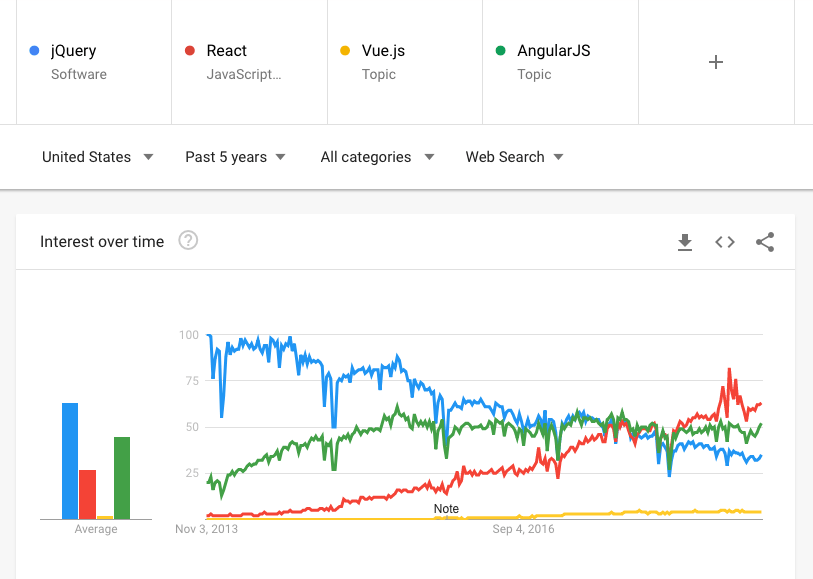

Whatever your preferences are in terms of JavaScript frameworks and libraries, jQuery has played a big part in the JavaScript ecosystem.

It used to be much more popular a few years ago, and now some of the needs of jQuery have been superseded by modern browsers (luckily!), but this JavaScript library is still used by a **lot** of people.

Why did jQuery become so popular in the first place? First, jQuery was born in a world where JavaScript applications weren't a thing. In the early-mid 2000s JavaScript was mainly used to power slideshows and other widgets that appeared inside a page, like image galleries, date pickers and so on. It wasn't powerful enough to do a lot of things without being too slow (computers were slower too, of course).

> It should be noted that jQuery was not the only or the first library. Other ones were very popular at the time, like Mootools, YUI, Dojo Toolkit, Scriptaculous and Prototype. jQuery probably became the most famous of those, later on.

Browsers at the time had a lot of interoperability issues. We had lots of cross-browser quirks and standardization issues, and jQuery helped us by creating an abstraction layer and taking care of al the workarounds.

jQuery allowed you to select DOM elements using the CSS selectors syntax, it was very user friendly and very simple to extend. It made JavaScript animations simple.

It also helped simplify working with AJAX (and its cross-browser differences) at a time when this term was super popular, and this also gave jQuery a nice boost in term of popularity.

Today, we don't have a lot of browser compatibility issues, and the [Selectors API](https://flaviocopes.com/selectors-api/) and [Fetch](https://flaviocopes.com/fetch-api/) standardized to the browser two of the best features of jQuery.

jQuery is certainly a topic full of debate. Some people say jQuery is a relic of the past, some people still use it day to day. Some people spend their time writing about [why we don't need jQuery](https://www.google.com/search?q=why+we+dont+need+jquery).

It's surely declining in usage in the past few years:



Today the JavaScript landscape has dramatically changed. That said, it's still useful to know what jQuery can do for you.

## Things we used jQuery for that now have a standardized browser API

### Selecting DOM elements

The jQuery way:

```js
$('.button')
```

We can now use the Selectors API:

```js
document.querySelector('.button')
```

if you have more elements:

```js
document.querySelectorAll('.button')
```

### Wait for the DOM to be loaded

The jQuery way:

```js
$(document).ready(() => {
	 //...
})
```

The DOM way:

```js
document.addEventListener("DOMContentLoaded", () => {
  //...
})
```


### Add or remove classes from a DOM element

The jQuery way:

```js
el.addClass('big')
el.removeClass('big')
el.toggleClass('big')
```

The DOM way:

```js
el.classList.add('big')
el.classList.remove('big')
el.classList.toggle('big')
```

### Removing an element from the DOM

The jQuery way:

```js
el.remove()
```

The DOM way:

```js
el.remove()
```

(right, no change)

### Change the content of an element in the DOM

The jQuery way:

```js
el.text('Hello')
el.html('Hello')
el.text()
el.html()
```

The DOM way:

```js
el.innerHTML = 'Hello'
el.textContent = 'Hello'
el.innerHTML
el.textContent
```

### Selecting the parent element in the DOM

The jQuery way:

```js
el.parent()
```

The DOM way:

```js
el.parentNode
```


### Listening for events on DOM elements

The jQuery way:

```js
el.on('click', (e) => { /* ... */ })
```

The DOM way:

```js
el.addEventListener('click', (e) => { /* ... */ })
```


### AJAX requests

The jQuery way:

```js
$.ajax({
  url: '/api.json',
  type: 'GET'
  success: (data) => {
    console.log(data)
  }
})
```

The modern JS way:

```js
fetch('/api.json')
  .then(response => response.text())
  .then(body => console.log(body))
```

### Animations

jQuery animations can now be done in the browser using CSS Transitions or CSS Animations.

### Browser quirks

Transpile your code using Babel, or use specific polyfills ([polyfill.io](https://polyfill.io))

## Should you use jQuery in 2018?

Let's answer the question that this article poses in its title. If you don't already know jQuery, is it worth learning in 2018?

In my opinion jQuery should not be used any more in new projects that only target modern browsers, and of course if your project relies on it for some particular reason, or just because you use plugins or other code that needs jQuery, definitely keep using it.

Some libraries also have a dependency on jQuery, like Bootstrap. You might also buy ready-made templates that just use it and its plugins.

Maybe you work in a team where frontend developers are not all JavaScript wizards and they are more used to jQuery than with newer standards. If this gets the job done, that's cool.

You might also not have the luxury of use the latest cool tech (like React or Vue) because you are required to support old browsers, that have an older set of standards. In this case, jQuery is still hugely relevant for you.