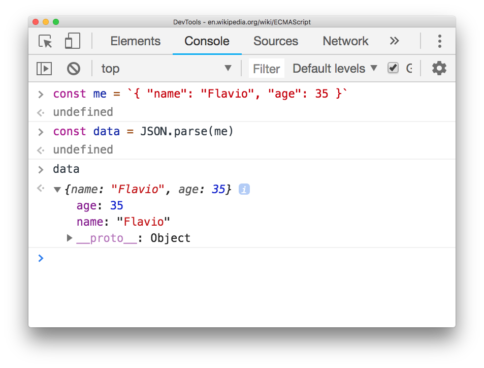
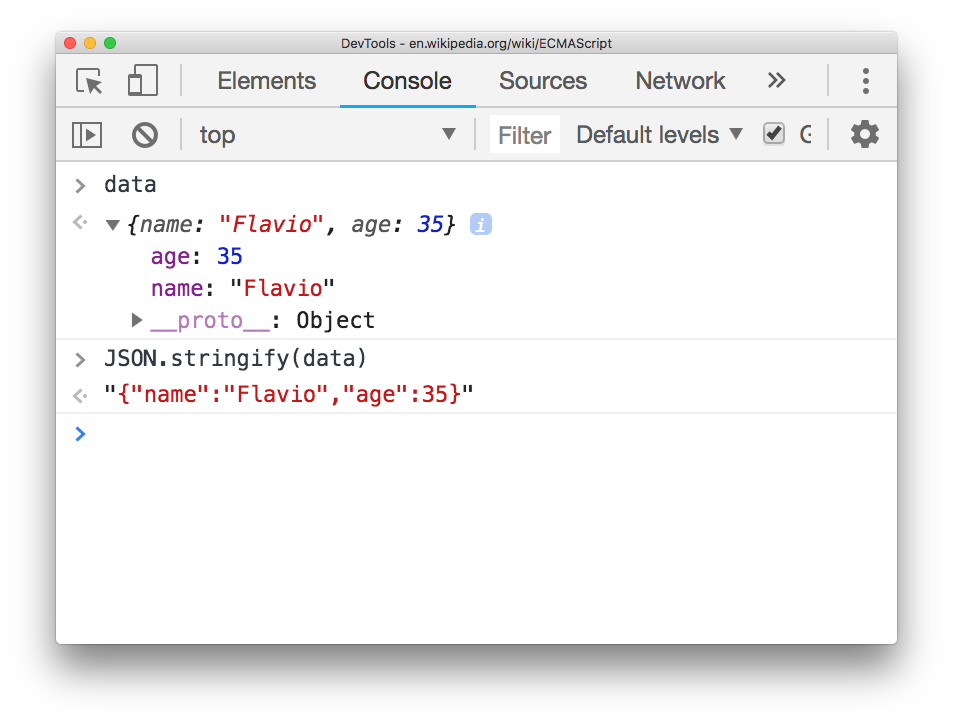

JSON is a file format that's used to store and interchange data.

Data is stored in a set of key-value pairs.

This data is human readable, which makes JSON perfect for manual editing.

Here's an example of a JSON string:

```json
{
  "name": "Flavio",
  "age": 35
}
```

From this little snippet you can see that keys are wrapped in double quotes, a colon separates the key and the value, and the value can be of different types.

Key-value sets are separated by a comma.

Spacing (spaces, tabs, new lines) does not matter in a JSON file. The above is equivalent to

```json
{"name": "Flavio","age": 35}
```

or

```json
{"name":
"Flavio","age":
35}
```

but as always well-formatted data is better to understand.

JSON was born in 2002 and got hugely popular thanks to its ease of use, and flexibility, and although being born out of the JavaScript world, it quickly spread out to other programming languages.

It's defined in the [ECMA-404 standard](http://www.ecma-international.org/flat/publications/files/ECMA-ST/ECMA-404.pdf).

JSON strings are commonly stored in `.json` files and transmitted over the network with an `application/json` MIME type.

## Data types

JSON supports some basic data types:

- `Number`: any number that's not wrapped in quotes
- `String`: any set of characters wrapped in quotes
- `Boolean`: `true` or `false`
- `Array`: a list of values, wrapped in square brackets
- `Object`: a set of key-value pairs, wrapped in curly brackets
- `null`: the `null` word, which represents an empty value

Any other data type must be serialized to a string (and then de-serialized) in order to be stored in JSON.

## Encoding and decoding JSON in JavaScript

ECMAScript 5 in 2009 introduced the `JSON` object in the JavaScript standard, which among other things offers the `JSON.parse()` and `JSON.stringify()` methods.

Before it can be used in a JavaScript program, a JSON in string format must be parsed and transformed in data that JavaScript can use.

`JSON.parse()` takes a JSON string as its parameter, and returns an object that contains the parsed JSON:



`JSON.stringify()` takes a JavaScript object as its parameter, and returns a string that represents it in JSON:



`JSON.parse()` can also accepts an optional second argument, called the reviver function. You can use that to hook into the parsing and perform any custom operation:

```js
JSON.parse(string, (key, value) => {
  if (key === 'name') {
    return `Name: ${value}`
  } else {
    return value
  }
})
```

## Nesting objects

You can organize data in a JSON file using a nested object:

```json
{
  "name": {
    "firstName": "Flavio",
    "lastName": "Copes"
  },
  "age": 35,
  "dogs": [
    { "name": "Roger" },
    { "name": "Syd" }
  ],
  "country": {
    "details": {
      "name": "Italy"
    }
  }
}
```

## Online tools for working with JSON

There are many useful tools you can use.

One of them is [JSONLint](https://jsonlint.com/), the JSON Validator. Using it you can verify if a JSON string is valid.

[JSONFormatter](https://jsonformatter.org/) is a nice tool to format a JSON string so it's more readable according to your conventions.

## JSON Schema

While JSON is very flexible right from the start, there are times when you need a bit more rigid organization to keep things in place.

This is when [JSON Schema](https://json-schema.org/) gets into play. It's a way to annotate and validate JSON documents according to some specific format you create.